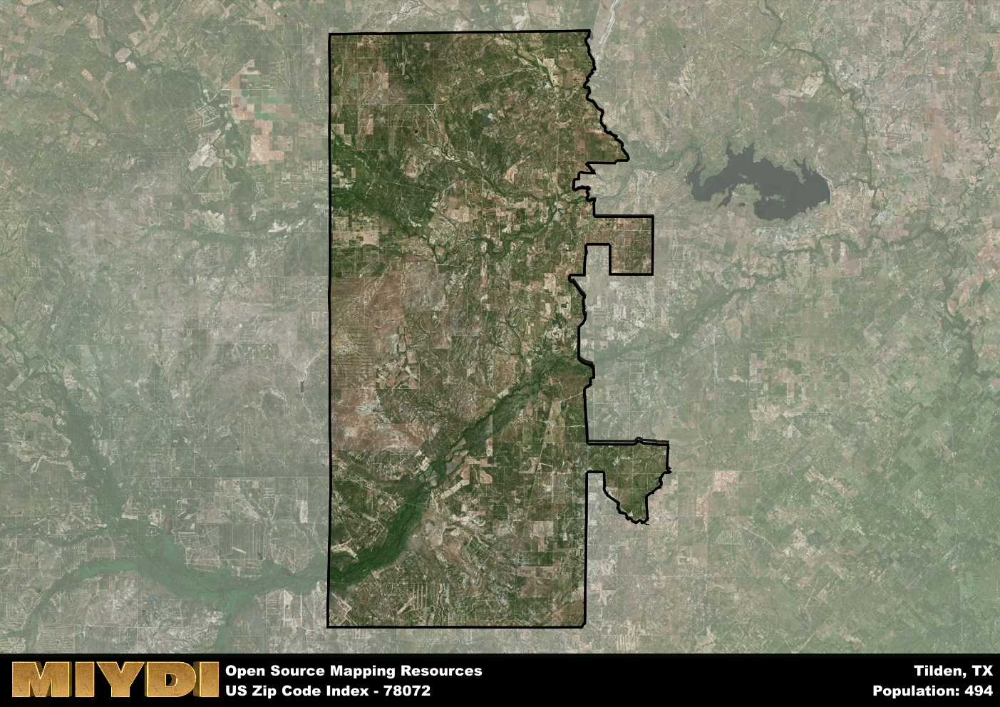

**Area Name:** Tilden

**Zip Code:** 78072

**State:** TX

Tilden is a part of the Alice - TX Micro Area, and makes up  of the Metro's population.  

# Tilden: A Historic and Vibrant Community in Zip Code 78072

Located in southern Texas, the zip code 78072 area corresponds to the town of Tilden. Situated in McMullen County, Tilden is surrounded by vast expanses of land and is approximately 75 miles south of San Antonio. While Tilden is a relatively small town, it plays a significant role in the region as a hub for ranching and oil production. The community is closely connected to nearby cities such as Three Rivers and George West, contributing to the overall economic activity of the area.

Tilden has a rich historical narrative that dates back to the mid-19th century when it was founded as a trading post. The town experienced rapid growth during the Texas oil boom in the early 1900s, becoming a center for oil and gas production. The town was named after Samuel J. Tilden, a former governor of New York, and has maintained its small-town charm despite its industrial importance. Tilden's history is deeply intertwined with the development of the oil industry in Texas, and the town continues to honor its heritage through various community events and historic landmarks.

Today, Tilden is a vibrant community with a mix of residential, commercial, and industrial areas. The town's economy is primarily driven by oil and gas production, agriculture, and tourism. Residents and visitors alike can enjoy outdoor activities such as hunting, fishing, and hiking in the surrounding natural landscapes. Tilden also boasts a variety of local businesses, restaurants, and services that cater to the needs of its residents. The town's cultural and historic sites, including the Tilden Museum and historic downtown area, offer a glimpse into its past while also showcasing its present vitality.

# Tilden Demographics

The population of Tilden is 494.  
Tilden has a population density of 0.67 per square mile.  
The area of Tilden is 742.68 square miles.  

## Tilden Income and Economic Data

These demographic numbers are sourced from IRS return data, providing comprehensive insights into the population dynamics and economic trends within Tilden.

**Breakdown of return types for Tilden**

The table offers insight into the composition of tax returns filed with the IRS, categorizing them into three main types. Single returns represent filings by individuals, joint returns by married couples, and head of household returns by individuals who qualify as heads of households, typically having dependents. This breakdown provides an understanding of the different filing statuses adopted by taxpayers when submitting their tax documentation.

| Return Types filed for Tilden                              | Percentage          |
|----------------------------------------------------------|---------------------|
| Single Returns                                            | 0.37 |
| Joint Returns                                             | 0.4 |
| Head Household Returns                                    | 0.13 |

The income and economic data presented here is sourced from the IRS income brackets, utilized for categorizing tax returns by income levels. This table displays income ranges for both single filers and married couples, along with the corresponding number of returns and the percentage within each bracket, providing valuable insight into the distribution of taxes across various income groups.

| Bracket Name       | Single Filer Income Range | Married Couple Range | Number of Returns | Percentage of Returns |
|--------------------|----------------------------|----------------------|-------------------|-----------------------|
| 10% Bracket        | Up to $10,275              | Up to $20,550        | 80 | 0.27% |
| 12% Bracket        | $10,276 - $41,775          | $20,551 - $83,550    | 70 | 0.23% |
| 22% Bracket        | $41,776 - $89,075          | $83,551 - $178,150   | 40 | 0.13% |
| 24% Bracket        | $89,076 - $170,050         | $178,151 - $340,100  | 40 | 0.13% |
| 32% Bracket        | $170,051 - $215,950        | $340,101 - $431,900  | 40 | 0.13% |
| 35% Bracket        | $215,951 - $539,900        | $431,901 - $647,850  | 30 | 0.1% |

### Exploring Taxpayer Diversity: A Breakdown of Different Types of Tax Returns in Tilden

The table offers insights into various types of tax returns filed, reflecting different aspects of taxpayer activities and demographics. Categories include charitable returns for donations, dependent returns for claimed dependents, educator population, elderly population, real estate returns, self-employment returns, student loan returns, and unemployment returns, providing valuable insights into taxpayer behavior and demographics.

| Tilden Filing Types                    | Count | Percentage |
|--------------------------------------|-------|------------|
| Charitable Donations                 | 0 | 0% |
| Dependents Claimed                   | 0 | 0% |
| Educator Residents                   | 0 | 0% |
| Elderly Population                   | 100 | 0.33% |
| Farming Population                   | 60 | 0.2% |
| Real Estate Transactions             | 0 | 0% |
| Self-Employed Individuals            | 70 | 0.233% |
| Student Loan Cases                   | 0 | 0% |
| Unemployment Benefit Filings         | 20 | 0.07% |

## Tilden AI and Census Variables

The values presented in this dataset for Tilden are AI-optimized, streamlined, and categorized into relevant buckets for enhanced utility in AI and mapping programs. These simplified values have been optimized to facilitate efficient analysis and integration into various technological applications, offering users accessible and actionable insights into demographics within the Tilden area.

| AI Variables for Tilden | Value |
|-------------|-------|
| Shape Area | 2492710970.85156 |
| Shape Length | 292823.437724874 |
| CBSA Federal Processing Standard Code | 10860 |

## How to use this free AI optimized Geo-Spatial Data for Tilden, TX

This data is made freely available under the Creative Commons license, allowing for unrestricted use for any purpose. Users can access static resources directly from GitHub or leverage more advanced functionalities by utilizing the GeoJSON files. All datasets originate from official government or private sector sources and are meticulously compiled into relevant datasets within QGIS. However, the versatility of the data ensures compatibility with any mapping application.

## Data Accuracy Disclaimer
It's important to note that the data provided here may contain errors or discrepancies and should be considered as 'close enough' for business applications and AI rather than a definitive source of truth. This data is aggregated from multiple sources, some of which publish information on wildly different intervals, leading to potential inconsistencies. Additionally, certain data points may not be corrected for Covid-related changes, further impacting accuracy. Moreover, the assumption that demographic trends are consistent throughout a region may lead to discrepancies, as trends often concentrate in areas of highest population density. As a result, dense areas may be slightly underrepresented, while rural areas may be slightly overrepresented, resulting in a more conservative dataset. Furthermore, the focus primarily on areas within US Major and Minor Statistical areas means that approximately 40 million Americans living outside of these areas may not be fully represented. Lastly, the historical background and area descriptions generated using AI are susceptible to potential mistakes, so users should exercise caution when interpreting the information provided.
