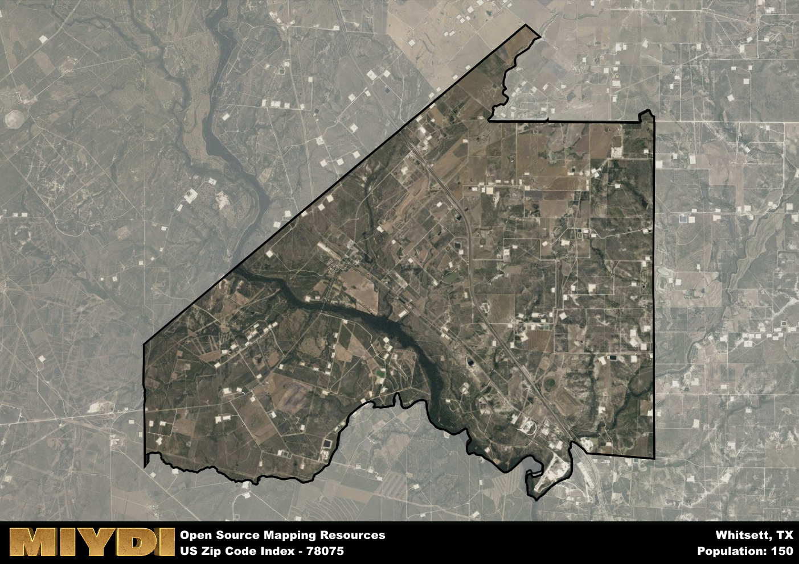

**Area Name:** Whitsett

**Zip Code:** 78075

**State:** TX

Whitsett is a part of the San Antonio-New Braunfels - TX Metro Area, and makes up  of the Metro's population.  

# Whitsett, Texas: A Charming Community in Zip Code 78075  

Located in the heart of South Texas, zip code 78075 encompasses the quaint community of Whitsett. Situated within Live Oak County, Whitsett neighbors the cities of Three Rivers to the south and George West to the north. This zip code area is an integral part of the larger metropolitan context of the region, serving as a residential hub for those seeking a peaceful small-town atmosphere while still being within driving distance of major urban centers like San Antonio and Corpus Christi.

Whitsett has a rich historical narrative that traces back to its establishment as a railway stop in the late 19th century. The area experienced growth with the arrival of settlers attracted to its fertile land for ranching and agriculture. Over time, Whitsett evolved into a tight-knit community known for its friendly residents and strong sense of community spirit. The town was officially incorporated in 1952 and has since maintained its unique character and charm.

Today, Whitsett continues to thrive as a peaceful rural community with a focus on agriculture and oil production. The area offers essential services such as schools, churches, and local businesses to meet the needs of its residents. Outdoor enthusiasts can enjoy the nearby Choke Canyon State Park for fishing and boating activities, while history buffs can explore the town's heritage sites like the Whitsett Historical Museum. With its blend of historic charm and modern amenities, Whitsett remains a hidden gem in South Texas for those seeking a peaceful and close-knit community.

# Whitsett Demographics

The population of Whitsett is 150.  
Whitsett has a population density of 3.16 per square mile.  
The area of Whitsett is 47.5 square miles.  

## Whitsett AI and Census Variables

The values presented in this dataset for Whitsett are AI-optimized, streamlined, and categorized into relevant buckets for enhanced utility in AI and mapping programs. These simplified values have been optimized to facilitate efficient analysis and integration into various technological applications, offering users accessible and actionable insights into demographics within the Whitsett area.

| AI Variables for Whitsett | Value |
|-------------|-------|
| Shape Area | 160253969.328125 |
| Shape Length | 69879.2568186466 |
| CBSA Federal Processing Standard Code | 41700 |

## How to use this free AI optimized Geo-Spatial Data for Whitsett, TX

This data is made freely available under the Creative Commons license, allowing for unrestricted use for any purpose. Users can access static resources directly from GitHub or leverage more advanced functionalities by utilizing the GeoJSON files. All datasets originate from official government or private sector sources and are meticulously compiled into relevant datasets within QGIS. However, the versatility of the data ensures compatibility with any mapping application.

## Data Accuracy Disclaimer
It's important to note that the data provided here may contain errors or discrepancies and should be considered as 'close enough' for business applications and AI rather than a definitive source of truth. This data is aggregated from multiple sources, some of which publish information on wildly different intervals, leading to potential inconsistencies. Additionally, certain data points may not be corrected for Covid-related changes, further impacting accuracy. Moreover, the assumption that demographic trends are consistent throughout a region may lead to discrepancies, as trends often concentrate in areas of highest population density. As a result, dense areas may be slightly underrepresented, while rural areas may be slightly overrepresented, resulting in a more conservative dataset. Furthermore, the focus primarily on areas within US Major and Minor Statistical areas means that approximately 40 million Americans living outside of these areas may not be fully represented. Lastly, the historical background and area descriptions generated using AI are susceptible to potential mistakes, so users should exercise caution when interpreting the information provided.
