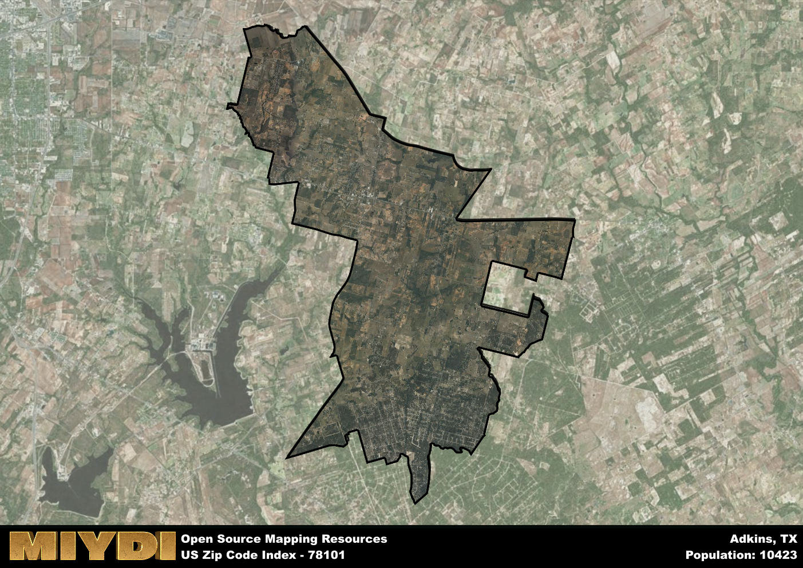

**Area Name:** Adkins

**Zip Code:** 78101

**State:** TX

Adkins is a part of the San Antonio-New Braunfels - TX Metro Area, and makes up  of the Metro's population.  

# Adkins: A Charming Rural Community in Texas  
Located in the southern part of Bexar County, Texas, the zip code area 78101 is home to the close-knit community of Adkins. Situated east of San Antonio, Adkins is bordered by the towns of St. Hedwig to the north and China Grove to the south. Despite its rural setting, Adkins is well-connected to the larger metropolitan area, providing residents with easy access to urban amenities while enjoying a quieter way of life.

Originally settled in the late 19th century, Adkins was named after William Adkins, a local landowner who played a significant role in the community's development. The area saw gradual growth with the establishment of farms and ranches, attracting families looking for a peaceful place to call home. Over the years, Adkins has maintained its agricultural roots while also evolving into a residential area with a strong sense of community pride.

Today, Adkins retains its small-town charm with a mix of residential neighborhoods, farms, and local businesses. The area is known for its farming and ranching activities, with many residents involved in agriculture. Adkins also offers a range of services such as schools, churches, and small businesses catering to the needs of its residents. With its scenic countryside and proximity to San Antonio, Adkins provides a peaceful retreat for those seeking a slower pace of life within reach of urban conveniences.

# Adkins Demographics

The population of Adkins is 10423.  
Adkins has a population density of 201.61 per square mile.  
The area of Adkins is 51.7 square miles.  

## Adkins Income and Economic Data

These demographic numbers are sourced from IRS return data, providing comprehensive insights into the population dynamics and economic trends within Adkins.

**Breakdown of return types for Adkins**

The table offers insight into the composition of tax returns filed with the IRS, categorizing them into three main types. Single returns represent filings by individuals, joint returns by married couples, and head of household returns by individuals who qualify as heads of households, typically having dependents. This breakdown provides an understanding of the different filing statuses adopted by taxpayers when submitting their tax documentation.

| Return Types filed for Adkins                              | Percentage          |
|----------------------------------------------------------|---------------------|
| Single Returns                                            | 0.42 |
| Joint Returns                                             | 0.47 |
| Head Household Returns                                    | 0.09 |

The income and economic data presented here is sourced from the IRS income brackets, utilized for categorizing tax returns by income levels. This table displays income ranges for both single filers and married couples, along with the corresponding number of returns and the percentage within each bracket, providing valuable insight into the distribution of taxes across various income groups.

| Bracket Name       | Single Filer Income Range | Married Couple Range | Number of Returns | Percentage of Returns |
|--------------------|----------------------------|----------------------|-------------------|-----------------------|
| 10% Bracket        | Up to $10,275              | Up to $20,550        | 1270 | 0.29% |
| 12% Bracket        | $10,276 - $41,775          | $20,551 - $83,550    | 970 | 0.22% |
| 22% Bracket        | $41,776 - $89,075          | $83,551 - $178,150   | 610 | 0.14% |
| 24% Bracket        | $89,076 - $170,050         | $178,151 - $340,100  | 500 | 0.11% |
| 32% Bracket        | $170,051 - $215,950        | $340,101 - $431,900  | 860 | 0.19% |
| 35% Bracket        | $215,951 - $539,900        | $431,901 - $647,850  | 230 | 0.05% |

### Exploring Taxpayer Diversity: A Breakdown of Different Types of Tax Returns in Adkins

The table offers insights into various types of tax returns filed, reflecting different aspects of taxpayer activities and demographics. Categories include charitable returns for donations, dependent returns for claimed dependents, educator population, elderly population, real estate returns, self-employment returns, student loan returns, and unemployment returns, providing valuable insights into taxpayer behavior and demographics.

| Adkins Filing Types                    | Count | Percentage |
|--------------------------------------|-------|------------|
| Charitable Donations                 | 240 | 0.054% |
| Dependents Claimed                   | 160 | 0.036% |
| Educator Residents                   | 120 | 0.027% |
| Elderly Population                   | 1260 | 0.28% |
| Farming Population                   | 360 | 0.081% |
| Real Estate Transactions             | 250 | 0.056% |
| Self-Employed Individuals            | 630 | 0.142% |
| Student Loan Cases                   | 270 | 0.061% |
| Unemployment Benefit Filings         | 500 | 0.11% |

## Adkins AI and Census Variables

The values presented in this dataset for Adkins are AI-optimized, streamlined, and categorized into relevant buckets for enhanced utility in AI and mapping programs. These simplified values have been optimized to facilitate efficient analysis and integration into various technological applications, offering users accessible and actionable insights into demographics within the Adkins area.

| AI Variables for Adkins | Value |
|-------------|-------|
| Shape Area | 176824655.398438 |
| Shape Length | 100335.325648771 |
| CBSA Federal Processing Standard Code | 41700 |

## How to use this free AI optimized Geo-Spatial Data for Adkins, TX

This data is made freely available under the Creative Commons license, allowing for unrestricted use for any purpose. Users can access static resources directly from GitHub or leverage more advanced functionalities by utilizing the GeoJSON files. All datasets originate from official government or private sector sources and are meticulously compiled into relevant datasets within QGIS. However, the versatility of the data ensures compatibility with any mapping application.

## Data Accuracy Disclaimer
It's important to note that the data provided here may contain errors or discrepancies and should be considered as 'close enough' for business applications and AI rather than a definitive source of truth. This data is aggregated from multiple sources, some of which publish information on wildly different intervals, leading to potential inconsistencies. Additionally, certain data points may not be corrected for Covid-related changes, further impacting accuracy. Moreover, the assumption that demographic trends are consistent throughout a region may lead to discrepancies, as trends often concentrate in areas of highest population density. As a result, dense areas may be slightly underrepresented, while rural areas may be slightly overrepresented, resulting in a more conservative dataset. Furthermore, the focus primarily on areas within US Major and Minor Statistical areas means that approximately 40 million Americans living outside of these areas may not be fully represented. Lastly, the historical background and area descriptions generated using AI are susceptible to potential mistakes, so users should exercise caution when interpreting the information provided.
