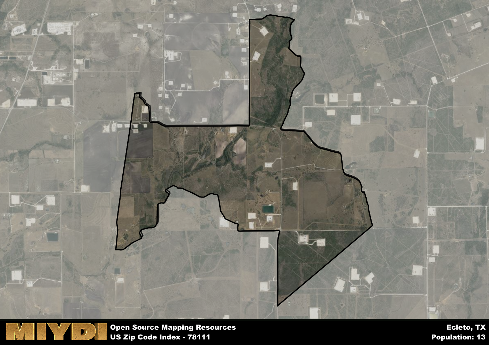

**Area Name:** Ecleto

**Zip Code:** 78111

**State:** TX

# Ecleto: A Charming Rural Community in South Texas  

Located in the southern part of Texas, the zip code area 78111 is home to the quaint community of Ecleto. Situated within Wilson County, Ecleto is surrounded by the rural landscapes of South Texas, with nearby towns such as Poth and Nixon providing the closest urban amenities. Despite its rural setting, Ecleto is conveniently located near major highways, allowing residents easy access to larger cities like San Antonio.

Ecleto has a rich historical background, originally settled by German immigrants in the mid-19th century. The area grew as an agricultural hub, with farming and ranching playing a significant role in its development. The community was named after the nearby Ecleto Creek, which flows through the area and provides a scenic backdrop to the town. Over the years, Ecleto has maintained its small-town charm while embracing modern developments.

Today, Ecleto remains a tight-knit community with a focus on agriculture and rural living. The area is known for its horse ranches and farmland, offering residents a peaceful and idyllic way of life. Local services include a post office, small businesses, and community events that bring residents together. Ecleto is also home to historic sites that showcase its German heritage, such as the Ecleto Baptist Church, which dates back to the 1870s. With its unique blend of history and rural charm, Ecleto continues to be a hidden gem in South Texas.

# Ecleto Demographics

The population of Ecleto is 13.  
Ecleto has a population density of 2.72 per square mile.  
The area of Ecleto is 4.78 square miles.  

## Ecleto AI and Census Variables

The values presented in this dataset for Ecleto are AI-optimized, streamlined, and categorized into relevant buckets for enhanced utility in AI and mapping programs. These simplified values have been optimized to facilitate efficient analysis and integration into various technological applications, offering users accessible and actionable insights into demographics within the Ecleto area.

| AI Variables for Ecleto | Value |
|-------------|-------|
| Shape Area | 16245551.9648438 |
| Shape Length | 27219.6442521548 |

## How to use this free AI optimized Geo-Spatial Data for Ecleto, TX

This data is made freely available under the Creative Commons license, allowing for unrestricted use for any purpose. Users can access static resources directly from GitHub or leverage more advanced functionalities by utilizing the GeoJSON files. All datasets originate from official government or private sector sources and are meticulously compiled into relevant datasets within QGIS. However, the versatility of the data ensures compatibility with any mapping application.

## Data Accuracy Disclaimer
It's important to note that the data provided here may contain errors or discrepancies and should be considered as 'close enough' for business applications and AI rather than a definitive source of truth. This data is aggregated from multiple sources, some of which publish information on wildly different intervals, leading to potential inconsistencies. Additionally, certain data points may not be corrected for Covid-related changes, further impacting accuracy. Moreover, the assumption that demographic trends are consistent throughout a region may lead to discrepancies, as trends often concentrate in areas of highest population density. As a result, dense areas may be slightly underrepresented, while rural areas may be slightly overrepresented, resulting in a more conservative dataset. Furthermore, the focus primarily on areas within US Major and Minor Statistical areas means that approximately 40 million Americans living outside of these areas may not be fully represented. Lastly, the historical background and area descriptions generated using AI are susceptible to potential mistakes, so users should exercise caution when interpreting the information provided.
