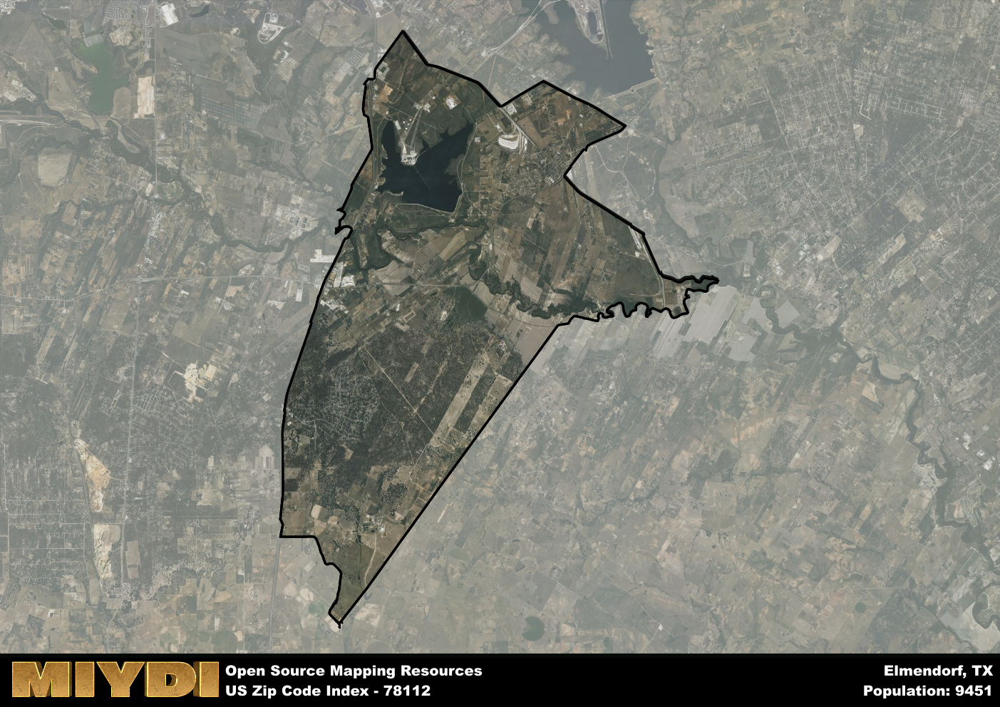

**Area Name:** Elmendorf

**Zip Code:** 78112

**State:** TX

Elmendorf is a part of the San Antonio-New Braunfels - TX Metro Area, and makes up  of the Metro's population.  

# Elmendorf: A Historic Neighborhood in the Greater San Antonio Area

Located in Bexar County, Texas, Elmendorf is a small neighborhood within the greater San Antonio metropolitan area. Zip code 78112 encompasses the area of Elmendorf, bordered by Loop 1604 to the north and Interstate 37 to the east. This neighborhood is situated approximately 16 miles southeast of downtown San Antonio, making it a convenient residential area for those working in the city. Elmendorf seamlessly integrates with nearby communities such as China Grove and Adkins, contributing to the vibrant cultural and economic landscape of the region.

Originally settled in the late 19th century, Elmendorf was named after Henry Elmendorf, a local landowner and businessman. The area experienced significant growth with the arrival of the railroad in the early 20th century, attracting new residents and businesses to the neighborhood. Elmendorf played a crucial role in supporting the agricultural industry in the region, particularly with its fertile soil and access to transportation routes. Over the years, Elmendorf has maintained its rural charm while evolving into a thriving residential community with a rich historical heritage.

Today, Elmendorf is known for its diverse economic activities, including agriculture, small businesses, and light industry. The neighborhood offers a range of services to its residents, such as schools, parks, and local businesses that cater to daily needs. Elmendorf boasts several parks and recreational areas for outdoor enthusiasts, providing opportunities for hiking, fishing, and picnicking. Additionally, the area is home to historic sites and landmarks that showcase its unique past, preserving the legacy of the early settlers and their contributions to the development of the region.

# Elmendorf Demographics

The population of Elmendorf is 9451.  
Elmendorf has a population density of 188.15 per square mile.  
The area of Elmendorf is 50.23 square miles.  

## Elmendorf Income and Economic Data

These demographic numbers are sourced from IRS return data, providing comprehensive insights into the population dynamics and economic trends within Elmendorf.

**Breakdown of return types for Elmendorf**

The table offers insight into the composition of tax returns filed with the IRS, categorizing them into three main types. Single returns represent filings by individuals, joint returns by married couples, and head of household returns by individuals who qualify as heads of households, typically having dependents. This breakdown provides an understanding of the different filing statuses adopted by taxpayers when submitting their tax documentation.

| Return Types filed for Elmendorf                              | Percentage          |
|----------------------------------------------------------|---------------------|
| Single Returns                                            | 0.46 |
| Joint Returns                                             | 0.33 |
| Head Household Returns                                    | 0.19 |

The income and economic data presented here is sourced from the IRS income brackets, utilized for categorizing tax returns by income levels. This table displays income ranges for both single filers and married couples, along with the corresponding number of returns and the percentage within each bracket, providing valuable insight into the distribution of taxes across various income groups.

| Bracket Name       | Single Filer Income Range | Married Couple Range | Number of Returns | Percentage of Returns |
|--------------------|----------------------------|----------------------|-------------------|-----------------------|
| 10% Bracket        | Up to $10,275              | Up to $20,550        | 1780 | 0.42% |
| 12% Bracket        | $10,276 - $41,775          | $20,551 - $83,550    | 1350 | 0.32% |
| 22% Bracket        | $41,776 - $89,075          | $83,551 - $178,150   | 600 | 0.14% |
| 24% Bracket        | $89,076 - $170,050         | $178,151 - $340,100  | 280 | 0.07% |
| 32% Bracket        | $170,051 - $215,950        | $340,101 - $431,900  | 210 | 0.05% |
| 35% Bracket        | $215,951 - $539,900        | $431,901 - $647,850  | 30 | 0.01% |

### Exploring Taxpayer Diversity: A Breakdown of Different Types of Tax Returns in Elmendorf

The table offers insights into various types of tax returns filed, reflecting different aspects of taxpayer activities and demographics. Categories include charitable returns for donations, dependent returns for claimed dependents, educator population, elderly population, real estate returns, self-employment returns, student loan returns, and unemployment returns, providing valuable insights into taxpayer behavior and demographics.

| Elmendorf Filing Types                    | Count | Percentage |
|--------------------------------------|-------|------------|
| Charitable Donations                 | 60 | 0.014% |
| Dependents Claimed                   | 80 | 0.019% |
| Educator Residents                   | 40 | 0.009% |
| Elderly Population                   | 770 | 0.18% |
| Farming Population                   | 70 | 0.016% |
| Real Estate Transactions             | 60 | 0.014% |
| Self-Employed Individuals            | 700 | 0.165% |
| Student Loan Cases                   | 140 | 0.033% |
| Unemployment Benefit Filings         | 640 | 0.15% |

## Elmendorf AI and Census Variables

The values presented in this dataset for Elmendorf are AI-optimized, streamlined, and categorized into relevant buckets for enhanced utility in AI and mapping programs. These simplified values have been optimized to facilitate efficient analysis and integration into various technological applications, offering users accessible and actionable insights into demographics within the Elmendorf area.

| AI Variables for Elmendorf | Value |
|-------------|-------|
| Shape Area | 171394104.066406 |
| Shape Length | 76432.2206446699 |
| CBSA Federal Processing Standard Code | 41700 |

## How to use this free AI optimized Geo-Spatial Data for Elmendorf, TX

This data is made freely available under the Creative Commons license, allowing for unrestricted use for any purpose. Users can access static resources directly from GitHub or leverage more advanced functionalities by utilizing the GeoJSON files. All datasets originate from official government or private sector sources and are meticulously compiled into relevant datasets within QGIS. However, the versatility of the data ensures compatibility with any mapping application.

## Data Accuracy Disclaimer
It's important to note that the data provided here may contain errors or discrepancies and should be considered as 'close enough' for business applications and AI rather than a definitive source of truth. This data is aggregated from multiple sources, some of which publish information on wildly different intervals, leading to potential inconsistencies. Additionally, certain data points may not be corrected for Covid-related changes, further impacting accuracy. Moreover, the assumption that demographic trends are consistent throughout a region may lead to discrepancies, as trends often concentrate in areas of highest population density. As a result, dense areas may be slightly underrepresented, while rural areas may be slightly overrepresented, resulting in a more conservative dataset. Furthermore, the focus primarily on areas within US Major and Minor Statistical areas means that approximately 40 million Americans living outside of these areas may not be fully represented. Lastly, the historical background and area descriptions generated using AI are susceptible to potential mistakes, so users should exercise caution when interpreting the information provided.
