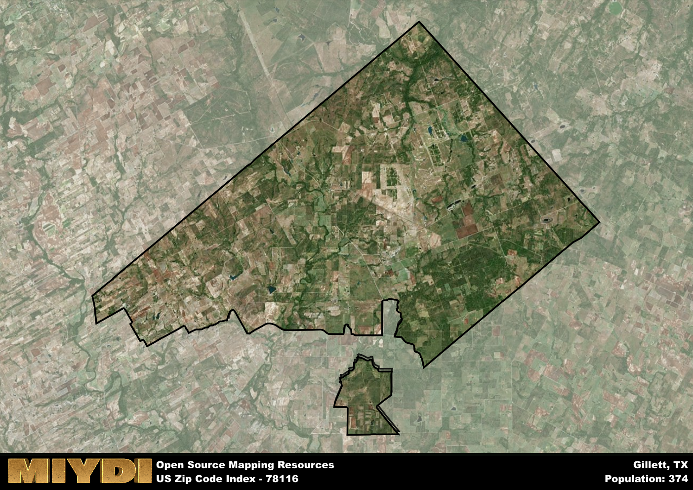

**Area Name:** Gillett

**Zip Code:** 78116

**State:** TX

Gillett is a part of the San Antonio-New Braunfels - TX Metro Area, and makes up  of the Metro's population.  

# Gillett: A Gem in South Texas
Gillett, located within the zip code 78116, is a charming rural community situated in Wilson County, South Texas. Bordered by the small towns of Pandora and Nixon, Gillett is approximately 60 miles southeast of San Antonio. Despite its rural setting, Gillett is well-connected to major transportation routes, making it an integral part of the larger metropolitan area.

Originally settled in the late 1800s, Gillett experienced a period of growth with the arrival of the railroad in the early 20th century. The town was named after Samuel Augustus Maverick's son-in-law, Arthur G. Gillett. Over the years, Gillett has maintained its small-town charm while adapting to modern times, preserving its unique historical identity.

Today, Gillett is a close-knit community known for its agricultural activities, particularly cattle ranching and farming. The town boasts a few local businesses, including a general store and restaurants, catering to both residents and visitors. Outdoor enthusiasts can enjoy the nearby state parks and wildlife areas, while history buffs will appreciate the town's historic buildings and sites. Gillett continues to thrive as a hidden gem in South Texas, offering residents a peaceful and picturesque place to call home.

# Gillett Demographics

The population of Gillett is 374.  
Gillett has a population density of 2.79 per square mile.  
The area of Gillett is 133.86 square miles.  

## Gillett Income and Economic Data

These demographic numbers are sourced from IRS return data, providing comprehensive insights into the population dynamics and economic trends within Gillett.

**Breakdown of return types for Gillett**

The table offers insight into the composition of tax returns filed with the IRS, categorizing them into three main types. Single returns represent filings by individuals, joint returns by married couples, and head of household returns by individuals who qualify as heads of households, typically having dependents. This breakdown provides an understanding of the different filing statuses adopted by taxpayers when submitting their tax documentation.

| Return Types filed for Gillett                              | Percentage          |
|----------------------------------------------------------|---------------------|
| Single Returns                                            | 0.33 |
| Joint Returns                                             | 0.53 |
| Head Household Returns                                    | 0 |

The income and economic data presented here is sourced from the IRS income brackets, utilized for categorizing tax returns by income levels. This table displays income ranges for both single filers and married couples, along with the corresponding number of returns and the percentage within each bracket, providing valuable insight into the distribution of taxes across various income groups.

| Bracket Name       | Single Filer Income Range | Married Couple Range | Number of Returns | Percentage of Returns |
|--------------------|----------------------------|----------------------|-------------------|-----------------------|
| 10% Bracket        | Up to $10,275              | Up to $20,550        | 50 | 0.33% |
| 12% Bracket        | $10,276 - $41,775          | $20,551 - $83,550    | 0 | 0% |
| 22% Bracket        | $41,776 - $89,075          | $83,551 - $178,150   | 30 | 0.2% |
| 24% Bracket        | $89,076 - $170,050         | $178,151 - $340,100  | 0 | 0% |
| 32% Bracket        | $170,051 - $215,950        | $340,101 - $431,900  | 40 | 0.27% |
| 35% Bracket        | $215,951 - $539,900        | $431,901 - $647,850  | 30 | 0.2% |

### Exploring Taxpayer Diversity: A Breakdown of Different Types of Tax Returns in Gillett

The table offers insights into various types of tax returns filed, reflecting different aspects of taxpayer activities and demographics. Categories include charitable returns for donations, dependent returns for claimed dependents, educator population, elderly population, real estate returns, self-employment returns, student loan returns, and unemployment returns, providing valuable insights into taxpayer behavior and demographics.

| Gillett Filing Types                    | Count | Percentage |
|--------------------------------------|-------|------------|
| Charitable Donations                 | 0 | 0% |
| Dependents Claimed                   | 0 | 0% |
| Educator Residents                   | 0 | 0% |
| Elderly Population                   | 60 | 0.4% |
| Farming Population                   | 70 | 0.467% |
| Real Estate Transactions             | 0 | 0% |
| Self-Employed Individuals            | 0 | 0% |
| Student Loan Cases                   | 0 | 0% |
| Unemployment Benefit Filings         | 0 | 0% |

## Gillett AI and Census Variables

The values presented in this dataset for Gillett are AI-optimized, streamlined, and categorized into relevant buckets for enhanced utility in AI and mapping programs. These simplified values have been optimized to facilitate efficient analysis and integration into various technological applications, offering users accessible and actionable insights into demographics within the Gillett area.

| AI Variables for Gillett | Value |
|-------------|-------|
| Shape Area | 455784069.617188 |
| Shape Length | 125116.776438158 |
| CBSA Federal Processing Standard Code | 41700 |

## How to use this free AI optimized Geo-Spatial Data for Gillett, TX

This data is made freely available under the Creative Commons license, allowing for unrestricted use for any purpose. Users can access static resources directly from GitHub or leverage more advanced functionalities by utilizing the GeoJSON files. All datasets originate from official government or private sector sources and are meticulously compiled into relevant datasets within QGIS. However, the versatility of the data ensures compatibility with any mapping application.

## Data Accuracy Disclaimer
It's important to note that the data provided here may contain errors or discrepancies and should be considered as 'close enough' for business applications and AI rather than a definitive source of truth. This data is aggregated from multiple sources, some of which publish information on wildly different intervals, leading to potential inconsistencies. Additionally, certain data points may not be corrected for Covid-related changes, further impacting accuracy. Moreover, the assumption that demographic trends are consistent throughout a region may lead to discrepancies, as trends often concentrate in areas of highest population density. As a result, dense areas may be slightly underrepresented, while rural areas may be slightly overrepresented, resulting in a more conservative dataset. Furthermore, the focus primarily on areas within US Major and Minor Statistical areas means that approximately 40 million Americans living outside of these areas may not be fully represented. Lastly, the historical background and area descriptions generated using AI are susceptible to potential mistakes, so users should exercise caution when interpreting the information provided.
