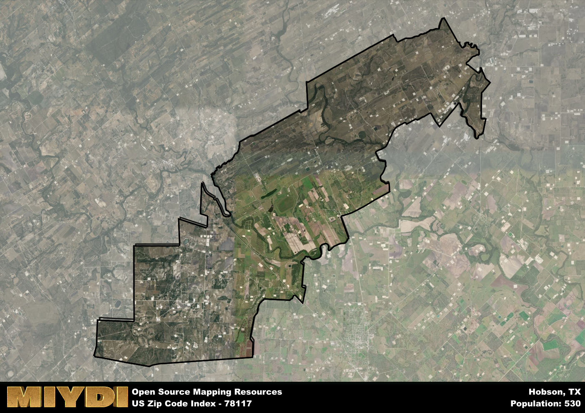

**Area Name:** Hobson

**Zip Code:** 78117

**State:** TX

# Discover the Charming Community of Hobson in Zip Code 78117  

Hobson, located within the zip code 78117, is a quaint rural community situated in south Texas. The area is surrounded by vast farmland and is located approximately 30 miles southeast of San Antonio. Hobson is a small neighborhood within the larger metropolitan area and is known for its peaceful atmosphere and tight-knit community. It is easily accessible via State Highway 119, making it a convenient location for residents who work in nearby cities.

The history of Hobson dates back to the late 19th century when it was established as a railroad stop along the San Antonio and Aransas Pass Railway. The area was named after George Hobson, a railroad official, and quickly grew as a hub for agriculture and livestock production. Over the years, Hobson has maintained its rural charm and is now home to a mix of historic buildings and modern developments. The community takes pride in its heritage and celebrates its roots through local events and festivals.

Today, Hobson remains a close-knit community with a focus on agriculture and ranching. The area is dotted with family-owned farms and ranches, contributing to its picturesque landscape. Residents of Hobson enjoy a peaceful way of life, with access to local schools, churches, and community centers. The neighborhood also offers recreational opportunities such as fishing and hiking, allowing residents to embrace the natural beauty of the surrounding countryside. Hobson is a hidden gem within the larger urban fabric, offering a serene escape from the hustle and bustle of city life.

# Hobson Demographics

The population of Hobson is 530.  
Hobson has a population density of 7.54 per square mile.  
The area of Hobson is 70.32 square miles.  

## Hobson Income and Economic Data

These demographic numbers are sourced from IRS return data, providing comprehensive insights into the population dynamics and economic trends within Hobson.

**Breakdown of return types for Hobson**

The table offers insight into the composition of tax returns filed with the IRS, categorizing them into three main types. Single returns represent filings by individuals, joint returns by married couples, and head of household returns by individuals who qualify as heads of households, typically having dependents. This breakdown provides an understanding of the different filing statuses adopted by taxpayers when submitting their tax documentation.

| Return Types filed for Hobson                              | Percentage          |
|----------------------------------------------------------|---------------------|
| Single Returns                                            | 0.47 |
| Joint Returns                                             | 0.4 |
| Head Household Returns                                    | 0 |

The income and economic data presented here is sourced from the IRS income brackets, utilized for categorizing tax returns by income levels. This table displays income ranges for both single filers and married couples, along with the corresponding number of returns and the percentage within each bracket, providing valuable insight into the distribution of taxes across various income groups.

| Bracket Name       | Single Filer Income Range | Married Couple Range | Number of Returns | Percentage of Returns |
|--------------------|----------------------------|----------------------|-------------------|-----------------------|
| 10% Bracket        | Up to $10,275              | Up to $20,550        | 70 | 0.23% |
| 12% Bracket        | $10,276 - $41,775          | $20,551 - $83,550    | 60 | 0.2% |
| 22% Bracket        | $41,776 - $89,075          | $83,551 - $178,150   | 30 | 0.1% |
| 24% Bracket        | $89,076 - $170,050         | $178,151 - $340,100  | 30 | 0.1% |
| 32% Bracket        | $170,051 - $215,950        | $340,101 - $431,900  | 70 | 0.23% |
| 35% Bracket        | $215,951 - $539,900        | $431,901 - $647,850  | 40 | 0.13% |

### Exploring Taxpayer Diversity: A Breakdown of Different Types of Tax Returns in Hobson

The table offers insights into various types of tax returns filed, reflecting different aspects of taxpayer activities and demographics. Categories include charitable returns for donations, dependent returns for claimed dependents, educator population, elderly population, real estate returns, self-employment returns, student loan returns, and unemployment returns, providing valuable insights into taxpayer behavior and demographics.

| Hobson Filing Types                    | Count | Percentage |
|--------------------------------------|-------|------------|
| Charitable Donations                 | 0 | 0% |
| Dependents Claimed                   | 0 | 0% |
| Educator Residents                   | 0 | 0% |
| Elderly Population                   | 100 | 0.33% |
| Farming Population                   | 110 | 0.367% |
| Real Estate Transactions             | 0 | 0% |
| Self-Employed Individuals            | 30 | 0.1% |
| Student Loan Cases                   | 0 | 0% |
| Unemployment Benefit Filings         | 0 | 0% |

## Hobson AI and Census Variables

The values presented in this dataset for Hobson are AI-optimized, streamlined, and categorized into relevant buckets for enhanced utility in AI and mapping programs. These simplified values have been optimized to facilitate efficient analysis and integration into various technological applications, offering users accessible and actionable insights into demographics within the Hobson area.

| AI Variables for Hobson | Value |
|-------------|-------|
| Shape Area | 238768690.890625 |
| Shape Length | 110506.968309453 |

## How to use this free AI optimized Geo-Spatial Data for Hobson, TX

This data is made freely available under the Creative Commons license, allowing for unrestricted use for any purpose. Users can access static resources directly from GitHub or leverage more advanced functionalities by utilizing the GeoJSON files. All datasets originate from official government or private sector sources and are meticulously compiled into relevant datasets within QGIS. However, the versatility of the data ensures compatibility with any mapping application.

## Data Accuracy Disclaimer
It's important to note that the data provided here may contain errors or discrepancies and should be considered as 'close enough' for business applications and AI rather than a definitive source of truth. This data is aggregated from multiple sources, some of which publish information on wildly different intervals, leading to potential inconsistencies. Additionally, certain data points may not be corrected for Covid-related changes, further impacting accuracy. Moreover, the assumption that demographic trends are consistent throughout a region may lead to discrepancies, as trends often concentrate in areas of highest population density. As a result, dense areas may be slightly underrepresented, while rural areas may be slightly overrepresented, resulting in a more conservative dataset. Furthermore, the focus primarily on areas within US Major and Minor Statistical areas means that approximately 40 million Americans living outside of these areas may not be fully represented. Lastly, the historical background and area descriptions generated using AI are susceptible to potential mistakes, so users should exercise caution when interpreting the information provided.
