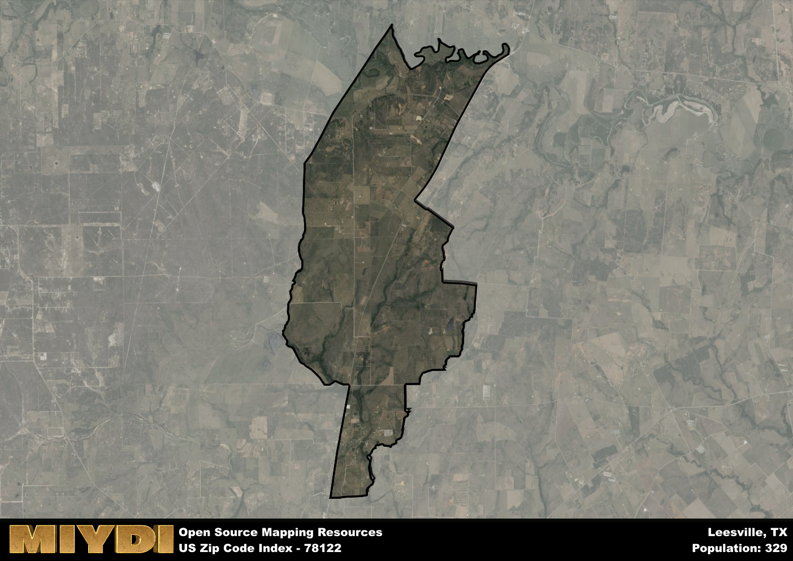

**Area Name:** Leesville

**Zip Code:** 78122

**State:** TX

Leesville is a part of the San Antonio-New Braunfels - TX Metro Area, and makes up  of the Metro's population.  

# Leesville: A Quaint Neighborhood in the Heart of Texas

Located within the zip code 78122, Leesville is a charming neighborhood nestled in the heart of Texas. Bordered by rolling hills and lush greenery, Leesville seamlessly integrates with the nearby cities of New Braunfels and San Antonio, offering residents a peaceful retreat from the bustling urban centers. This zip code area is known for its close-knit community and easy access to major highways, making it a desirable location for those seeking a tranquil yet accessible place to call home.

Originally settled in the 1850s, Leesville has a rich historical narrative that is evident in its well-preserved architecture and quaint streets. The area experienced significant growth during the late 19th century, with the establishment of local businesses and schools contributing to its development. Leesville played a role in the cattle industry and served as a hub for travelers passing through Texas, leaving a lasting imprint on its identity as a historic and culturally significant neighborhood.

Today, Leesville maintains its small-town charm while offering modern conveniences and amenities to its residents. The area boasts a variety of local businesses, including family-owned shops and restaurants that showcase the community's entrepreneurial spirit. Outdoor enthusiasts can enjoy the nearby parks and recreational facilities, while history buffs can explore the neighborhood's historic sites and landmarks. With a strong sense of community pride and a thriving local economy, Leesville continues to be a hidden gem within the larger urban fabric of Texas.

# Leesville Demographics

The population of Leesville is 329.  
Leesville has a population density of 16.25 per square mile.  
The area of Leesville is 20.24 square miles.  

## Leesville Income and Economic Data

These demographic numbers are sourced from IRS return data, providing comprehensive insights into the population dynamics and economic trends within Leesville.

**Breakdown of return types for Leesville**

The table offers insight into the composition of tax returns filed with the IRS, categorizing them into three main types. Single returns represent filings by individuals, joint returns by married couples, and head of household returns by individuals who qualify as heads of households, typically having dependents. This breakdown provides an understanding of the different filing statuses adopted by taxpayers when submitting their tax documentation.

| Return Types filed for Leesville                              | Percentage          |
|----------------------------------------------------------|---------------------|
| Single Returns                                            | 0.4 |
| Joint Returns                                             | 0.45 |
| Head Household Returns                                    | 0.15 |

The income and economic data presented here is sourced from the IRS income brackets, utilized for categorizing tax returns by income levels. This table displays income ranges for both single filers and married couples, along with the corresponding number of returns and the percentage within each bracket, providing valuable insight into the distribution of taxes across various income groups.

| Bracket Name       | Single Filer Income Range | Married Couple Range | Number of Returns | Percentage of Returns |
|--------------------|----------------------------|----------------------|-------------------|-----------------------|
| 10% Bracket        | Up to $10,275              | Up to $20,550        | 70 | 0.35% |
| 12% Bracket        | $10,276 - $41,775          | $20,551 - $83,550    | 60 | 0.3% |
| 22% Bracket        | $41,776 - $89,075          | $83,551 - $178,150   | 50 | 0.25% |
| 24% Bracket        | $89,076 - $170,050         | $178,151 - $340,100  | 0 | 0% |
| 32% Bracket        | $170,051 - $215,950        | $340,101 - $431,900  | 20 | 0.1% |
| 35% Bracket        | $215,951 - $539,900        | $431,901 - $647,850  | 0 | 0% |

### Exploring Taxpayer Diversity: A Breakdown of Different Types of Tax Returns in Leesville

The table offers insights into various types of tax returns filed, reflecting different aspects of taxpayer activities and demographics. Categories include charitable returns for donations, dependent returns for claimed dependents, educator population, elderly population, real estate returns, self-employment returns, student loan returns, and unemployment returns, providing valuable insights into taxpayer behavior and demographics.

| Leesville Filing Types                    | Count | Percentage |
|--------------------------------------|-------|------------|
| Charitable Donations                 | 0 | 0% |
| Dependents Claimed                   | 0 | 0% |
| Educator Residents                   | 0 | 0% |
| Elderly Population                   | 70 | 0.35% |
| Farming Population                   | 40 | 0.2% |
| Real Estate Transactions             | 0 | 0% |
| Self-Employed Individuals            | 30 | 0.15% |
| Student Loan Cases                   | 0 | 0% |
| Unemployment Benefit Filings         | 20 | 0.1% |

## Leesville AI and Census Variables

The values presented in this dataset for Leesville are AI-optimized, streamlined, and categorized into relevant buckets for enhanced utility in AI and mapping programs. These simplified values have been optimized to facilitate efficient analysis and integration into various technological applications, offering users accessible and actionable insights into demographics within the Leesville area.

| AI Variables for Leesville | Value |
|-------------|-------|
| Shape Area | 69394002.828125 |
| Shape Length | 55226.7237807398 |
| CBSA Federal Processing Standard Code | 41700 |

## How to use this free AI optimized Geo-Spatial Data for Leesville, TX

This data is made freely available under the Creative Commons license, allowing for unrestricted use for any purpose. Users can access static resources directly from GitHub or leverage more advanced functionalities by utilizing the GeoJSON files. All datasets originate from official government or private sector sources and are meticulously compiled into relevant datasets within QGIS. However, the versatility of the data ensures compatibility with any mapping application.

## Data Accuracy Disclaimer
It's important to note that the data provided here may contain errors or discrepancies and should be considered as 'close enough' for business applications and AI rather than a definitive source of truth. This data is aggregated from multiple sources, some of which publish information on wildly different intervals, leading to potential inconsistencies. Additionally, certain data points may not be corrected for Covid-related changes, further impacting accuracy. Moreover, the assumption that demographic trends are consistent throughout a region may lead to discrepancies, as trends often concentrate in areas of highest population density. As a result, dense areas may be slightly underrepresented, while rural areas may be slightly overrepresented, resulting in a more conservative dataset. Furthermore, the focus primarily on areas within US Major and Minor Statistical areas means that approximately 40 million Americans living outside of these areas may not be fully represented. Lastly, the historical background and area descriptions generated using AI are susceptible to potential mistakes, so users should exercise caution when interpreting the information provided.
