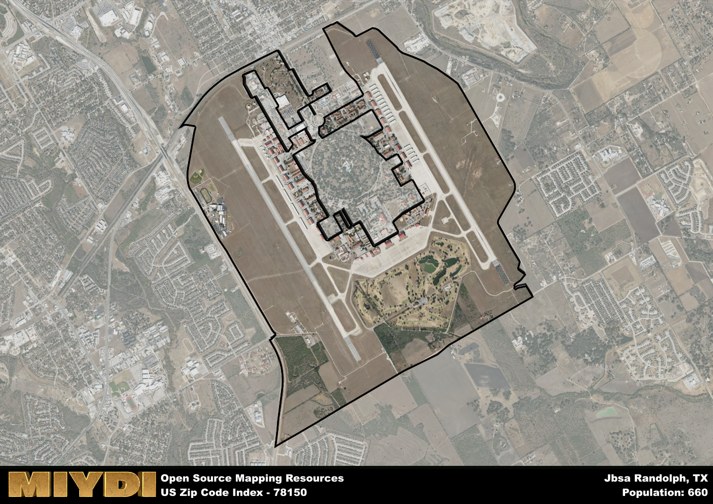

**Area Name:** Jbsa Randolph

**Zip Code:** 78150

**State:** TX

Jbsa Randolph is a part of the San Antonio-New Braunfels - TX Metro Area, and makes up 0.03% of the Metro's population.  

# Jbsa Randolph: A Historic Neighborhood in San Antonio Metropolitan Area

Located within the San Antonio metropolitan area, zip code 78150 corresponds to the neighborhood of Jbsa Randolph. Situated in the northeastern part of the city, Jbsa Randolph is bordered by Schertz to the east and Converse to the south. This neighborhood is an integral part of the larger Joint Base San Antonio (JBSA) complex, which includes Randolph Air Force Base and provides support to various military branches.

Originally established as a military base in 1931, Jbsa Randolph has a rich historical background closely tied to the development of the United States Air Force. Over the years, the neighborhood has grown into a vibrant community with a mix of military personnel, civilians, and their families. The area's name pays homage to Captain William Millican Randolph, a World War I aviator who tragically lost his life during a test flight.

Today, Jbsa Randolph boasts a diverse range of economic activities, including defense contractors, retail establishments, and service providers catering to the needs of military personnel and their families. The neighborhood offers a variety of recreational amenities such as parks, fitness centers, and sports facilities. Additionally, Jbsa Randolph is home to several historic sites, such as the Randolph Air Force Base Heritage Center, showcasing the rich aviation history of the area.

# Jbsa Randolph Demographics

The population of Jbsa Randolph is 660.  
Jbsa Randolph has a population density of 175.07 per square mile.  
The area of Jbsa Randolph is 3.77 square miles.  

### Exploring Real Estate Trends: A Comprehensive Analysis of the Jbsa Randolph Area and its Neighbors

This table contains an in-depth examination of the real estate market in the Jbsa Randolph area. Sourced from trusted real estate market firms, this dataset provides a wealth of raw data detailing the local real estate landscape, along with comparative analyses juxtaposing the market dynamics with those of neighboring areas. Explore the intricacies of the Jbsa Randolph real estate market and gain valuable insights into its relationship with adjacent regions.

| Real Estate Data for Jbsa Randolph                       | Value    |
|------------------------------------------------|----------|
| Real Estate Prices to Income Ratio           | 2.45 |

This table offers essential real estate data for the Jbsa Randolph area, including average and median listing prices, median days on market, and property size. It also presents ratio metrics as percentages, providing insights into how the local market compares to the surrounding region. A ratio of 100% signifies performance in line with the regional average, while values above or below indicate overperformance or underperformance, respectively, relative to expectations.

## Jbsa Randolph Sports and Recreation Data

#### Annual Youth Sports Spending for Jbsa Randolph

This table provides fundamental insights into the Sports and Recreation data for the Jbsa Randolph area, detailing the estimated annual expenditure on Youth Athletics. This includes estimated spending by the major consumer brackets. 
| Sports Spending for Jbsa Randolph| Value |
|-------------------------|-------|
| Athlete Spending Compared to the region | 1.98% |
| Total Youth Athlete Spending | 03,031 |
| Athletic Spending - Essential Focused Consumer | 5,533 |
| Athletic Spending - Typical Consumer | 6,530 |
| Athletic Spending - Affluent Consumers | 0,946 |

#### Youth Coaching Estimates for Jbsa Randolph

This table presents the estimated number of coaches for the Jbsa Randolph area, derived from comprehensive national coaching surveys and athletic participation rates by state. It offers valuable insights into the vital role of coaching personnel in fostering athletic development and facilitating sports participation within the local community.

| Coaching Data for Jbsa Randolph | Value |
|-------------|-------|
| Total Coaches | 11 |
| Paid Coaches | 3 |
| Volunteer Coaches | 8 |

#### Youth Athlete Participation for Jbsa Randolph

This table shows the estimated total number of youth athletes in the Jbsa Randolph area, sourced from comprehensive national coaching surveys and athletic participation rates by state.

| Total YA Athletes in Jbsa Randolph | Value |
|-------------|-------|
| Total High School Athletes | 16 |
| Total Youth Athletes | 49 |
| Total Young Adult Athletes | 33 |
| Total Athletes to Age 25 | 99 |

#### High School Age Athletes - Breakdown by Sport for Jbsa Randolph

This table shows insights regarding high school age estimated players by sport in the Jbsa Randolph area, derived from national and state-level athletic participation trends. 

| HS Players by Sport in Jbsa Randolph | Value |
|-------------|-------|
| Football Players | 4 |
| Basketball Players | 2 |
| Soccer Players | 2 |
| Volleyball Players | 1 |
| Baseball Players | 2 |
| Tennis Players | 1 |
| Track Athletes | 3 |
| Golf Players | 0 |
| Swimming Athletes | 0 |
| Wrestling Competitors | 0 |
| Lacrosse Players | 0 |

Estimating the number of younger athletes presents unique challenges due to their varied starting ages, typically beginning around six years old, and a gradual decline in participation rates as they age. Unlike high school-aged athletes, younger athletes are less likely to switch sports as they grow older, contributing to the stability of participation numbers within specific sports at younger ages.  

As a general trend, the total number of younger athletes is approximately three times the number of high school-aged athletes, underscoring the significant presence of youth athletes in sports programs and highlighting the importance of early engagement in athletic activities.

## Jbsa Randolph AI and Census Variables

The values presented in this dataset for Jbsa Randolph are AI-optimized, streamlined, and categorized into relevant buckets for enhanced utility in AI and mapping programs. These simplified values have been optimized to facilitate efficient analysis and integration into various technological applications, offering users accessible and actionable insights into demographics within the Jbsa Randolph area.

| AI Variables for Jbsa Randolph | Value |
|-------------|-------|
| Shape Area | 12944511.0664063 |
| Shape Length | 30958.5860317002 |
| CBSA Federal Processing Standard Code | 41700 |
| RE Income Ratio | 2.45 |
| RE Activity Flag | 1 |

## How to use this free AI optimized Geo-Spatial Data for Jbsa Randolph, TX

This data is made freely available under the Creative Commons license, allowing for unrestricted use for any purpose. Users can access static resources directly from GitHub or leverage more advanced functionalities by utilizing the GeoJSON files. All datasets originate from official government or private sector sources and are meticulously compiled into relevant datasets within QGIS. However, the versatility of the data ensures compatibility with any mapping application.

## Data Accuracy Disclaimer
It's important to note that the data provided here may contain errors or discrepancies and should be considered as 'close enough' for business applications and AI rather than a definitive source of truth. This data is aggregated from multiple sources, some of which publish information on wildly different intervals, leading to potential inconsistencies. Additionally, certain data points may not be corrected for Covid-related changes, further impacting accuracy. Moreover, the assumption that demographic trends are consistent throughout a region may lead to discrepancies, as trends often concentrate in areas of highest population density. As a result, dense areas may be slightly underrepresented, while rural areas may be slightly overrepresented, resulting in a more conservative dataset. Furthermore, the focus primarily on areas within US Major and Minor Statistical areas means that approximately 40 million Americans living outside of these areas may not be fully represented. Lastly, the historical background and area descriptions generated using AI are susceptible to potential mistakes, so users should exercise caution when interpreting the information provided.
