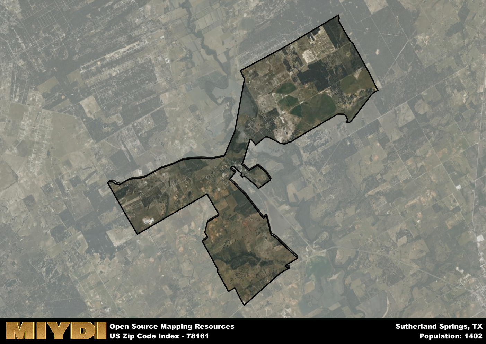

**Area Name:** Sutherland Springs

**Zip Code:** 78161

**State:** TX

Sutherland Springs is a part of the San Antonio-New Braunfels - TX Metro Area, and makes up  of the Metro's population.  

# Sutherland Springs: A Historic Community in South Texas  

Sutherland Springs, represented by the zip code 78161, is a small rural community located in Wilson County, South Texas. Situated approximately 30 miles southeast of San Antonio, the area is surrounded by vast farmland and rolling hills. It is connected to nearby towns such as Floresville and Stockdale via State Highway 87, adding to its accessibility within the region. Despite its proximity to urban centers, Sutherland Springs maintains its serene and close-knit atmosphere, offering residents a peaceful retreat from the hustle and bustle of city life.  

The history of Sutherland Springs is deeply intertwined with its origins as a farming and ranching community. Founded in the mid-19th century, the area was named after Dr. John Sutherland, a local physician who settled in the region. Over the years, Sutherland Springs experienced steady growth as more settlers arrived to partake in agricultural activities. However, the community gained national attention in 2017 when a tragic mass shooting occurred at the First Baptist Church, forever impacting the area and its residents. Despite this dark chapter, Sutherland Springs has remained resilient and united, showcasing the strength of its community spirit.  

Presently, Sutherland Springs is a close-knit community that cherishes its rural charm and rich history. The economy is primarily driven by agriculture, with farms and ranches dotting the landscape. Local businesses cater to the needs of residents, providing essential services and goods. The area also boasts recreational amenities such as parks and outdoor spaces, where residents can enjoy the natural beauty of the region. Additionally, Sutherland Springs is home to historic sites like the First Baptist Church, serving as a reminder of the community's perseverance and solidarity in the face of adversity.

# Sutherland Springs Demographics

The population of Sutherland Springs is 1402.  
Sutherland Springs has a population density of 116.64 per square mile.  
The area of Sutherland Springs is 12.02 square miles.  

## Sutherland Springs Income and Economic Data

These demographic numbers are sourced from IRS return data, providing comprehensive insights into the population dynamics and economic trends within Sutherland Springs.

**Breakdown of return types for Sutherland Springs**

The table offers insight into the composition of tax returns filed with the IRS, categorizing them into three main types. Single returns represent filings by individuals, joint returns by married couples, and head of household returns by individuals who qualify as heads of households, typically having dependents. This breakdown provides an understanding of the different filing statuses adopted by taxpayers when submitting their tax documentation.

| Return Types filed for Sutherland Springs                              | Percentage          |
|----------------------------------------------------------|---------------------|
| Single Returns                                            | 0.4 |
| Joint Returns                                             | 0.45 |
| Head Household Returns                                    | 0.15 |

The income and economic data presented here is sourced from the IRS income brackets, utilized for categorizing tax returns by income levels. This table displays income ranges for both single filers and married couples, along with the corresponding number of returns and the percentage within each bracket, providing valuable insight into the distribution of taxes across various income groups.

| Bracket Name       | Single Filer Income Range | Married Couple Range | Number of Returns | Percentage of Returns |
|--------------------|----------------------------|----------------------|-------------------|-----------------------|
| 10% Bracket        | Up to $10,275              | Up to $20,550        | 120 | 0.3% |
| 12% Bracket        | $10,276 - $41,775          | $20,551 - $83,550    | 110 | 0.28% |
| 22% Bracket        | $41,776 - $89,075          | $83,551 - $178,150   | 60 | 0.15% |
| 24% Bracket        | $89,076 - $170,050         | $178,151 - $340,100  | 50 | 0.13% |
| 32% Bracket        | $170,051 - $215,950        | $340,101 - $431,900  | 60 | 0.15% |
| 35% Bracket        | $215,951 - $539,900        | $431,901 - $647,850  | 0 | 0% |

### Exploring Taxpayer Diversity: A Breakdown of Different Types of Tax Returns in Sutherland Springs

The table offers insights into various types of tax returns filed, reflecting different aspects of taxpayer activities and demographics. Categories include charitable returns for donations, dependent returns for claimed dependents, educator population, elderly population, real estate returns, self-employment returns, student loan returns, and unemployment returns, providing valuable insights into taxpayer behavior and demographics.

| Sutherland Springs Filing Types                    | Count | Percentage |
|--------------------------------------|-------|------------|
| Charitable Donations                 | 0 | 0% |
| Dependents Claimed                   | 0 | 0% |
| Educator Residents                   | 0 | 0% |
| Elderly Population                   | 100 | 0.25% |
| Farming Population                   | 40 | 0.1% |
| Real Estate Transactions             | 0 | 0% |
| Self-Employed Individuals            | 60 | 0.15% |
| Student Loan Cases                   | 20 | 0.05% |
| Unemployment Benefit Filings         | 50 | 0.13% |

## Sutherland Springs AI and Census Variables

The values presented in this dataset for Sutherland Springs are AI-optimized, streamlined, and categorized into relevant buckets for enhanced utility in AI and mapping programs. These simplified values have been optimized to facilitate efficient analysis and integration into various technological applications, offering users accessible and actionable insights into demographics within the Sutherland Springs area.

| AI Variables for Sutherland Springs | Value |
|-------------|-------|
| Shape Area | 41059162.953125 |
| Shape Length | 49830.0123868768 |
| CBSA Federal Processing Standard Code | 41700 |

## How to use this free AI optimized Geo-Spatial Data for Sutherland Springs, TX

This data is made freely available under the Creative Commons license, allowing for unrestricted use for any purpose. Users can access static resources directly from GitHub or leverage more advanced functionalities by utilizing the GeoJSON files. All datasets originate from official government or private sector sources and are meticulously compiled into relevant datasets within QGIS. However, the versatility of the data ensures compatibility with any mapping application.

## Data Accuracy Disclaimer
It's important to note that the data provided here may contain errors or discrepancies and should be considered as 'close enough' for business applications and AI rather than a definitive source of truth. This data is aggregated from multiple sources, some of which publish information on wildly different intervals, leading to potential inconsistencies. Additionally, certain data points may not be corrected for Covid-related changes, further impacting accuracy. Moreover, the assumption that demographic trends are consistent throughout a region may lead to discrepancies, as trends often concentrate in areas of highest population density. As a result, dense areas may be slightly underrepresented, while rural areas may be slightly overrepresented, resulting in a more conservative dataset. Furthermore, the focus primarily on areas within US Major and Minor Statistical areas means that approximately 40 million Americans living outside of these areas may not be fully represented. Lastly, the historical background and area descriptions generated using AI are susceptible to potential mistakes, so users should exercise caution when interpreting the information provided.
