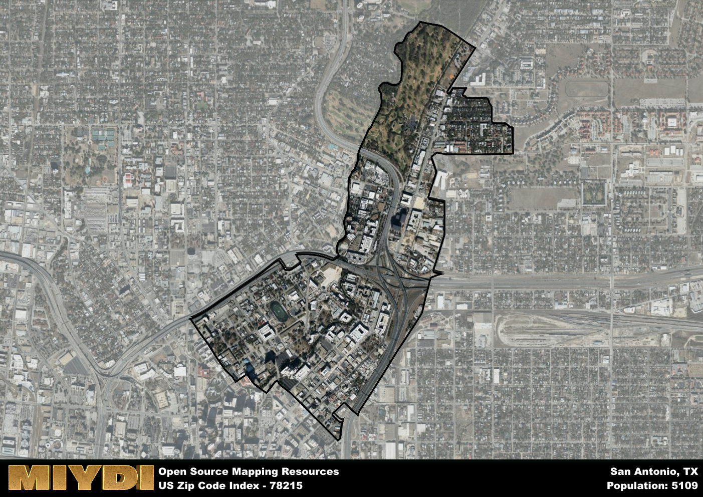

**Area Name:** San Antonio

**Zip Code:** 78215

**State:** TX

San Antonio is a part of the San Antonio-New Braunfels - TX Metro Area, and makes up  of the Metro's population.  

# Vibrant Neighborhood of Alamo Heights in San Antonio, TX (Zip Code: 78215)

Located just north of downtown San Antonio, the zip code 78215 encompasses the upscale neighborhood of Alamo Heights. Bordered by major thoroughfares such as Highway 281 and Loop 410, this area seamlessly integrates with the surrounding districts and serves as a well-connected residential enclave within the larger urban fabric of San Antonio.

Established in the late 19th century, Alamo Heights has a rich historical narrative characterized by its early development as a streetcar suburb for the growing city of San Antonio. Named for its proximity to the iconic Alamo Mission, the neighborhood has evolved into a thriving community known for its tree-lined streets, historic homes, and top-rated schools. The area's growth was further fueled by the post-World War II economic boom, attracting affluent residents and establishing itself as a sought-after address in the city.

Today, Alamo Heights is a bustling neighborhood offering a mix of upscale residences, boutique shops, gourmet restaurants, and picturesque parks. The area is home to a diverse range of businesses, from local boutiques to high-end eateries, catering to the affluent population. Residents enjoy a vibrant cultural scene, with art galleries, theaters, and museums dotting the area. Additionally, the neighborhood boasts an array of recreational amenities, including jogging trails, golf courses, and community centers, making it a desirable place to live and visit in San Antonio.

# San Antonio Demographics

The population of San Antonio is 5109.  
San Antonio has a population density of 4865.71 per square mile.  
The area of San Antonio is 1.05 square miles.  

## San Antonio Income and Economic Data

These demographic numbers are sourced from IRS return data, providing comprehensive insights into the population dynamics and economic trends within San Antonio.

**Breakdown of return types for San Antonio**

The table offers insight into the composition of tax returns filed with the IRS, categorizing them into three main types. Single returns represent filings by individuals, joint returns by married couples, and head of household returns by individuals who qualify as heads of households, typically having dependents. This breakdown provides an understanding of the different filing statuses adopted by taxpayers when submitting their tax documentation.

| Return Types filed for San Antonio                              | Percentage          |
|----------------------------------------------------------|---------------------|
| Single Returns                                            | 0.79 |
| Joint Returns                                             | 0.15 |
| Head Household Returns                                    | 0.05 |

The income and economic data presented here is sourced from the IRS income brackets, utilized for categorizing tax returns by income levels. This table displays income ranges for both single filers and married couples, along with the corresponding number of returns and the percentage within each bracket, providing valuable insight into the distribution of taxes across various income groups.

| Bracket Name       | Single Filer Income Range | Married Couple Range | Number of Returns | Percentage of Returns |
|--------------------|----------------------------|----------------------|-------------------|-----------------------|
| 10% Bracket        | Up to $10,275              | Up to $20,550        | 390 | 0.18% |
| 12% Bracket        | $10,276 - $41,775          | $20,551 - $83,550    | 500 | 0.24% |
| 22% Bracket        | $41,776 - $89,075          | $83,551 - $178,150   | 480 | 0.23% |
| 24% Bracket        | $89,076 - $170,050         | $178,151 - $340,100  | 250 | 0.12% |
| 32% Bracket        | $170,051 - $215,950        | $340,101 - $431,900  | 340 | 0.16% |
| 35% Bracket        | $215,951 - $539,900        | $431,901 - $647,850  | 150 | 0.07% |

### Exploring Taxpayer Diversity: A Breakdown of Different Types of Tax Returns in San Antonio

The table offers insights into various types of tax returns filed, reflecting different aspects of taxpayer activities and demographics. Categories include charitable returns for donations, dependent returns for claimed dependents, educator population, elderly population, real estate returns, self-employment returns, student loan returns, and unemployment returns, providing valuable insights into taxpayer behavior and demographics.

| San Antonio Filing Types                    | Count | Percentage |
|--------------------------------------|-------|------------|
| Charitable Donations                 | 100 | 0.047% |
| Dependents Claimed                   | 0 | 0% |
| Educator Residents                   | 70 | 0.033% |
| Elderly Population                   | 210 | 0.1% |
| Farming Population                   | 0 | 0% |
| Real Estate Transactions             | 110 | 0.052% |
| Self-Employed Individuals            | 220 | 0.104% |
| Student Loan Cases                   | 310 | 0.147% |
| Unemployment Benefit Filings         | 260 | 0.12% |

## San Antonio AI and Census Variables

The values presented in this dataset for San Antonio are AI-optimized, streamlined, and categorized into relevant buckets for enhanced utility in AI and mapping programs. These simplified values have been optimized to facilitate efficient analysis and integration into various technological applications, offering users accessible and actionable insights into demographics within the San Antonio area.

| AI Variables for San Antonio | Value |
|-------------|-------|
| Shape Area | 3590041.953125 |
| Shape Length | 12239.9596670325 |
| CBSA Federal Processing Standard Code | 41700 |

## How to use this free AI optimized Geo-Spatial Data for San Antonio, TX

This data is made freely available under the Creative Commons license, allowing for unrestricted use for any purpose. Users can access static resources directly from GitHub or leverage more advanced functionalities by utilizing the GeoJSON files. All datasets originate from official government or private sector sources and are meticulously compiled into relevant datasets within QGIS. However, the versatility of the data ensures compatibility with any mapping application.

## Data Accuracy Disclaimer
It's important to note that the data provided here may contain errors or discrepancies and should be considered as 'close enough' for business applications and AI rather than a definitive source of truth. This data is aggregated from multiple sources, some of which publish information on wildly different intervals, leading to potential inconsistencies. Additionally, certain data points may not be corrected for Covid-related changes, further impacting accuracy. Moreover, the assumption that demographic trends are consistent throughout a region may lead to discrepancies, as trends often concentrate in areas of highest population density. As a result, dense areas may be slightly underrepresented, while rural areas may be slightly overrepresented, resulting in a more conservative dataset. Furthermore, the focus primarily on areas within US Major and Minor Statistical areas means that approximately 40 million Americans living outside of these areas may not be fully represented. Lastly, the historical background and area descriptions generated using AI are susceptible to potential mistakes, so users should exercise caution when interpreting the information provided.
