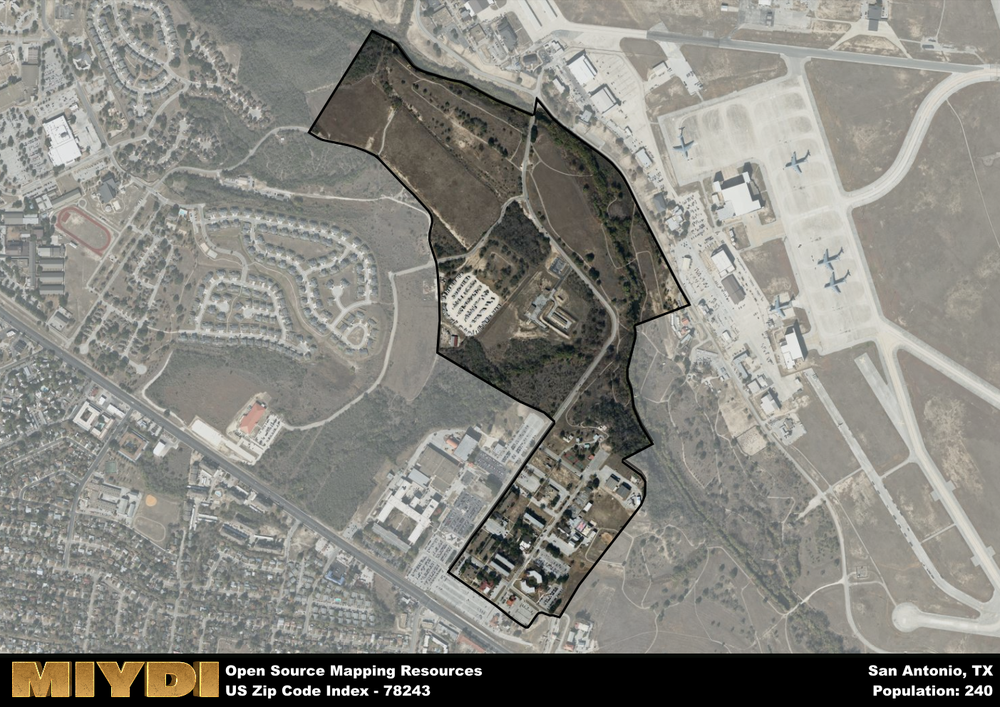

**Area Name:** San Antonio

**Zip Code:** 78243

**State:** TX

San Antonio is a part of the San Antonio-New Braunfels - TX Metro Area, and makes up  of the Metro's population.  

# Exploring San Antonio's Military City  
Zip code 78243 is located in the southeastern part of San Antonio, Texas. This area is primarily known as the "Military City" due to its close proximity to Joint Base San Antonio-Lackland, one of the largest military installations in the United States. The zip code is bordered by Loop 1604 to the south, Highway 90 to the north, and intersects with Loop 410, providing easy access to other parts of the city. 

Originally settled as part of the Spanish colonization of Texas, the area corresponding to zip code 78243 has a rich history dating back to the early 18th century. It played a significant role in the Texas Revolution and later became a strategic military location during the Civil War and World War II. The name "Military City" reflects its long-standing association with the military and its importance in the defense of the nation.

Today, zip code 78243 is a vibrant community with a mix of residential, commercial, and military establishments. The area is home to a diverse population, including active-duty military personnel, veterans, and civilian residents. In addition to its military presence, the neighborhood offers a range of amenities such as shopping centers, restaurants, and parks. Visitors can explore historic sites like the Lackland Air Force Base History Museum or enjoy outdoor activities at nearby Medina River Natural Area.

# San Antonio Demographics

The population of San Antonio is 240.  
San Antonio has a population density of 685.71 per square mile.  
The area of San Antonio is 0.35 square miles.  

## San Antonio AI and Census Variables

The values presented in this dataset for San Antonio are AI-optimized, streamlined, and categorized into relevant buckets for enhanced utility in AI and mapping programs. These simplified values have been optimized to facilitate efficient analysis and integration into various technological applications, offering users accessible and actionable insights into demographics within the San Antonio area.

| AI Variables for San Antonio | Value |
|-------------|-------|
| Shape Area | 1191813.63671875 |
| Shape Length | 6176.63243801439 |
| CBSA Federal Processing Standard Code | 41700 |

## How to use this free AI optimized Geo-Spatial Data for San Antonio, TX

This data is made freely available under the Creative Commons license, allowing for unrestricted use for any purpose. Users can access static resources directly from GitHub or leverage more advanced functionalities by utilizing the GeoJSON files. All datasets originate from official government or private sector sources and are meticulously compiled into relevant datasets within QGIS. However, the versatility of the data ensures compatibility with any mapping application.

## Data Accuracy Disclaimer
It's important to note that the data provided here may contain errors or discrepancies and should be considered as 'close enough' for business applications and AI rather than a definitive source of truth. This data is aggregated from multiple sources, some of which publish information on wildly different intervals, leading to potential inconsistencies. Additionally, certain data points may not be corrected for Covid-related changes, further impacting accuracy. Moreover, the assumption that demographic trends are consistent throughout a region may lead to discrepancies, as trends often concentrate in areas of highest population density. As a result, dense areas may be slightly underrepresented, while rural areas may be slightly overrepresented, resulting in a more conservative dataset. Furthermore, the focus primarily on areas within US Major and Minor Statistical areas means that approximately 40 million Americans living outside of these areas may not be fully represented. Lastly, the historical background and area descriptions generated using AI are susceptible to potential mistakes, so users should exercise caution when interpreting the information provided.
