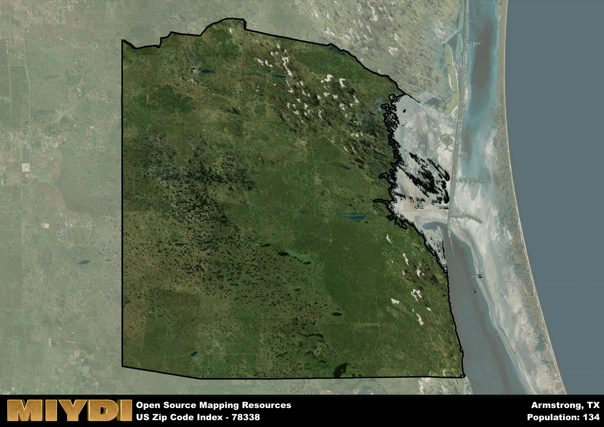

**Area Name:** Armstrong

**Zip Code:** 78338

**State:** TX

Armstrong is a part of the Kingsville - TX Micro Area, and makes up  of the Metro's population.  

# Exploring the Charming Neighborhood of Armstrong (Zip Code 78338)  

Located in the southern region of Texas, the neighborhood of Armstrong in zip code 78338 is nestled within the larger city of Corpus Christi. Bordered by the neighborhoods of Flour Bluff to the east and Chapman Ranch to the west, Armstrong is an integral part of the metropolitan area. With its proximity to the Gulf of Mexico, residents of Armstrong enjoy easy access to the coastline and its recreational offerings.

Originally settled in the mid-19th century, Armstrong has a rich history rooted in agriculture and ranching. The area experienced significant growth during the oil boom in the early 20th century, attracting new residents and businesses. The neighborhood was named after a prominent local family, known for their contributions to the community. Over the years, Armstrong has evolved into a vibrant residential area with a mix of historic homes and modern developments.

Today, Armstrong boasts a thriving community with a variety of local businesses, schools, and parks. Residents can enjoy shopping and dining options along the neighborhood's main streets, as well as access to well-maintained recreational facilities. The area also features several historic sites, including landmarks dating back to its early days. With its blend of history and modern amenities, Armstrong offers a unique and charming place to call home within the bustling city of Corpus Christi.

# Armstrong Demographics

The population of Armstrong is 134.  
Armstrong has a population density of 0.14 per square mile.  
The area of Armstrong is 952.24 square miles.  

## Armstrong AI and Census Variables

The values presented in this dataset for Armstrong are AI-optimized, streamlined, and categorized into relevant buckets for enhanced utility in AI and mapping programs. These simplified values have been optimized to facilitate efficient analysis and integration into various technological applications, offering users accessible and actionable insights into demographics within the Armstrong area.

| AI Variables for Armstrong | Value |
|-------------|-------|
| Shape Area | 3109472788.96484 |
| Shape Length | 698347.886621057 |
| CBSA Federal Processing Standard Code | 28780 |

## How to use this free AI optimized Geo-Spatial Data for Armstrong, TX

This data is made freely available under the Creative Commons license, allowing for unrestricted use for any purpose. Users can access static resources directly from GitHub or leverage more advanced functionalities by utilizing the GeoJSON files. All datasets originate from official government or private sector sources and are meticulously compiled into relevant datasets within QGIS. However, the versatility of the data ensures compatibility with any mapping application.

## Data Accuracy Disclaimer
It's important to note that the data provided here may contain errors or discrepancies and should be considered as 'close enough' for business applications and AI rather than a definitive source of truth. This data is aggregated from multiple sources, some of which publish information on wildly different intervals, leading to potential inconsistencies. Additionally, certain data points may not be corrected for Covid-related changes, further impacting accuracy. Moreover, the assumption that demographic trends are consistent throughout a region may lead to discrepancies, as trends often concentrate in areas of highest population density. As a result, dense areas may be slightly underrepresented, while rural areas may be slightly overrepresented, resulting in a more conservative dataset. Furthermore, the focus primarily on areas within US Major and Minor Statistical areas means that approximately 40 million Americans living outside of these areas may not be fully represented. Lastly, the historical background and area descriptions generated using AI are susceptible to potential mistakes, so users should exercise caution when interpreting the information provided.
