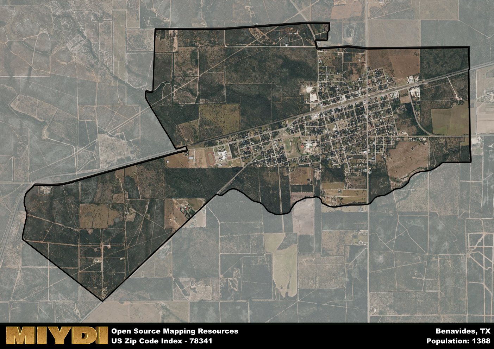

**Area Name:** Benavides

**Zip Code:** 78341

**State:** TX

Benavides is a part of the Alice - TX Micro Area, and makes up 1.11% of the Metro's population.  

# Benavides: A Historic and Vibrant Community in South Texas  

Benavides, located within the 78341 zip code, is a small but vibrant community in South Texas. Situated in Duval County, Benavides is bordered by the cities of San Diego to the east and Freer to the west. It is part of the larger metropolitan area known as the Rio Grande Valley, known for its rich cultural heritage and agricultural economy. Benavides serves as a hub for the surrounding rural areas, providing essential services and a close-knit community for its residents.  

The area now known as Benavides traces its roots back to the mid-19th century when it was established as a ranching community. Named after Plácido Benavides, a local landowner and political figure, the town grew steadily as more settlers arrived to work in the ranching and agricultural industries. Over the years, Benavides has faced challenges such as economic downturns and natural disasters, but has always maintained its strong sense of community and heritage. Today, Benavides is a mix of old and new, with historic buildings standing alongside modern amenities.  

Presently, Benavides is a thriving community with a diverse economy that includes agriculture, oil and gas production, and small businesses. The town offers a range of services for its residents, including schools, healthcare facilities, and local shops. Benavides is also known for its recreational opportunities, with nearby parks and outdoor spaces for residents to enjoy. Cultural and historic sites, such as the Benavides Museum, showcase the town's rich history and provide insight into its unique identity within the Rio Grande Valley.

# Benavides Demographics

The population of Benavides is 1388.  
Benavides has a population density of 311.21 per square mile.  
The area of Benavides is 4.46 square miles.  

### Exploring Real Estate Trends: A Comprehensive Analysis of the Benavides Area and its Neighbors

This table contains an in-depth examination of the real estate market in the Benavides area. Sourced from trusted real estate market firms, this dataset provides a wealth of raw data detailing the local real estate landscape, along with comparative analyses juxtaposing the market dynamics with those of neighboring areas. Explore the intricacies of the Benavides real estate market and gain valuable insights into its relationship with adjacent regions.

| Real Estate Data for Benavides                       | Value    |
|------------------------------------------------|----------|
| Average Listing Price for Benavides               | 61633 |
| Median Listing Price for Benavides                | 35000 |
| Median Days on Market for Benavides               | 169 |
| Median Listing Price per Square Foot for Benavides| 9 |
| Median Square Feet for Benavides                  | 1200 |
| Real Estate Prices to Income Ratio           | 35.89% |
| Price per Square Foot Ratio                  | 20.05% |
| Price Median Ratio                           | 14.46% |
| Market Sales Speed Ratio                     | 187.1% |

This table offers essential real estate data for the Benavides area, including average and median listing prices, median days on market, and property size. It also presents ratio metrics as percentages, providing insights into how the local market compares to the surrounding region. A ratio of 100% signifies performance in line with the regional average, while values above or below indicate overperformance or underperformance, respectively, relative to expectations.

## Benavides Sports and Recreation Data

#### Annual Youth Sports Spending for Benavides

This table provides fundamental insights into the Sports and Recreation data for the Benavides area, detailing the estimated annual expenditure on Youth Athletics. This includes estimated spending by the major consumer brackets. 
| Sports Spending for Benavides| Value |
|-------------------------|-------|
| Athlete Spending Compared to the region | 11.66% |
| Total Youth Athlete Spending | 16,566 |
| Athletic Spending - Essential Focused Consumer | 2,603 |
| Athletic Spending - Typical Consumer | 7,760 |
| Athletic Spending - Affluent Consumers | 6,158 |

#### Youth Coaching Estimates for Benavides

This table presents the estimated number of coaches for the Benavides area, derived from comprehensive national coaching surveys and athletic participation rates by state. It offers valuable insights into the vital role of coaching personnel in fostering athletic development and facilitating sports participation within the local community.

| Coaching Data for Benavides | Value |
|-------------|-------|
| Total Coaches | 23 |
| Paid Coaches | 6 |
| Volunteer Coaches | 17 |

#### Youth Athlete Participation for Benavides

This table shows the estimated total number of youth athletes in the Benavides area, sourced from comprehensive national coaching surveys and athletic participation rates by state.

| Total YA Athletes in Benavides | Value |
|-------------|-------|
| Total High School Athletes | 35 |
| Total Youth Athletes | 104 |
| Total Young Adult Athletes | 69 |
| Total Athletes to Age 25 | 208 |

#### High School Age Athletes - Breakdown by Sport for Benavides

This table shows insights regarding high school age estimated players by sport in the Benavides area, derived from national and state-level athletic participation trends. 

| HS Players by Sport in Benavides | Value |
|-------------|-------|
| Football Players | 8 |
| Basketball Players | 5 |
| Soccer Players | 4 |
| Volleyball Players | 2 |
| Baseball Players | 4 |
| Tennis Players | 2 |
| Track Athletes | 6 |
| Golf Players | 1 |
| Swimming Athletes | 1 |
| Wrestling Competitors | 1 |
| Lacrosse Players | 0 |

Estimating the number of younger athletes presents unique challenges due to their varied starting ages, typically beginning around six years old, and a gradual decline in participation rates as they age. Unlike high school-aged athletes, younger athletes are less likely to switch sports as they grow older, contributing to the stability of participation numbers within specific sports at younger ages.  

As a general trend, the total number of younger athletes is approximately three times the number of high school-aged athletes, underscoring the significant presence of youth athletes in sports programs and highlighting the importance of early engagement in athletic activities.

## Benavides AI and Census Variables

The values presented in this dataset for Benavides are AI-optimized, streamlined, and categorized into relevant buckets for enhanced utility in AI and mapping programs. These simplified values have been optimized to facilitate efficient analysis and integration into various technological applications, offering users accessible and actionable insights into demographics within the Benavides area.

| AI Variables for Benavides | Value |
|-------------|-------|
| Shape Area | 14772265.7363281 |
| Shape Length | 21289.1310787563 |
| CBSA Federal Processing Standard Code | 10860 |
| RE Price per Square Foot Ratio | 20.05% |
| RE Price Average Ratio | 22.83% |
| RE Speed Ratio | 187.1% |
| RE Income Ratio | 35.89% |
| RE Affordability Index Flag | 1 |
| Income Bracket Flag | 4 |
| RE Income Flag | 1 |
| RE Median Square Footage Price Flag | 1 |
| RE Median Square Footage Size Flag | 1 |
| RE Activity Flag | 7 |
| Poverty Line Risk Flag | 2 |

## How to use this free AI optimized Geo-Spatial Data for Benavides, TX

This data is made freely available under the Creative Commons license, allowing for unrestricted use for any purpose. Users can access static resources directly from GitHub or leverage more advanced functionalities by utilizing the GeoJSON files. All datasets originate from official government or private sector sources and are meticulously compiled into relevant datasets within QGIS. However, the versatility of the data ensures compatibility with any mapping application.

## Data Accuracy Disclaimer
It's important to note that the data provided here may contain errors or discrepancies and should be considered as 'close enough' for business applications and AI rather than a definitive source of truth. This data is aggregated from multiple sources, some of which publish information on wildly different intervals, leading to potential inconsistencies. Additionally, certain data points may not be corrected for Covid-related changes, further impacting accuracy. Moreover, the assumption that demographic trends are consistent throughout a region may lead to discrepancies, as trends often concentrate in areas of highest population density. As a result, dense areas may be slightly underrepresented, while rural areas may be slightly overrepresented, resulting in a more conservative dataset. Furthermore, the focus primarily on areas within US Major and Minor Statistical areas means that approximately 40 million Americans living outside of these areas may not be fully represented. Lastly, the historical background and area descriptions generated using AI are susceptible to potential mistakes, so users should exercise caution when interpreting the information provided.
