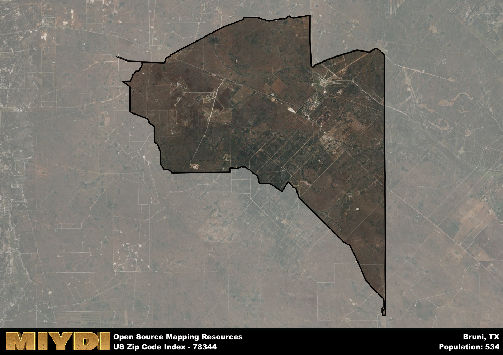

**Area Name:** Bruni

**Zip Code:** 78344

**State:** TX

Bruni is a part of the Laredo - TX Metro Area, and makes up  of the Metro's population.  

# Bruni: A Charming Neighborhood in South Texas  

Located in South Texas, zip code 78344 encompasses the quaint community of Bruni. Situated in Webb County, Bruni is a rural area that is surrounded by vast stretches of farmland and ranches. Despite its rural setting, Bruni is only a short drive away from the bustling city of Laredo, providing residents with easy access to urban amenities while still enjoying the peaceful atmosphere of small-town living. The area is known for its close-knit community and scenic landscapes, making it a desirable place to call home for many.

Established in the late 1800s, Bruni has a rich history rooted in agriculture and ranching. The town was named after Antonio Mateo Bruni, an Italian immigrant who played a key role in the development of the area. Over the years, Bruni has grown into a close community known for its strong sense of identity and pride in its heritage. The town has preserved many of its historic buildings and landmarks, providing a glimpse into its past while embracing modern progress and development.

Today, Bruni remains a vibrant community with a thriving agricultural industry at its core. The town is home to a variety of small businesses, including local shops and restaurants that cater to residents and visitors alike. In addition to its economic activities, Bruni offers a range of recreational amenities, such as parks, hiking trails, and community events that bring residents together. With its rich history, strong sense of community, and picturesque surroundings, Bruni continues to be a charming neighborhood in South Texas.

# Bruni Demographics

The population of Bruni is 534.  
Bruni has a population density of 13.32 per square mile.  
The area of Bruni is 40.09 square miles.  

## Bruni Income and Economic Data

These demographic numbers are sourced from IRS return data, providing comprehensive insights into the population dynamics and economic trends within Bruni.

**Breakdown of return types for Bruni**

The table offers insight into the composition of tax returns filed with the IRS, categorizing them into three main types. Single returns represent filings by individuals, joint returns by married couples, and head of household returns by individuals who qualify as heads of households, typically having dependents. This breakdown provides an understanding of the different filing statuses adopted by taxpayers when submitting their tax documentation.

| Return Types filed for Bruni                              | Percentage          |
|----------------------------------------------------------|---------------------|
| Single Returns                                            | 0.38 |
| Joint Returns                                             | 0.38 |
| Head Household Returns                                    | 0.19 |

The income and economic data presented here is sourced from the IRS income brackets, utilized for categorizing tax returns by income levels. This table displays income ranges for both single filers and married couples, along with the corresponding number of returns and the percentage within each bracket, providing valuable insight into the distribution of taxes across various income groups.

| Bracket Name       | Single Filer Income Range | Married Couple Range | Number of Returns | Percentage of Returns |
|--------------------|----------------------------|----------------------|-------------------|-----------------------|
| 10% Bracket        | Up to $10,275              | Up to $20,550        | 50 | 0.31% |
| 12% Bracket        | $10,276 - $41,775          | $20,551 - $83,550    | 40 | 0.25% |
| 22% Bracket        | $41,776 - $89,075          | $83,551 - $178,150   | 50 | 0.31% |
| 24% Bracket        | $89,076 - $170,050         | $178,151 - $340,100  | 0 | 0% |
| 32% Bracket        | $170,051 - $215,950        | $340,101 - $431,900  | 20 | 0.13% |
| 35% Bracket        | $215,951 - $539,900        | $431,901 - $647,850  | 0 | 0% |

### Exploring Taxpayer Diversity: A Breakdown of Different Types of Tax Returns in Bruni

The table offers insights into various types of tax returns filed, reflecting different aspects of taxpayer activities and demographics. Categories include charitable returns for donations, dependent returns for claimed dependents, educator population, elderly population, real estate returns, self-employment returns, student loan returns, and unemployment returns, providing valuable insights into taxpayer behavior and demographics.

| Bruni Filing Types                    | Count | Percentage |
|--------------------------------------|-------|------------|
| Charitable Donations                 | 0 | 0% |
| Dependents Claimed                   | 0 | 0% |
| Educator Residents                   | 20 | 0.125% |
| Elderly Population                   | 30 | 0.19% |
| Farming Population                   | 0 | 0% |
| Real Estate Transactions             | 0 | 0% |
| Self-Employed Individuals            | 20 | 0.125% |
| Student Loan Cases                   | 0 | 0% |
| Unemployment Benefit Filings         | 20 | 0.13% |

## Bruni AI and Census Variables

The values presented in this dataset for Bruni are AI-optimized, streamlined, and categorized into relevant buckets for enhanced utility in AI and mapping programs. These simplified values have been optimized to facilitate efficient analysis and integration into various technological applications, offering users accessible and actionable insights into demographics within the Bruni area.

| AI Variables for Bruni | Value |
|-------------|-------|
| Shape Area | 132277478.857422 |
| Shape Length | 63786.6515081015 |
| CBSA Federal Processing Standard Code | 29700 |

## How to use this free AI optimized Geo-Spatial Data for Bruni, TX

This data is made freely available under the Creative Commons license, allowing for unrestricted use for any purpose. Users can access static resources directly from GitHub or leverage more advanced functionalities by utilizing the GeoJSON files. All datasets originate from official government or private sector sources and are meticulously compiled into relevant datasets within QGIS. However, the versatility of the data ensures compatibility with any mapping application.

## Data Accuracy Disclaimer
It's important to note that the data provided here may contain errors or discrepancies and should be considered as 'close enough' for business applications and AI rather than a definitive source of truth. This data is aggregated from multiple sources, some of which publish information on wildly different intervals, leading to potential inconsistencies. Additionally, certain data points may not be corrected for Covid-related changes, further impacting accuracy. Moreover, the assumption that demographic trends are consistent throughout a region may lead to discrepancies, as trends often concentrate in areas of highest population density. As a result, dense areas may be slightly underrepresented, while rural areas may be slightly overrepresented, resulting in a more conservative dataset. Furthermore, the focus primarily on areas within US Major and Minor Statistical areas means that approximately 40 million Americans living outside of these areas may not be fully represented. Lastly, the historical background and area descriptions generated using AI are susceptible to potential mistakes, so users should exercise caution when interpreting the information provided.
