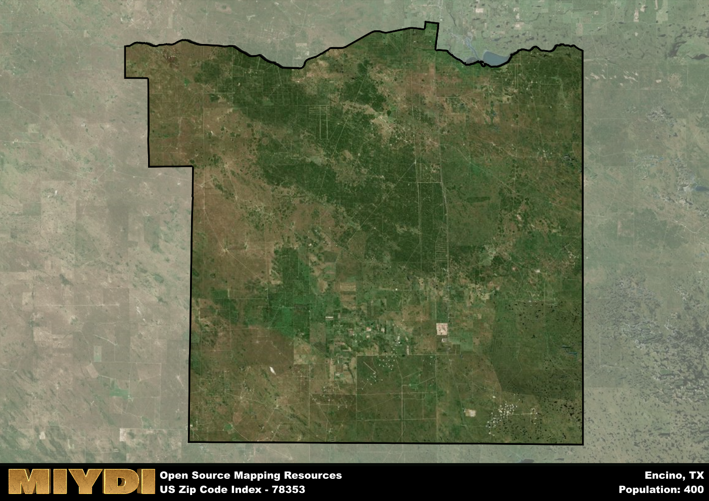

**Area Name:** Encino

**Zip Code:** 78353

**State:** TX

Encino is a part of the Kingsville - TX Micro Area, and makes up  of the Metro's population.  

# Encino, Texas: A Vibrant Community in 78353

Encino, located in zip code 78353, is a small rural community situated in southern Texas. The area is bordered by expansive farmlands and is approximately 20 miles southeast of the city of Falfurrias. Encino forms part of the larger Brooks County and serves as a quiet residential pocket within the agricultural landscape of the region.

Originally settled in the late 19th century, Encino was established as a farming community that primarily focused on cattle ranching and agriculture. The area experienced gradual growth as more families and farmers were attracted to the fertile land and temperate climate. The name "Encino" is Spanish for "oak tree," reflecting the abundance of oak trees that once populated the area.

Today, Encino remains a close-knit community that values its agricultural heritage. The area is known for its farming activities, particularly cattle ranching and crop cultivation. Residents enjoy a peaceful way of life with access to local schools, churches, and community events. Encino also boasts a small park and a historic church that serve as focal points for social gatherings and cultural celebrations.

# Encino Demographics

The population of Encino is 400.  
Encino has a population density of 0.54 per square mile.  
The area of Encino is 747.49 square miles.  

## Encino Income and Economic Data

These demographic numbers are sourced from IRS return data, providing comprehensive insights into the population dynamics and economic trends within Encino.

**Breakdown of return types for Encino**

The table offers insight into the composition of tax returns filed with the IRS, categorizing them into three main types. Single returns represent filings by individuals, joint returns by married couples, and head of household returns by individuals who qualify as heads of households, typically having dependents. This breakdown provides an understanding of the different filing statuses adopted by taxpayers when submitting their tax documentation.

| Return Types filed for Encino                              | Percentage          |
|----------------------------------------------------------|---------------------|
| Single Returns                                            | 0.6 |
| Joint Returns                                             | 0.4 |
| Head Household Returns                                    | 0.13 |

The income and economic data presented here is sourced from the IRS income brackets, utilized for categorizing tax returns by income levels. This table displays income ranges for both single filers and married couples, along with the corresponding number of returns and the percentage within each bracket, providing valuable insight into the distribution of taxes across various income groups.

| Bracket Name       | Single Filer Income Range | Married Couple Range | Number of Returns | Percentage of Returns |
|--------------------|----------------------------|----------------------|-------------------|-----------------------|
| 10% Bracket        | Up to $10,275              | Up to $20,550        | 70 | 0.47% |
| 12% Bracket        | $10,276 - $41,775          | $20,551 - $83,550    | 40 | 0.27% |
| 22% Bracket        | $41,776 - $89,075          | $83,551 - $178,150   | 40 | 0.27% |
| 24% Bracket        | $89,076 - $170,050         | $178,151 - $340,100  | 0 | 0% |
| 32% Bracket        | $170,051 - $215,950        | $340,101 - $431,900  | 0 | 0% |
| 35% Bracket        | $215,951 - $539,900        | $431,901 - $647,850  | 0 | 0% |

### Exploring Taxpayer Diversity: A Breakdown of Different Types of Tax Returns in Encino

The table offers insights into various types of tax returns filed, reflecting different aspects of taxpayer activities and demographics. Categories include charitable returns for donations, dependent returns for claimed dependents, educator population, elderly population, real estate returns, self-employment returns, student loan returns, and unemployment returns, providing valuable insights into taxpayer behavior and demographics.

| Encino Filing Types                    | Count | Percentage |
|--------------------------------------|-------|------------|
| Charitable Donations                 | 0 | 0% |
| Dependents Claimed                   | 0 | 0% |
| Educator Residents                   | 0 | 0% |
| Elderly Population                   | 50 | 0.33% |
| Farming Population                   | 30 | 0.2% |
| Real Estate Transactions             | 0 | 0% |
| Self-Employed Individuals            | 30 | 0.2% |
| Student Loan Cases                   | 0 | 0% |
| Unemployment Benefit Filings         | 30 | 0.2% |

## Encino AI and Census Variables

The values presented in this dataset for Encino are AI-optimized, streamlined, and categorized into relevant buckets for enhanced utility in AI and mapping programs. These simplified values have been optimized to facilitate efficient analysis and integration into various technological applications, offering users accessible and actionable insights into demographics within the Encino area.

| AI Variables for Encino | Value |
|-------------|-------|
| Shape Area | 2447538894.93164 |
| Shape Length | 223816.703881486 |
| CBSA Federal Processing Standard Code | 28780 |

## How to use this free AI optimized Geo-Spatial Data for Encino, TX

This data is made freely available under the Creative Commons license, allowing for unrestricted use for any purpose. Users can access static resources directly from GitHub or leverage more advanced functionalities by utilizing the GeoJSON files. All datasets originate from official government or private sector sources and are meticulously compiled into relevant datasets within QGIS. However, the versatility of the data ensures compatibility with any mapping application.

## Data Accuracy Disclaimer
It's important to note that the data provided here may contain errors or discrepancies and should be considered as 'close enough' for business applications and AI rather than a definitive source of truth. This data is aggregated from multiple sources, some of which publish information on wildly different intervals, leading to potential inconsistencies. Additionally, certain data points may not be corrected for Covid-related changes, further impacting accuracy. Moreover, the assumption that demographic trends are consistent throughout a region may lead to discrepancies, as trends often concentrate in areas of highest population density. As a result, dense areas may be slightly underrepresented, while rural areas may be slightly overrepresented, resulting in a more conservative dataset. Furthermore, the focus primarily on areas within US Major and Minor Statistical areas means that approximately 40 million Americans living outside of these areas may not be fully represented. Lastly, the historical background and area descriptions generated using AI are susceptible to potential mistakes, so users should exercise caution when interpreting the information provided.
