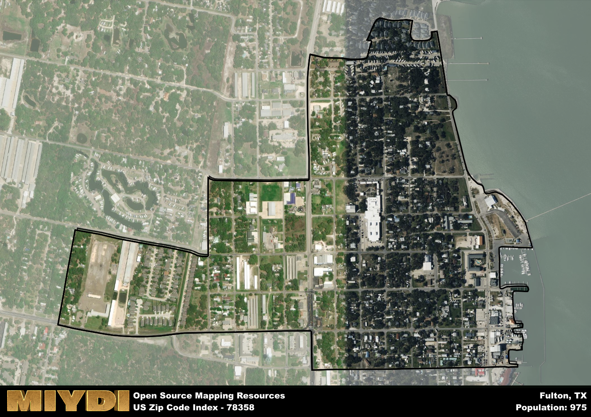

**Area Name:** Fulton

**Zip Code:** 78358

**State:** TX

Fulton is a part of the Rockport - TX Micro Area, and makes up  of the Metro's population.  

# Fulton: A Charming Coastal Community in Texas  

Located within the 78358 zip code, Fulton is a picturesque coastal community in Texas. Bordered by the Aransas Bay to the east and Rockport to the west, Fulton seamlessly integrates with the surrounding areas to form a vibrant coastal region. Just a short drive away from Corpus Christi, Fulton offers residents and visitors alike easy access to urban amenities while maintaining its small-town charm.

Fulton has a rich historical narrative that dates back to its founding in the mid-19th century. Originally established as a shipping port, Fulton played a significant role in the region's economic development. Over the years, the community grew into a thriving fishing and tourism destination, attracting visitors with its scenic waterfront views and laid-back atmosphere. The name "Fulton" itself is believed to have been inspired by the Fulton Steamboat Company, a prominent player in the maritime industry during that era.

Today, Fulton continues to enchant visitors with its quaint shops, seafood restaurants, and recreational activities. The area's economy is driven by tourism, fishing, and local businesses that cater to residents and vacationers. Fulton is also home to historic sites such as the Fulton Mansion State Historic Site, which offers a glimpse into the area's past. With its stunning coastal views and vibrant community spirit, Fulton remains a beloved destination on the Texas coast.

# Fulton Demographics

The population of Fulton is 975.  
Fulton has a population density of 2074.47 per square mile.  
The area of Fulton is 0.47 square miles.  

## Fulton AI and Census Variables

The values presented in this dataset for Fulton are AI-optimized, streamlined, and categorized into relevant buckets for enhanced utility in AI and mapping programs. These simplified values have been optimized to facilitate efficient analysis and integration into various technological applications, offering users accessible and actionable insights into demographics within the Fulton area.

| AI Variables for Fulton | Value |
|-------------|-------|
| Shape Area | 1555815.5234375 |
| Shape Length | 7314.42075562481 |
| CBSA Federal Processing Standard Code | 40530 |

## How to use this free AI optimized Geo-Spatial Data for Fulton, TX

This data is made freely available under the Creative Commons license, allowing for unrestricted use for any purpose. Users can access static resources directly from GitHub or leverage more advanced functionalities by utilizing the GeoJSON files. All datasets originate from official government or private sector sources and are meticulously compiled into relevant datasets within QGIS. However, the versatility of the data ensures compatibility with any mapping application.

## Data Accuracy Disclaimer
It's important to note that the data provided here may contain errors or discrepancies and should be considered as 'close enough' for business applications and AI rather than a definitive source of truth. This data is aggregated from multiple sources, some of which publish information on wildly different intervals, leading to potential inconsistencies. Additionally, certain data points may not be corrected for Covid-related changes, further impacting accuracy. Moreover, the assumption that demographic trends are consistent throughout a region may lead to discrepancies, as trends often concentrate in areas of highest population density. As a result, dense areas may be slightly underrepresented, while rural areas may be slightly overrepresented, resulting in a more conservative dataset. Furthermore, the focus primarily on areas within US Major and Minor Statistical areas means that approximately 40 million Americans living outside of these areas may not be fully represented. Lastly, the historical background and area descriptions generated using AI are susceptible to potential mistakes, so users should exercise caution when interpreting the information provided.
