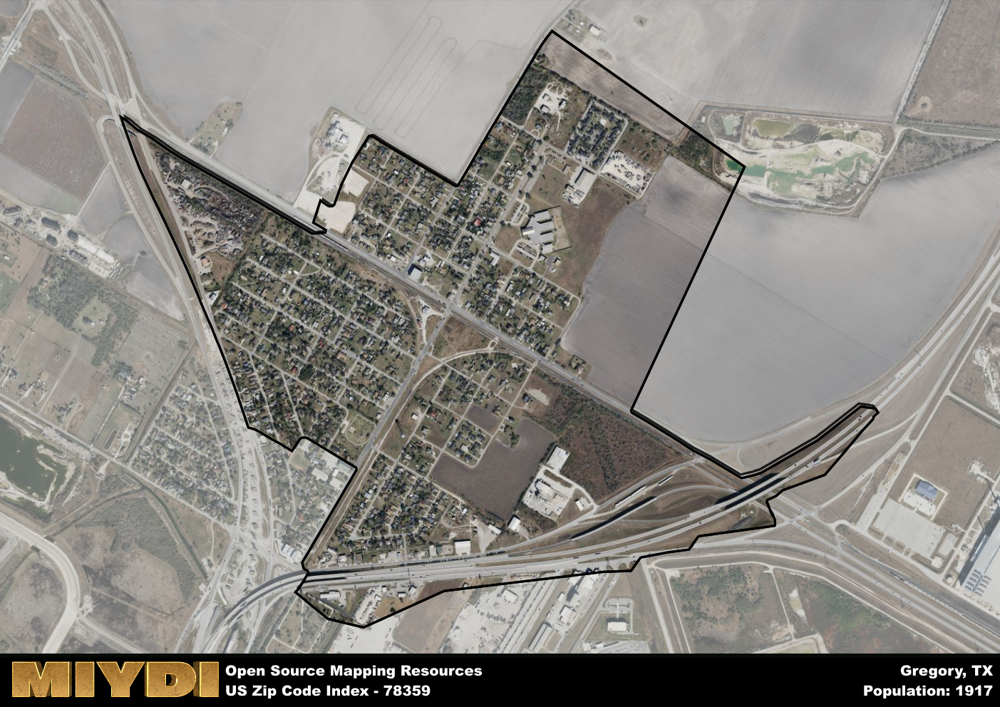

**Area Name:** Gregory

**Zip Code:** 78359

**State:** TX

Gregory is a part of the Corpus Christi - TX Metro Area, and makes up 0.47% of the Metro's population.  

# Gregory: A Charming Neighborhood in South Texas  

Located in the southern region of Texas, the zip code 78359 encompasses the neighborhood of Gregory. Bordered by the city of Portland to the north and the waters of Nueces Bay to the east, Gregory is a small but vibrant community that is part of the larger Corpus Christi metropolitan area. Its proximity to major highways and the Corpus Christi International Airport allows for easy access to the amenities of the bustling city while still maintaining a close-knit neighborhood feel.

Originally founded as a railroad town in the late 19th century, Gregory has a rich history of serving as a hub for transportation and commerce in the region. Over the years, the area has evolved into a residential community with a strong sense of pride in its heritage. The town was named after John Gregory, a civil engineer who played a crucial role in the construction of the railroad that put Gregory on the map.

Today, Gregory continues to thrive with a mix of residential areas, small businesses, and recreational facilities. The community is known for its friendly atmosphere and strong sense of community spirit. Local businesses cater to the needs of residents, offering everything from dining options to specialty shops. In addition, Gregory is home to parks and green spaces where residents can enjoy outdoor activities. The area also boasts a few historic sites that offer a glimpse into its past, adding to its unique charm within the Corpus Christi metropolitan area.

# Gregory Demographics

The population of Gregory is 1917.  
Gregory has a population density of 2366.67 per square mile.  
The area of Gregory is 0.81 square miles.  

### Exploring Real Estate Trends: A Comprehensive Analysis of the Gregory Area and its Neighbors

This table contains an in-depth examination of the real estate market in the Gregory area. Sourced from trusted real estate market firms, this dataset provides a wealth of raw data detailing the local real estate landscape, along with comparative analyses juxtaposing the market dynamics with those of neighboring areas. Explore the intricacies of the Gregory real estate market and gain valuable insights into its relationship with adjacent regions.

| Real Estate Data for Gregory                       | Value    |
|------------------------------------------------|----------|
| Average Listing Price for Gregory               | 151180 |
| Median Listing Price for Gregory                | 115975 |
| Median Days on Market for Gregory               | 45 |
| Median Listing Price per Square Foot for Gregory| 7 |
| Median Square Feet for Gregory                  | 1200 |
| Real Estate Prices to Income Ratio           | 98.02% |
| Price per Square Foot Ratio                  | 59.44% |
| Price Median Ratio                           | 44.33% |
| Market Sales Speed Ratio                     | 74.6% |

This table offers essential real estate data for the Gregory area, including average and median listing prices, median days on market, and property size. It also presents ratio metrics as percentages, providing insights into how the local market compares to the surrounding region. A ratio of 100% signifies performance in line with the regional average, while values above or below indicate overperformance or underperformance, respectively, relative to expectations.

## Gregory Sports and Recreation Data

#### Annual Youth Sports Spending for Gregory

This table provides fundamental insights into the Sports and Recreation data for the Gregory area, detailing the estimated annual expenditure on Youth Athletics. This includes estimated spending by the major consumer brackets. 
| Sports Spending for Gregory| Value |
|-------------------------|-------|
| Athlete Spending Compared to the region | 10.20% |
| Total Youth Athlete Spending | 98,634 |
| Athletic Spending - Essential Focused Consumer | 5,015 |
| Athletic Spending - Typical Consumer | 34,971 |
| Athletic Spending - Affluent Consumers | 18,584 |

#### Youth Coaching Estimates for Gregory

This table presents the estimated number of coaches for the Gregory area, derived from comprehensive national coaching surveys and athletic participation rates by state. It offers valuable insights into the vital role of coaching personnel in fostering athletic development and facilitating sports participation within the local community.

| Coaching Data for Gregory | Value |
|-------------|-------|
| Total Coaches | 31 |
| Paid Coaches | 8 |
| Volunteer Coaches | 23 |

#### Youth Athlete Participation for Gregory

This table shows the estimated total number of youth athletes in the Gregory area, sourced from comprehensive national coaching surveys and athletic participation rates by state.

| Total YA Athletes in Gregory | Value |
|-------------|-------|
| Total High School Athletes | 48 |
| Total Youth Athletes | 144 |
| Total Young Adult Athletes | 96 |
| Total Athletes to Age 25 | 287 |

#### High School Age Athletes - Breakdown by Sport for Gregory

This table shows insights regarding high school age estimated players by sport in the Gregory area, derived from national and state-level athletic participation trends. 

| HS Players by Sport in Gregory | Value |
|-------------|-------|
| Football Players | 11 |
| Basketball Players | 7 |
| Soccer Players | 5 |
| Volleyball Players | 3 |
| Baseball Players | 6 |
| Tennis Players | 3 |
| Track Athletes | 8 |
| Golf Players | 1 |
| Swimming Athletes | 1 |
| Wrestling Competitors | 1 |
| Lacrosse Players | 0 |

Estimating the number of younger athletes presents unique challenges due to their varied starting ages, typically beginning around six years old, and a gradual decline in participation rates as they age. Unlike high school-aged athletes, younger athletes are less likely to switch sports as they grow older, contributing to the stability of participation numbers within specific sports at younger ages.  

As a general trend, the total number of younger athletes is approximately three times the number of high school-aged athletes, underscoring the significant presence of youth athletes in sports programs and highlighting the importance of early engagement in athletic activities.

## Gregory AI and Census Variables

The values presented in this dataset for Gregory are AI-optimized, streamlined, and categorized into relevant buckets for enhanced utility in AI and mapping programs. These simplified values have been optimized to facilitate efficient analysis and integration into various technological applications, offering users accessible and actionable insights into demographics within the Gregory area.

| AI Variables for Gregory | Value |
|-------------|-------|
| Shape Area | 2690078.03125 |
| Shape Length | 9815.12910892222 |
| CBSA Federal Processing Standard Code | 18580 |
| RE Price per Square Foot Ratio | 59.44% |
| RE Price Average Ratio | 46.53% |
| RE Speed Ratio | 74.6% |
| RE Income Ratio | 98.02% |
| RE Affordability Index Flag | 1 |
| Income Bracket Flag | 2 |
| RE Income Flag | 3 |
| RE Median Square Footage Price Flag | 2 |
| RE Median Square Footage Size Flag | 1 |
| RE Activity Flag | 3 |
| Poverty Line Risk Flag | 2 |

## How to use this free AI optimized Geo-Spatial Data for Gregory, TX

This data is made freely available under the Creative Commons license, allowing for unrestricted use for any purpose. Users can access static resources directly from GitHub or leverage more advanced functionalities by utilizing the GeoJSON files. All datasets originate from official government or private sector sources and are meticulously compiled into relevant datasets within QGIS. However, the versatility of the data ensures compatibility with any mapping application.

## Data Accuracy Disclaimer
It's important to note that the data provided here may contain errors or discrepancies and should be considered as 'close enough' for business applications and AI rather than a definitive source of truth. This data is aggregated from multiple sources, some of which publish information on wildly different intervals, leading to potential inconsistencies. Additionally, certain data points may not be corrected for Covid-related changes, further impacting accuracy. Moreover, the assumption that demographic trends are consistent throughout a region may lead to discrepancies, as trends often concentrate in areas of highest population density. As a result, dense areas may be slightly underrepresented, while rural areas may be slightly overrepresented, resulting in a more conservative dataset. Furthermore, the focus primarily on areas within US Major and Minor Statistical areas means that approximately 40 million Americans living outside of these areas may not be fully represented. Lastly, the historical background and area descriptions generated using AI are susceptible to potential mistakes, so users should exercise caution when interpreting the information provided.
