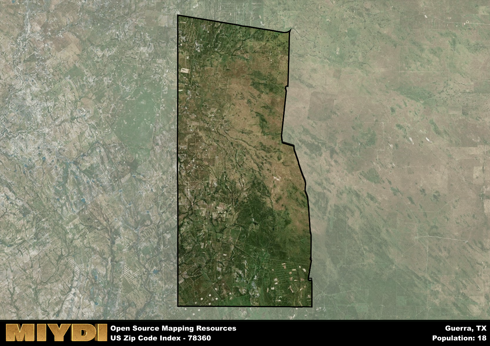

**Area Name:** Guerra

**Zip Code:** 78360

**State:** TX

Guerra is a part of the Zapata - TX Micro Area, and makes up  of the Metro's population.  

# Explore the Charming Neighborhood of Guerra in Zip Code 78360

Located in the southern part of Texas, the zip code 78360 corresponds to the quaint neighborhood of Guerra. Bordered by lush farmlands and the Rio Grande, Guerra is a peaceful oasis within the bustling metropolitan area of Rio Grande City. Just a short drive away from the vibrant city center, Guerra offers a perfect blend of rural tranquility and urban convenience for its residents.

Guerra has a rich historical background, dating back to the early 19th century when it was established as a small settlement along the Rio Grande. The area experienced growth during the Mexican-American War and became a thriving community known for its agricultural production and vibrant cultural heritage. Over the years, Guerra has maintained its small-town charm while embracing modern developments, creating a unique blend of old-world charm and contemporary living.

Today, Guerra is a close-knit community known for its friendly residents, locally-owned businesses, and scenic beauty. The area's economy is primarily driven by agriculture, with citrus groves and vegetable farms dotting the landscape. Residents and visitors alike can enjoy recreational activities such as fishing and birdwatching along the Rio Grande, or explore historic sites like the Guerra Ranch House. With its strong sense of community and rich cultural heritage, Guerra continues to be a hidden gem within the bustling urban fabric of Rio Grande City.

# Guerra Demographics

The population of Guerra is 18.  
Guerra has a population density of 0.1 per square mile.  
The area of Guerra is 175.96 square miles.  

## Guerra AI and Census Variables

The values presented in this dataset for Guerra are AI-optimized, streamlined, and categorized into relevant buckets for enhanced utility in AI and mapping programs. These simplified values have been optimized to facilitate efficient analysis and integration into various technological applications, offering users accessible and actionable insights into demographics within the Guerra area.

| AI Variables for Guerra | Value |
|-------------|-------|
| Shape Area | 575581774.326172 |
| Shape Length | 108912.105592261 |
| CBSA Federal Processing Standard Code | 49820 |

## How to use this free AI optimized Geo-Spatial Data for Guerra, TX

This data is made freely available under the Creative Commons license, allowing for unrestricted use for any purpose. Users can access static resources directly from GitHub or leverage more advanced functionalities by utilizing the GeoJSON files. All datasets originate from official government or private sector sources and are meticulously compiled into relevant datasets within QGIS. However, the versatility of the data ensures compatibility with any mapping application.

## Data Accuracy Disclaimer
It's important to note that the data provided here may contain errors or discrepancies and should be considered as 'close enough' for business applications and AI rather than a definitive source of truth. This data is aggregated from multiple sources, some of which publish information on wildly different intervals, leading to potential inconsistencies. Additionally, certain data points may not be corrected for Covid-related changes, further impacting accuracy. Moreover, the assumption that demographic trends are consistent throughout a region may lead to discrepancies, as trends often concentrate in areas of highest population density. As a result, dense areas may be slightly underrepresented, while rural areas may be slightly overrepresented, resulting in a more conservative dataset. Furthermore, the focus primarily on areas within US Major and Minor Statistical areas means that approximately 40 million Americans living outside of these areas may not be fully represented. Lastly, the historical background and area descriptions generated using AI are susceptible to potential mistakes, so users should exercise caution when interpreting the information provided.
