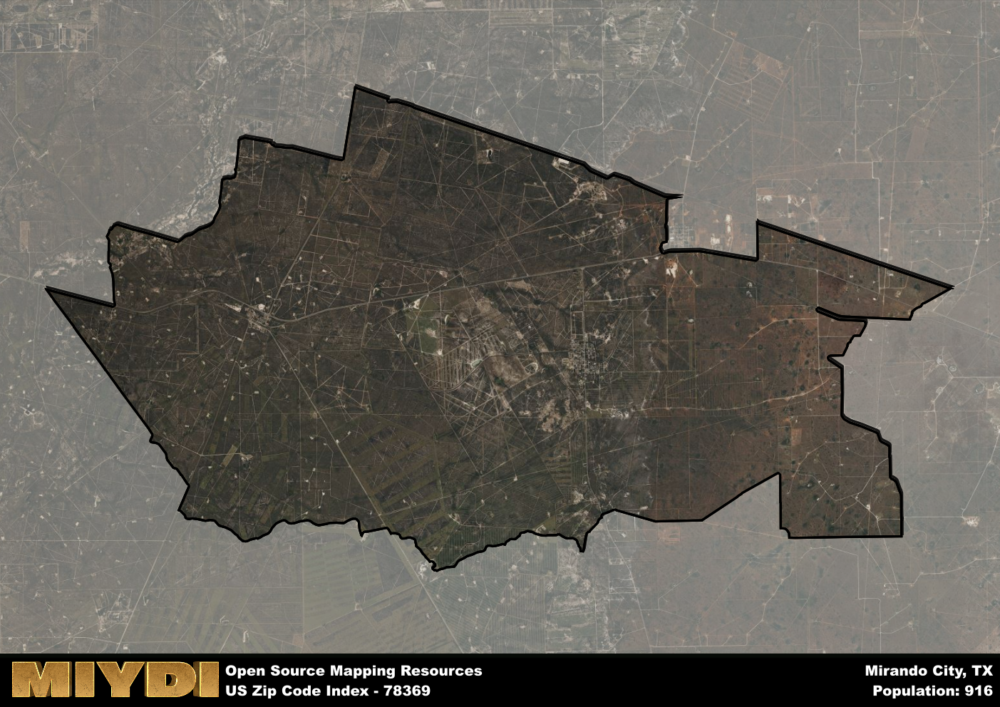

**Area Name:** Mirando City

**Zip Code:** 78369

**State:** TX

Mirando City is a part of the Laredo - TX Metro Area, and makes up  of the Metro's population.  

# Mirando City: A Snapshot of Zip Code 78369

Located in south Texas, Mirando City is a small community situated within Webb County. The zip code area of 78369 is bordered by oilfield fields to the north and agricultural lands to the south. It is approximately 30 miles southeast of the city of Laredo and is a part of the larger Laredo metropolitan area. Mirando City serves as a residential area for those working in the nearby oil and gas industry, with a close-knit community feel.

Mirando City was founded in the 1930s as an oil boomtown, named after a local rancher. The town experienced rapid growth during this time with the discovery of oil in the area, attracting workers and families looking for opportunities in the industry. Over the years, Mirando City has maintained its identity as a tight-knit community centered around the oil and gas sector, with a focus on preserving its unique history and heritage.

Today, Mirando City continues to be a hub for the oil and gas industry, with many residents working in this sector. The area also offers essential services such as a post office, a small grocery store, and a few local eateries. While the community is primarily residential, there are recreational amenities nearby, including parks and outdoor spaces for residents to enjoy. Mirando City takes pride in its history, with historic sites and landmarks that showcase its roots as an oil boomtown in south Texas.

# Mirando City Demographics

The population of Mirando City is 916.  
Mirando City has a population density of 13.01 per square mile.  
The area of Mirando City is 70.4 square miles.  

## Mirando City Income and Economic Data

These demographic numbers are sourced from IRS return data, providing comprehensive insights into the population dynamics and economic trends within Mirando City.

**Breakdown of return types for Mirando City**

The table offers insight into the composition of tax returns filed with the IRS, categorizing them into three main types. Single returns represent filings by individuals, joint returns by married couples, and head of household returns by individuals who qualify as heads of households, typically having dependents. This breakdown provides an understanding of the different filing statuses adopted by taxpayers when submitting their tax documentation.

| Return Types filed for Mirando City                              | Percentage          |
|----------------------------------------------------------|---------------------|
| Single Returns                                            | 0.44 |
| Joint Returns                                             | 0.38 |
| Head Household Returns                                    | 0.25 |

The income and economic data presented here is sourced from the IRS income brackets, utilized for categorizing tax returns by income levels. This table displays income ranges for both single filers and married couples, along with the corresponding number of returns and the percentage within each bracket, providing valuable insight into the distribution of taxes across various income groups.

| Bracket Name       | Single Filer Income Range | Married Couple Range | Number of Returns | Percentage of Returns |
|--------------------|----------------------------|----------------------|-------------------|-----------------------|
| 10% Bracket        | Up to $10,275              | Up to $20,550        | 80 | 0.5% |
| 12% Bracket        | $10,276 - $41,775          | $20,551 - $83,550    | 40 | 0.25% |
| 22% Bracket        | $41,776 - $89,075          | $83,551 - $178,150   | 20 | 0.13% |
| 24% Bracket        | $89,076 - $170,050         | $178,151 - $340,100  | 0 | 0% |
| 32% Bracket        | $170,051 - $215,950        | $340,101 - $431,900  | 20 | 0.13% |
| 35% Bracket        | $215,951 - $539,900        | $431,901 - $647,850  | 0 | 0% |

### Exploring Taxpayer Diversity: A Breakdown of Different Types of Tax Returns in Mirando City

The table offers insights into various types of tax returns filed, reflecting different aspects of taxpayer activities and demographics. Categories include charitable returns for donations, dependent returns for claimed dependents, educator population, elderly population, real estate returns, self-employment returns, student loan returns, and unemployment returns, providing valuable insights into taxpayer behavior and demographics.

| Mirando City Filing Types                    | Count | Percentage |
|--------------------------------------|-------|------------|
| Charitable Donations                 | 0 | 0% |
| Dependents Claimed                   | 0 | 0% |
| Educator Residents                   | 0 | 0% |
| Elderly Population                   | 40 | 0.25% |
| Farming Population                   | 0 | 0% |
| Real Estate Transactions             | 0 | 0% |
| Self-Employed Individuals            | 30 | 0.188% |
| Student Loan Cases                   | 0 | 0% |
| Unemployment Benefit Filings         | 20 | 0.13% |

## Mirando City AI and Census Variables

The values presented in this dataset for Mirando City are AI-optimized, streamlined, and categorized into relevant buckets for enhanced utility in AI and mapping programs. These simplified values have been optimized to facilitate efficient analysis and integration into various technological applications, offering users accessible and actionable insights into demographics within the Mirando City area.

| AI Variables for Mirando City | Value |
|-------------|-------|
| Shape Area | 232393762.126953 |
| Shape Length | 89637.8322893349 |
| CBSA Federal Processing Standard Code | 29700 |

## How to use this free AI optimized Geo-Spatial Data for Mirando City, TX

This data is made freely available under the Creative Commons license, allowing for unrestricted use for any purpose. Users can access static resources directly from GitHub or leverage more advanced functionalities by utilizing the GeoJSON files. All datasets originate from official government or private sector sources and are meticulously compiled into relevant datasets within QGIS. However, the versatility of the data ensures compatibility with any mapping application.

## Data Accuracy Disclaimer
It's important to note that the data provided here may contain errors or discrepancies and should be considered as 'close enough' for business applications and AI rather than a definitive source of truth. This data is aggregated from multiple sources, some of which publish information on wildly different intervals, leading to potential inconsistencies. Additionally, certain data points may not be corrected for Covid-related changes, further impacting accuracy. Moreover, the assumption that demographic trends are consistent throughout a region may lead to discrepancies, as trends often concentrate in areas of highest population density. As a result, dense areas may be slightly underrepresented, while rural areas may be slightly overrepresented, resulting in a more conservative dataset. Furthermore, the focus primarily on areas within US Major and Minor Statistical areas means that approximately 40 million Americans living outside of these areas may not be fully represented. Lastly, the historical background and area descriptions generated using AI are susceptible to potential mistakes, so users should exercise caution when interpreting the information provided.
