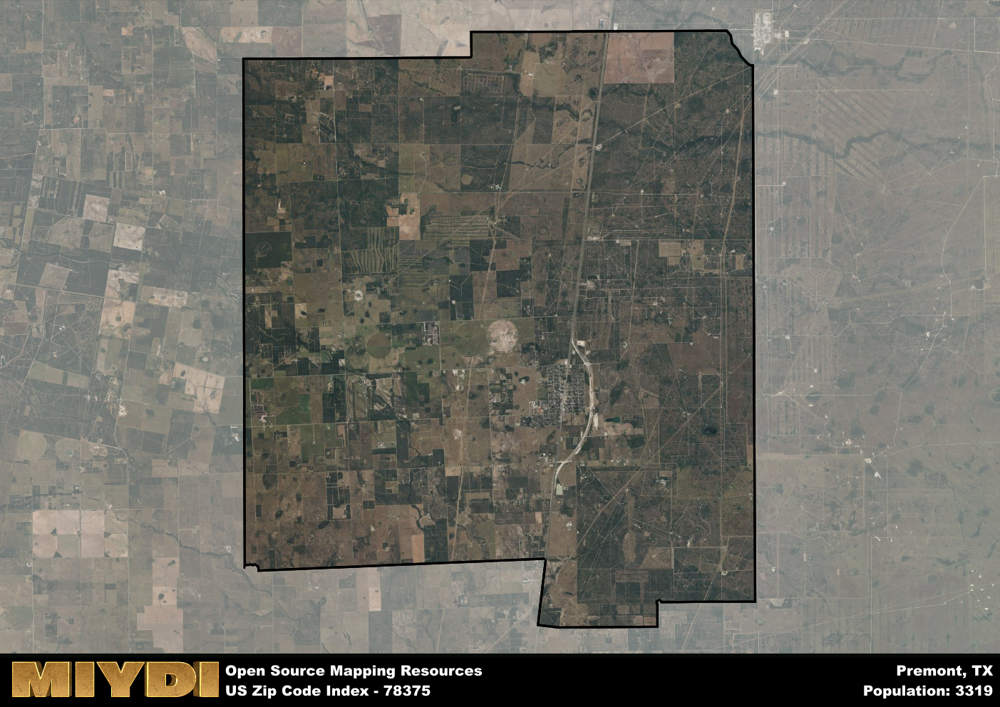

**Area Name:** Premont

**Zip Code:** 78375

**State:** TX

Premont is a part of the Alice - TX Micro Area, and makes up 2.66% of the Metro's population.  

# Premont: A Charming Community in South Texas

Located in South Texas, the zip code area 78375 encompasses the charming town of Premont. Situated in Jim Wells County, Premont is surrounded by vast agricultural lands and is in close proximity to the larger cities of Alice and Kingsville. Despite being a small town, Premont plays a vital role in the region's economy and culture, serving as a hub for local residents and visitors alike.

Premont has a rich history dating back to its establishment in the early 1900s. The town was originally founded as a stop along the railroad, attracting settlers looking to take advantage of the area's fertile soil for agriculture. Over the years, Premont has grown into a close-knit community known for its strong agricultural roots and friendly atmosphere. The town's name is derived from a combination of the words "pre" and "monte," meaning "before the mountain" in Spanish, reflecting its location on the flat South Texas plains.

Today, Premont continues to thrive as a center of agriculture and commerce in the region. The town is home to a variety of small businesses, restaurants, and local shops that cater to the needs of its residents. In addition, Premont boasts several parks and recreational facilities, providing ample opportunities for outdoor activities and community gatherings. Visitors to the area can also explore the town's historic sites, including the old railroad depot and local museums, which offer insights into Premont's fascinating past.

# Premont Demographics

The population of Premont is 3319.  
Premont has a population density of 27.41 per square mile.  
The area of Premont is 121.1 square miles.  

## Premont Income and Economic Data

These demographic numbers are sourced from IRS return data, providing comprehensive insights into the population dynamics and economic trends within Premont.

**Breakdown of return types for Premont**

The table offers insight into the composition of tax returns filed with the IRS, categorizing them into three main types. Single returns represent filings by individuals, joint returns by married couples, and head of household returns by individuals who qualify as heads of households, typically having dependents. This breakdown provides an understanding of the different filing statuses adopted by taxpayers when submitting their tax documentation.

| Return Types filed for Premont                              | Percentage          |
|----------------------------------------------------------|---------------------|
| Single Returns                                            | 0.47 |
| Joint Returns                                             | 0.3 |
| Head Household Returns                                    | 0.23 |

The income and economic data presented here is sourced from the IRS income brackets, utilized for categorizing tax returns by income levels. This table displays income ranges for both single filers and married couples, along with the corresponding number of returns and the percentage within each bracket, providing valuable insight into the distribution of taxes across various income groups.

| Bracket Name       | Single Filer Income Range | Married Couple Range | Number of Returns | Percentage of Returns |
|--------------------|----------------------------|----------------------|-------------------|-----------------------|
| 10% Bracket        | Up to $10,275              | Up to $20,550        | 620 | 0.48% |
| 12% Bracket        | $10,276 - $41,775          | $20,551 - $83,550    | 360 | 0.28% |
| 22% Bracket        | $41,776 - $89,075          | $83,551 - $178,150   | 150 | 0.12% |
| 24% Bracket        | $89,076 - $170,050         | $178,151 - $340,100  | 70 | 0.05% |
| 32% Bracket        | $170,051 - $215,950        | $340,101 - $431,900  | 90 | 0.07% |
| 35% Bracket        | $215,951 - $539,900        | $431,901 - $647,850  | 0 | 0% |

### Exploring Taxpayer Diversity: A Breakdown of Different Types of Tax Returns in Premont

The table offers insights into various types of tax returns filed, reflecting different aspects of taxpayer activities and demographics. Categories include charitable returns for donations, dependent returns for claimed dependents, educator population, elderly population, real estate returns, self-employment returns, student loan returns, and unemployment returns, providing valuable insights into taxpayer behavior and demographics.

| Premont Filing Types                    | Count | Percentage |
|--------------------------------------|-------|------------|
| Charitable Donations                 | 0 | 0% |
| Dependents Claimed                   | 0 | 0% |
| Educator Residents                   | 0 | 0% |
| Elderly Population                   | 310 | 0.24% |
| Farming Population                   | 140 | 0.109% |
| Real Estate Transactions             | 0 | 0% |
| Self-Employed Individuals            | 180 | 0.14% |
| Student Loan Cases                   | 20 | 0.016% |
| Unemployment Benefit Filings         | 240 | 0.19% |

### Exploring Real Estate Trends: A Comprehensive Analysis of the Premont Area and its Neighbors

This table contains an in-depth examination of the real estate market in the Premont area. Sourced from trusted real estate market firms, this dataset provides a wealth of raw data detailing the local real estate landscape, along with comparative analyses juxtaposing the market dynamics with those of neighboring areas. Explore the intricacies of the Premont real estate market and gain valuable insights into its relationship with adjacent regions.

| Real Estate Data for Premont                       | Value    |
|------------------------------------------------|----------|
| Average Listing Price for Premont               | 138604 |
| Median Listing Price for Premont                | 147000 |
| Median Days on Market for Premont               | 25 |
| Median Listing Price per Square Foot for Premont| 7 |
| Median Square Feet for Premont                  | 1466 |
| Real Estate Prices to Income Ratio           | 88.05% |
| Price per Square Foot Ratio                  | 60.14% |
| Price Median Ratio                           | 60.74% |
| Market Sales Speed Ratio                     | 27.7% |

This table offers essential real estate data for the Premont area, including average and median listing prices, median days on market, and property size. It also presents ratio metrics as percentages, providing insights into how the local market compares to the surrounding region. A ratio of 100% signifies performance in line with the regional average, while values above or below indicate overperformance or underperformance, respectively, relative to expectations.

## Premont Sports and Recreation Data

#### Annual Youth Sports Spending for Premont

This table provides fundamental insights into the Sports and Recreation data for the Premont area, detailing the estimated annual expenditure on Youth Athletics. This includes estimated spending by the major consumer brackets. 
| Sports Spending for Premont| Value |
|-------------------------|-------|
| Athlete Spending Compared to the region | 27.92% |
| Total Youth Athlete Spending | 18,500 |
| Athletic Spending - Essential Focused Consumer | 8,162 |
| Athletic Spending - Typical Consumer | 34,154 |
| Athletic Spending - Affluent Consumers | 06,076 |

#### Youth Coaching Estimates for Premont

This table presents the estimated number of coaches for the Premont area, derived from comprehensive national coaching surveys and athletic participation rates by state. It offers valuable insights into the vital role of coaching personnel in fostering athletic development and facilitating sports participation within the local community.

| Coaching Data for Premont | Value |
|-------------|-------|
| Total Coaches | 54 |
| Paid Coaches | 14 |
| Volunteer Coaches | 40 |

#### Youth Athlete Participation for Premont

This table shows the estimated total number of youth athletes in the Premont area, sourced from comprehensive national coaching surveys and athletic participation rates by state.

| Total YA Athletes in Premont | Value |
|-------------|-------|
| Total High School Athletes | 83 |
| Total Youth Athletes | 249 |
| Total Young Adult Athletes | 166 |
| Total Athletes to Age 25 | 498 |

#### High School Age Athletes - Breakdown by Sport for Premont

This table shows insights regarding high school age estimated players by sport in the Premont area, derived from national and state-level athletic participation trends. 

| HS Players by Sport in Premont | Value |
|-------------|-------|
| Football Players | 19 |
| Basketball Players | 12 |
| Soccer Players | 9 |
| Volleyball Players | 6 |
| Baseball Players | 10 |
| Tennis Players | 5 |
| Track Athletes | 14 |
| Golf Players | 2 |
| Swimming Athletes | 2 |
| Wrestling Competitors | 2 |
| Lacrosse Players | 0 |

Estimating the number of younger athletes presents unique challenges due to their varied starting ages, typically beginning around six years old, and a gradual decline in participation rates as they age. Unlike high school-aged athletes, younger athletes are less likely to switch sports as they grow older, contributing to the stability of participation numbers within specific sports at younger ages.  

As a general trend, the total number of younger athletes is approximately three times the number of high school-aged athletes, underscoring the significant presence of youth athletes in sports programs and highlighting the importance of early engagement in athletic activities.

## Premont AI and Census Variables

The values presented in this dataset for Premont are AI-optimized, streamlined, and categorized into relevant buckets for enhanced utility in AI and mapping programs. These simplified values have been optimized to facilitate efficient analysis and integration into various technological applications, offering users accessible and actionable insights into demographics within the Premont area.

| AI Variables for Premont | Value |
|-------------|-------|
| Shape Area | 399345578.863281 |
| Shape Length | 84399.674100704 |
| CBSA Federal Processing Standard Code | 10860 |
| RE Price per Square Foot Ratio | 60.14% |
| RE Price Average Ratio | 51.34% |
| RE Speed Ratio | 27.7% |
| RE Income Ratio | 88.05% |
| Single Opportunity Flag | 2 |
| Single Parent Risk Flag | 4 |
| Elderly Opportunity Flag | 2 |
| Farm Opportunity Flag | 4 |
| Unemployment Risk | 5 |
| RE Affordability Index Flag | 2 |
| Income Bracket Flag | 4 |
| RE Income Flag | 3 |
| RE Median Square Footage Price Flag | 1 |
| RE Median Square Footage Size Flag | 2 |
| RE Activity Flag | 1 |
| Poverty Line Risk Flag | 2 |

## How to use this free AI optimized Geo-Spatial Data for Premont, TX

This data is made freely available under the Creative Commons license, allowing for unrestricted use for any purpose. Users can access static resources directly from GitHub or leverage more advanced functionalities by utilizing the GeoJSON files. All datasets originate from official government or private sector sources and are meticulously compiled into relevant datasets within QGIS. However, the versatility of the data ensures compatibility with any mapping application.

## Data Accuracy Disclaimer
It's important to note that the data provided here may contain errors or discrepancies and should be considered as 'close enough' for business applications and AI rather than a definitive source of truth. This data is aggregated from multiple sources, some of which publish information on wildly different intervals, leading to potential inconsistencies. Additionally, certain data points may not be corrected for Covid-related changes, further impacting accuracy. Moreover, the assumption that demographic trends are consistent throughout a region may lead to discrepancies, as trends often concentrate in areas of highest population density. As a result, dense areas may be slightly underrepresented, while rural areas may be slightly overrepresented, resulting in a more conservative dataset. Furthermore, the focus primarily on areas within US Major and Minor Statistical areas means that approximately 40 million Americans living outside of these areas may not be fully represented. Lastly, the historical background and area descriptions generated using AI are susceptible to potential mistakes, so users should exercise caution when interpreting the information provided.
