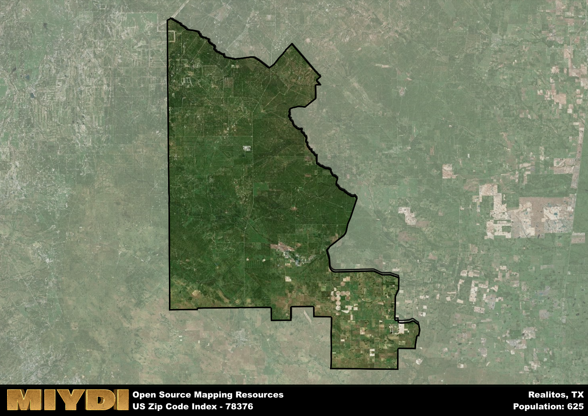

**Area Name:** Realitos

**Zip Code:** 78376

**State:** TX

Realitos is a part of the Alice - TX Micro Area, and makes up  of the Metro's population.  

# Realitos: A Historic Town in South Texas  

Realitos, located within the 78376 zip code in South Texas, is a small, unincorporated community situated in Duval County. Bordered by the towns of Benavides and Concepcion, Realitos is part of the larger metropolitan area that includes the city of San Diego. Nestled in the heart of the South Texas Plains, Realitos serves as a quiet residential area that offers a peaceful retreat from the bustling urban centers nearby.

Founded in the late 19th century, Realitos has a rich history rooted in ranching and agriculture. The town's name, which means "little royal ones" in Spanish, reflects its heritage as a royal land grant from the Spanish crown. Over the years, Realitos has grown into a close-knit community known for its strong agricultural traditions and cultural celebrations. The town's historic buildings and landmarks serve as a reminder of its past, preserving the stories of generations that have called Realitos home.

Today, Realitos continues to thrive as a rural oasis in South Texas. The town's economy revolves around agriculture, with many residents working in ranching and farming. Realitos offers essential services such as schools, churches, and small businesses to meet the needs of its residents. Outdoor enthusiasts can enjoy the natural beauty of the area through hunting, fishing, and birdwatching. Additionally, visitors can explore the town's historic sites, including the old Spanish land grant markers that dot the landscape, providing a glimpse into Realitos' storied past.

# Realitos Demographics

The population of Realitos is 625.  
Realitos has a population density of 1.18 per square mile.  
The area of Realitos is 528.86 square miles.  

## Realitos Income and Economic Data

These demographic numbers are sourced from IRS return data, providing comprehensive insights into the population dynamics and economic trends within Realitos.

**Breakdown of return types for Realitos**

The table offers insight into the composition of tax returns filed with the IRS, categorizing them into three main types. Single returns represent filings by individuals, joint returns by married couples, and head of household returns by individuals who qualify as heads of households, typically having dependents. This breakdown provides an understanding of the different filing statuses adopted by taxpayers when submitting their tax documentation.

| Return Types filed for Realitos                              | Percentage          |
|----------------------------------------------------------|---------------------|
| Single Returns                                            | 0.45 |
| Joint Returns                                             | 0.27 |
| Head Household Returns                                    | 0.27 |

The income and economic data presented here is sourced from the IRS income brackets, utilized for categorizing tax returns by income levels. This table displays income ranges for both single filers and married couples, along with the corresponding number of returns and the percentage within each bracket, providing valuable insight into the distribution of taxes across various income groups.

| Bracket Name       | Single Filer Income Range | Married Couple Range | Number of Returns | Percentage of Returns |
|--------------------|----------------------------|----------------------|-------------------|-----------------------|
| 10% Bracket        | Up to $10,275              | Up to $20,550        | 60 | 0.55% |
| 12% Bracket        | $10,276 - $41,775          | $20,551 - $83,550    | 30 | 0.27% |
| 22% Bracket        | $41,776 - $89,075          | $83,551 - $178,150   | 20 | 0.18% |
| 24% Bracket        | $89,076 - $170,050         | $178,151 - $340,100  | 0 | 0% |
| 32% Bracket        | $170,051 - $215,950        | $340,101 - $431,900  | 0 | 0% |
| 35% Bracket        | $215,951 - $539,900        | $431,901 - $647,850  | 0 | 0% |

### Exploring Taxpayer Diversity: A Breakdown of Different Types of Tax Returns in Realitos

The table offers insights into various types of tax returns filed, reflecting different aspects of taxpayer activities and demographics. Categories include charitable returns for donations, dependent returns for claimed dependents, educator population, elderly population, real estate returns, self-employment returns, student loan returns, and unemployment returns, providing valuable insights into taxpayer behavior and demographics.

| Realitos Filing Types                    | Count | Percentage |
|--------------------------------------|-------|------------|
| Charitable Donations                 | 0 | 0% |
| Dependents Claimed                   | 0 | 0% |
| Educator Residents                   | 0 | 0% |
| Elderly Population                   | 30 | 0.27% |
| Farming Population                   | 30 | 0.273% |
| Real Estate Transactions             | 0 | 0% |
| Self-Employed Individuals            | 0 | 0% |
| Student Loan Cases                   | 0 | 0% |
| Unemployment Benefit Filings         | 0 | 0% |

## Realitos AI and Census Variables

The values presented in this dataset for Realitos are AI-optimized, streamlined, and categorized into relevant buckets for enhanced utility in AI and mapping programs. These simplified values have been optimized to facilitate efficient analysis and integration into various technological applications, offering users accessible and actionable insights into demographics within the Realitos area.

| AI Variables for Realitos | Value |
|-------------|-------|
| Shape Area | 1748151560.25195 |
| Shape Length | 248162.00244536 |
| CBSA Federal Processing Standard Code | 10860 |

## How to use this free AI optimized Geo-Spatial Data for Realitos, TX

This data is made freely available under the Creative Commons license, allowing for unrestricted use for any purpose. Users can access static resources directly from GitHub or leverage more advanced functionalities by utilizing the GeoJSON files. All datasets originate from official government or private sector sources and are meticulously compiled into relevant datasets within QGIS. However, the versatility of the data ensures compatibility with any mapping application.

## Data Accuracy Disclaimer
It's important to note that the data provided here may contain errors or discrepancies and should be considered as 'close enough' for business applications and AI rather than a definitive source of truth. This data is aggregated from multiple sources, some of which publish information on wildly different intervals, leading to potential inconsistencies. Additionally, certain data points may not be corrected for Covid-related changes, further impacting accuracy. Moreover, the assumption that demographic trends are consistent throughout a region may lead to discrepancies, as trends often concentrate in areas of highest population density. As a result, dense areas may be slightly underrepresented, while rural areas may be slightly overrepresented, resulting in a more conservative dataset. Furthermore, the focus primarily on areas within US Major and Minor Statistical areas means that approximately 40 million Americans living outside of these areas may not be fully represented. Lastly, the historical background and area descriptions generated using AI are susceptible to potential mistakes, so users should exercise caution when interpreting the information provided.
