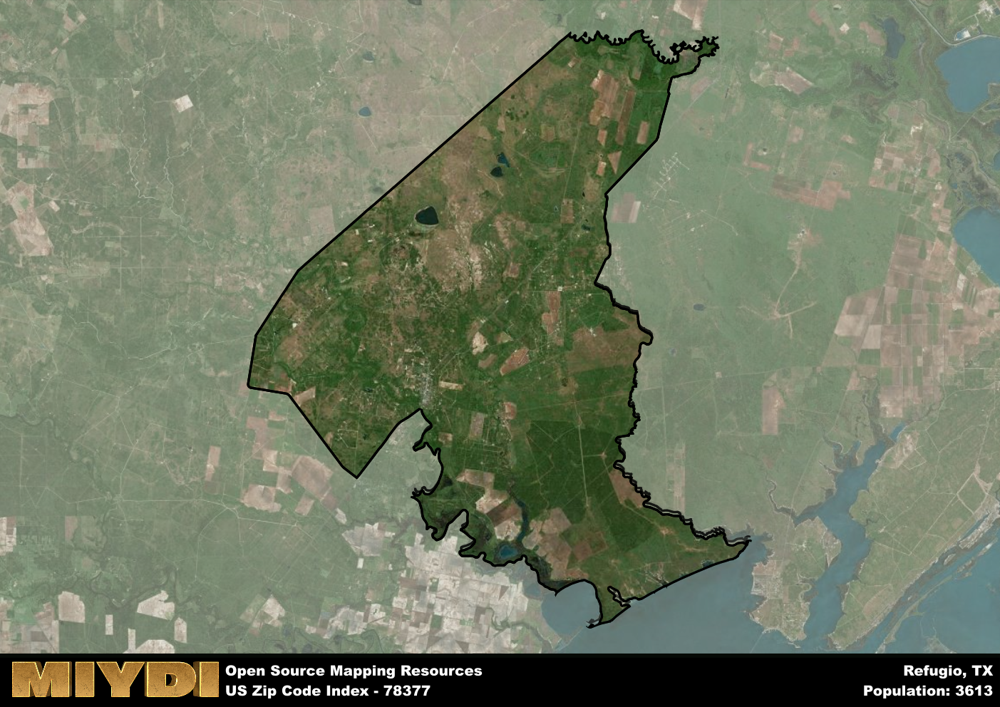

**Area Name:** Refugio

**Zip Code:** 78377

**State:** TX

Refugio is a part of the Rockport - TX Micro Area, and makes up  of the Metro's population.  

# Refugio: A Historic Gem in South Texas  
Located in South Texas, the zip code 78377 corresponds to the charming town of Refugio. Bordered by the Aransas National Wildlife Refuge to the east and the San Antonio River to the west, Refugio is situated within close proximity to major cities such as Corpus Christi and Victoria. This zip code area forms an integral part of the larger metropolitan context by serving as a center for agriculture and oil industries in the region.

Founded in 1795, Refugio has a rich historical narrative that dates back to Spanish colonization. The town played a significant role in the Texas Revolution, with the iconic Refugio Mission serving as a key site during this period. Over the years, Refugio has evolved into a close-knit community with a strong sense of pride in its heritage. The town's name, which means "refuge" in Spanish, reflects its historical role as a safe haven for settlers and travelers.

Today, Refugio continues to thrive as a vibrant community with a mix of historic landmarks and modern amenities. The town's economy is primarily driven by agriculture, oil production, and tourism. Residents and visitors alike can enjoy a range of recreational activities, including fishing on the nearby Gulf Coast and exploring the town's historic sites. Refugio is also home to a variety of local businesses, restaurants, and cultural attractions that showcase the unique charm of this historic town in South Texas.

# Refugio Demographics

The population of Refugio is 3613.  
Refugio has a population density of 11.06 per square mile.  
The area of Refugio is 326.73 square miles.  

## Refugio Income and Economic Data

These demographic numbers are sourced from IRS return data, providing comprehensive insights into the population dynamics and economic trends within Refugio.

**Breakdown of return types for Refugio**

The table offers insight into the composition of tax returns filed with the IRS, categorizing them into three main types. Single returns represent filings by individuals, joint returns by married couples, and head of household returns by individuals who qualify as heads of households, typically having dependents. This breakdown provides an understanding of the different filing statuses adopted by taxpayers when submitting their tax documentation.

| Return Types filed for Refugio                              | Percentage          |
|----------------------------------------------------------|---------------------|
| Single Returns                                            | 0.45 |
| Joint Returns                                             | 0.33 |
| Head Household Returns                                    | 0.19 |

The income and economic data presented here is sourced from the IRS income brackets, utilized for categorizing tax returns by income levels. This table displays income ranges for both single filers and married couples, along with the corresponding number of returns and the percentage within each bracket, providing valuable insight into the distribution of taxes across various income groups.

| Bracket Name       | Single Filer Income Range | Married Couple Range | Number of Returns | Percentage of Returns |
|--------------------|----------------------------|----------------------|-------------------|-----------------------|
| 10% Bracket        | Up to $10,275              | Up to $20,550        | 620 | 0.39% |
| 12% Bracket        | $10,276 - $41,775          | $20,551 - $83,550    | 400 | 0.25% |
| 22% Bracket        | $41,776 - $89,075          | $83,551 - $178,150   | 240 | 0.15% |
| 24% Bracket        | $89,076 - $170,050         | $178,151 - $340,100  | 130 | 0.08% |
| 32% Bracket        | $170,051 - $215,950        | $340,101 - $431,900  | 170 | 0.11% |
| 35% Bracket        | $215,951 - $539,900        | $431,901 - $647,850  | 30 | 0.02% |

### Exploring Taxpayer Diversity: A Breakdown of Different Types of Tax Returns in Refugio

The table offers insights into various types of tax returns filed, reflecting different aspects of taxpayer activities and demographics. Categories include charitable returns for donations, dependent returns for claimed dependents, educator population, elderly population, real estate returns, self-employment returns, student loan returns, and unemployment returns, providing valuable insights into taxpayer behavior and demographics.

| Refugio Filing Types                    | Count | Percentage |
|--------------------------------------|-------|------------|
| Charitable Donations                 | 60 | 0.038% |
| Dependents Claimed                   | 0 | 0% |
| Educator Residents                   | 50 | 0.031% |
| Elderly Population                   | 420 | 0.26% |
| Farming Population                   | 80 | 0.05% |
| Real Estate Transactions             | 70 | 0.044% |
| Self-Employed Individuals            | 150 | 0.094% |
| Student Loan Cases                   | 50 | 0.031% |
| Unemployment Benefit Filings         | 240 | 0.15% |

## Refugio AI and Census Variables

The values presented in this dataset for Refugio are AI-optimized, streamlined, and categorized into relevant buckets for enhanced utility in AI and mapping programs. These simplified values have been optimized to facilitate efficient analysis and integration into various technological applications, offering users accessible and actionable insights into demographics within the Refugio area.

| AI Variables for Refugio | Value |
|-------------|-------|
| Shape Area | 1096603238.62891 |
| Shape Length | 246894.830458578 |
| CBSA Federal Processing Standard Code | 40530 |

## How to use this free AI optimized Geo-Spatial Data for Refugio, TX

This data is made freely available under the Creative Commons license, allowing for unrestricted use for any purpose. Users can access static resources directly from GitHub or leverage more advanced functionalities by utilizing the GeoJSON files. All datasets originate from official government or private sector sources and are meticulously compiled into relevant datasets within QGIS. However, the versatility of the data ensures compatibility with any mapping application.

## Data Accuracy Disclaimer
It's important to note that the data provided here may contain errors or discrepancies and should be considered as 'close enough' for business applications and AI rather than a definitive source of truth. This data is aggregated from multiple sources, some of which publish information on wildly different intervals, leading to potential inconsistencies. Additionally, certain data points may not be corrected for Covid-related changes, further impacting accuracy. Moreover, the assumption that demographic trends are consistent throughout a region may lead to discrepancies, as trends often concentrate in areas of highest population density. As a result, dense areas may be slightly underrepresented, while rural areas may be slightly overrepresented, resulting in a more conservative dataset. Furthermore, the focus primarily on areas within US Major and Minor Statistical areas means that approximately 40 million Americans living outside of these areas may not be fully represented. Lastly, the historical background and area descriptions generated using AI are susceptible to potential mistakes, so users should exercise caution when interpreting the information provided.
