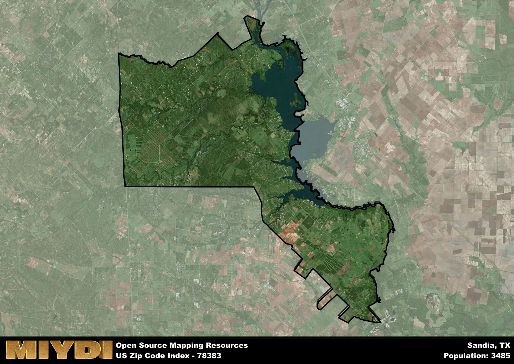

**Area Name:** Sandia

**Zip Code:** 78383

**State:** TX

Sandia is a part of the Alice - TX Micro Area, and makes up  of the Metro's population.  

# Sandia: A Quaint Community in South Texas  

Sandia, Texas, located within the 78383 zip code, is a small community situated in the southern part of the state. Its boundaries encompass a charming rural area, surrounded by vast farmland and ranches. Sandia is located within close proximity to the larger cities of Corpus Christi and Alice, allowing residents easy access to urban amenities while still enjoying a peaceful country setting.

Originally settled in the late 1800s, Sandia was primarily an agricultural community, known for its fertile soil and abundant crops. Over the years, the area has experienced steady growth, attracting new residents seeking a quieter way of life. The name "Sandia" is Spanish for "watermelon," a nod to the region's history of watermelon farming and production.

Today, Sandia maintains its agricultural roots while also embracing modern developments. The area is home to various small businesses, including local shops and restaurants that cater to both residents and passing travelers. Residents can enjoy outdoor activities at nearby Lake Corpus Christi State Park or visit historical sites such as the Old Nueces County Courthouse. Sandia's tight-knit community, rich history, and picturesque surroundings make it a hidden gem in South Texas.

# Sandia Demographics

The population of Sandia is 3485.  
Sandia has a population density of 20.53 per square mile.  
The area of Sandia is 169.77 square miles.  

## Sandia Income and Economic Data

These demographic numbers are sourced from IRS return data, providing comprehensive insights into the population dynamics and economic trends within Sandia.

**Breakdown of return types for Sandia**

The table offers insight into the composition of tax returns filed with the IRS, categorizing them into three main types. Single returns represent filings by individuals, joint returns by married couples, and head of household returns by individuals who qualify as heads of households, typically having dependents. This breakdown provides an understanding of the different filing statuses adopted by taxpayers when submitting their tax documentation.

| Return Types filed for Sandia                              | Percentage          |
|----------------------------------------------------------|---------------------|
| Single Returns                                            | 0.39 |
| Joint Returns                                             | 0.48 |
| Head Household Returns                                    | 0.14 |

The income and economic data presented here is sourced from the IRS income brackets, utilized for categorizing tax returns by income levels. This table displays income ranges for both single filers and married couples, along with the corresponding number of returns and the percentage within each bracket, providing valuable insight into the distribution of taxes across various income groups.

| Bracket Name       | Single Filer Income Range | Married Couple Range | Number of Returns | Percentage of Returns |
|--------------------|----------------------------|----------------------|-------------------|-----------------------|
| 10% Bracket        | Up to $10,275              | Up to $20,550        | 530 | 0.32% |
| 12% Bracket        | $10,276 - $41,775          | $20,551 - $83,550    | 360 | 0.22% |
| 22% Bracket        | $41,776 - $89,075          | $83,551 - $178,150   | 240 | 0.14% |
| 24% Bracket        | $89,076 - $170,050         | $178,151 - $340,100  | 170 | 0.1% |
| 32% Bracket        | $170,051 - $215,950        | $340,101 - $431,900  | 260 | 0.16% |
| 35% Bracket        | $215,951 - $539,900        | $431,901 - $647,850  | 100 | 0.06% |

### Exploring Taxpayer Diversity: A Breakdown of Different Types of Tax Returns in Sandia

The table offers insights into various types of tax returns filed, reflecting different aspects of taxpayer activities and demographics. Categories include charitable returns for donations, dependent returns for claimed dependents, educator population, elderly population, real estate returns, self-employment returns, student loan returns, and unemployment returns, providing valuable insights into taxpayer behavior and demographics.

| Sandia Filing Types                    | Count | Percentage |
|--------------------------------------|-------|------------|
| Charitable Donations                 | 90 | 0.054% |
| Dependents Claimed                   | 40 | 0.024% |
| Educator Residents                   | 40 | 0.024% |
| Elderly Population                   | 540 | 0.33% |
| Farming Population                   | 110 | 0.066% |
| Real Estate Transactions             | 90 | 0.054% |
| Self-Employed Individuals            | 190 | 0.114% |
| Student Loan Cases                   | 60 | 0.036% |
| Unemployment Benefit Filings         | 270 | 0.16% |

## Sandia AI and Census Variables

The values presented in this dataset for Sandia are AI-optimized, streamlined, and categorized into relevant buckets for enhanced utility in AI and mapping programs. These simplified values have been optimized to facilitate efficient analysis and integration into various technological applications, offering users accessible and actionable insights into demographics within the Sandia area.

| AI Variables for Sandia | Value |
|-------------|-------|
| Shape Area | 567098012.21875 |
| Shape Length | 182580.87483613 |
| CBSA Federal Processing Standard Code | 10860 |

## How to use this free AI optimized Geo-Spatial Data for Sandia, TX

This data is made freely available under the Creative Commons license, allowing for unrestricted use for any purpose. Users can access static resources directly from GitHub or leverage more advanced functionalities by utilizing the GeoJSON files. All datasets originate from official government or private sector sources and are meticulously compiled into relevant datasets within QGIS. However, the versatility of the data ensures compatibility with any mapping application.

## Data Accuracy Disclaimer
It's important to note that the data provided here may contain errors or discrepancies and should be considered as 'close enough' for business applications and AI rather than a definitive source of truth. This data is aggregated from multiple sources, some of which publish information on wildly different intervals, leading to potential inconsistencies. Additionally, certain data points may not be corrected for Covid-related changes, further impacting accuracy. Moreover, the assumption that demographic trends are consistent throughout a region may lead to discrepancies, as trends often concentrate in areas of highest population density. As a result, dense areas may be slightly underrepresented, while rural areas may be slightly overrepresented, resulting in a more conservative dataset. Furthermore, the focus primarily on areas within US Major and Minor Statistical areas means that approximately 40 million Americans living outside of these areas may not be fully represented. Lastly, the historical background and area descriptions generated using AI are susceptible to potential mistakes, so users should exercise caution when interpreting the information provided.
