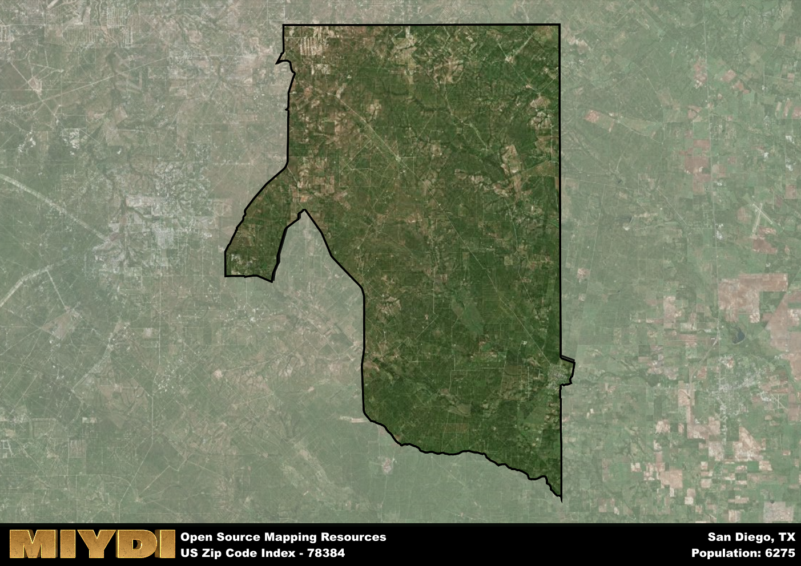

**Area Name:** San Diego

**Zip Code:** 78384

**State:** TX

San Diego is a part of the Alice - TX Micro Area, and makes up 5.02% of the Metro's population.  

# San Diego, TX - Zip Code 78384

Located in the southern region of Texas, zip code 78384 corresponds to the neighborhood of San Diego in the city of San Diego. This area is situated within the larger metropolitan context of San Diego County and serves as a vibrant residential and commercial hub. San Diego seamlessly integrates with neighboring districts and cities, such as Alice and Freer, contributing to the dynamic urban fabric of the region.

San Diego has a rich historical narrative, dating back to its establishment in the late 19th century. Originally founded as a ranching and agricultural community, the area experienced significant growth with the arrival of the railroad in the early 1900s. Over the years, San Diego has evolved into a diverse and thriving neighborhood, attracting residents and businesses with its strong sense of community and historical charm.

Today, San Diego boasts a mix of residential, commercial, and industrial developments, making it a bustling center of activity within San Diego County. The area is known for its agricultural production, particularly in citrus fruits and vegetables, contributing to the local economy. Residents and visitors can enjoy a range of neighborhood-specific services, recreational amenities, and cultural sites, such as parks, museums, and historic landmarks, that showcase the unique character of San Diego within the larger urban landscape.

# San Diego Demographics

The population of San Diego is 6275.  
San Diego has a population density of 17.39 per square mile.  
The area of San Diego is 360.74 square miles.  

## San Diego Income and Economic Data

These demographic numbers are sourced from IRS return data, providing comprehensive insights into the population dynamics and economic trends within San Diego.

**Breakdown of return types for San Diego**

The table offers insight into the composition of tax returns filed with the IRS, categorizing them into three main types. Single returns represent filings by individuals, joint returns by married couples, and head of household returns by individuals who qualify as heads of households, typically having dependents. This breakdown provides an understanding of the different filing statuses adopted by taxpayers when submitting their tax documentation.

| Return Types filed for San Diego                              | Percentage          |
|----------------------------------------------------------|---------------------|
| Single Returns                                            | 0.42 |
| Joint Returns                                             | 0.25 |
| Head Household Returns                                    | 0.31 |

The income and economic data presented here is sourced from the IRS income brackets, utilized for categorizing tax returns by income levels. This table displays income ranges for both single filers and married couples, along with the corresponding number of returns and the percentage within each bracket, providing valuable insight into the distribution of taxes across various income groups.

| Bracket Name       | Single Filer Income Range | Married Couple Range | Number of Returns | Percentage of Returns |
|--------------------|----------------------------|----------------------|-------------------|-----------------------|
| 10% Bracket        | Up to $10,275              | Up to $20,550        | 1130 | 0.48% |
| 12% Bracket        | $10,276 - $41,775          | $20,551 - $83,550    | 690 | 0.29% |
| 22% Bracket        | $41,776 - $89,075          | $83,551 - $178,150   | 280 | 0.12% |
| 24% Bracket        | $89,076 - $170,050         | $178,151 - $340,100  | 110 | 0.05% |
| 32% Bracket        | $170,051 - $215,950        | $340,101 - $431,900  | 130 | 0.06% |
| 35% Bracket        | $215,951 - $539,900        | $431,901 - $647,850  | 0 | 0% |

### Exploring Taxpayer Diversity: A Breakdown of Different Types of Tax Returns in San Diego

The table offers insights into various types of tax returns filed, reflecting different aspects of taxpayer activities and demographics. Categories include charitable returns for donations, dependent returns for claimed dependents, educator population, elderly population, real estate returns, self-employment returns, student loan returns, and unemployment returns, providing valuable insights into taxpayer behavior and demographics.

| San Diego Filing Types                    | Count | Percentage |
|--------------------------------------|-------|------------|
| Charitable Donations                 | 40 | 0.017% |
| Dependents Claimed                   | 50 | 0.021% |
| Educator Residents                   | 40 | 0.017% |
| Elderly Population                   | 450 | 0.19% |
| Farming Population                   | 210 | 0.09% |
| Real Estate Transactions             | 30 | 0.013% |
| Self-Employed Individuals            | 290 | 0.124% |
| Student Loan Cases                   | 70 | 0.03% |
| Unemployment Benefit Filings         | 600 | 0.26% |

### Exploring Real Estate Trends: A Comprehensive Analysis of the San Diego Area and its Neighbors

This table contains an in-depth examination of the real estate market in the San Diego area. Sourced from trusted real estate market firms, this dataset provides a wealth of raw data detailing the local real estate landscape, along with comparative analyses juxtaposing the market dynamics with those of neighboring areas. Explore the intricacies of the San Diego real estate market and gain valuable insights into its relationship with adjacent regions.

| Real Estate Data for San Diego                       | Value    |
|------------------------------------------------|----------|
| Average Listing Price for San Diego               | 179933 |
| Median Listing Price for San Diego                | 168000 |
| Median Days on Market for San Diego               | 219 |
| Median Listing Price per Square Foot for San Diego| 40 |
| Median Square Feet for San Diego                  | 1200 |
| Real Estate Prices to Income Ratio           | 127.15% |
| Price per Square Foot Ratio                  | 96.77% |
| Price Median Ratio                           | 69.42% |
| Market Sales Speed Ratio                     | 242.4% |

This table offers essential real estate data for the San Diego area, including average and median listing prices, median days on market, and property size. It also presents ratio metrics as percentages, providing insights into how the local market compares to the surrounding region. A ratio of 100% signifies performance in line with the regional average, while values above or below indicate overperformance or underperformance, respectively, relative to expectations.

## San Diego Sports and Recreation Data

#### Annual Youth Sports Spending for San Diego

This table provides fundamental insights into the Sports and Recreation data for the San Diego area, detailing the estimated annual expenditure on Youth Athletics. This includes estimated spending by the major consumer brackets. 
| Sports Spending for San Diego| Value |
|-------------------------|-------|
| Athlete Spending Compared to the region | 52.75% |
| Total Youth Athlete Spending | 79,454 |
| Athletic Spending - Essential Focused Consumer | 47,692 |
| Athletic Spending - Typical Consumer | 42,358 |
| Athletic Spending - Affluent Consumers | 89,198 |

#### Youth Coaching Estimates for San Diego

This table presents the estimated number of coaches for the San Diego area, derived from comprehensive national coaching surveys and athletic participation rates by state. It offers valuable insights into the vital role of coaching personnel in fostering athletic development and facilitating sports participation within the local community.

| Coaching Data for San Diego | Value |
|-------------|-------|
| Total Coaches | 103 |
| Paid Coaches | 27 |
| Volunteer Coaches | 76 |

#### Youth Athlete Participation for San Diego

This table shows the estimated total number of youth athletes in the San Diego area, sourced from comprehensive national coaching surveys and athletic participation rates by state.

| Total YA Athletes in San Diego | Value |
|-------------|-------|
| Total High School Athletes | 157 |
| Total Youth Athletes | 470 |
| Total Young Adult Athletes | 314 |
| Total Athletes to Age 25 | 941 |

#### High School Age Athletes - Breakdown by Sport for San Diego

This table shows insights regarding high school age estimated players by sport in the San Diego area, derived from national and state-level athletic participation trends. 

| HS Players by Sport in San Diego | Value |
|-------------|-------|
| Football Players | 36 |
| Basketball Players | 22 |
| Soccer Players | 17 |
| Volleyball Players | 11 |
| Baseball Players | 19 |
| Tennis Players | 9 |
| Track Athletes | 27 |
| Golf Players | 5 |
| Swimming Athletes | 5 |
| Wrestling Competitors | 5 |
| Lacrosse Players | 0 |

Estimating the number of younger athletes presents unique challenges due to their varied starting ages, typically beginning around six years old, and a gradual decline in participation rates as they age. Unlike high school-aged athletes, younger athletes are less likely to switch sports as they grow older, contributing to the stability of participation numbers within specific sports at younger ages.  

As a general trend, the total number of younger athletes is approximately three times the number of high school-aged athletes, underscoring the significant presence of youth athletes in sports programs and highlighting the importance of early engagement in athletic activities.

## San Diego AI and Census Variables

The values presented in this dataset for San Diego are AI-optimized, streamlined, and categorized into relevant buckets for enhanced utility in AI and mapping programs. These simplified values have been optimized to facilitate efficient analysis and integration into various technological applications, offering users accessible and actionable insights into demographics within the San Diego area.

| AI Variables for San Diego | Value |
|-------------|-------|
| Shape Area | 1200540059.48047 |
| Shape Length | 178411.508744116 |
| CBSA Federal Processing Standard Code | 10860 |
| RE Price per Square Foot Ratio | 96.77% |
| RE Price Average Ratio | 66.65% |
| RE Speed Ratio | 242.4% |
| RE Income Ratio | 127.15% |
| Single Opportunity Flag | 5 |
| Single Parent Risk Flag | 6 |
| Elderly Opportunity Flag | 2 |
| Farm Opportunity Flag | 5 |
| Unemployment Risk | 7 |
| Educator Opportunity Flag | 2 |
| RE Affordability Index Flag | 3 |
| Income Bracket Flag | 3 |
| RE Income Flag | 4 |
| RE Median Square Footage Price Flag | 3 |
| RE Median Square Footage Size Flag | 1 |
| RE Activity Flag | 7 |
| Poverty Line Risk Flag | 2 |

## How to use this free AI optimized Geo-Spatial Data for San Diego, TX

This data is made freely available under the Creative Commons license, allowing for unrestricted use for any purpose. Users can access static resources directly from GitHub or leverage more advanced functionalities by utilizing the GeoJSON files. All datasets originate from official government or private sector sources and are meticulously compiled into relevant datasets within QGIS. However, the versatility of the data ensures compatibility with any mapping application.

## Data Accuracy Disclaimer
It's important to note that the data provided here may contain errors or discrepancies and should be considered as 'close enough' for business applications and AI rather than a definitive source of truth. This data is aggregated from multiple sources, some of which publish information on wildly different intervals, leading to potential inconsistencies. Additionally, certain data points may not be corrected for Covid-related changes, further impacting accuracy. Moreover, the assumption that demographic trends are consistent throughout a region may lead to discrepancies, as trends often concentrate in areas of highest population density. As a result, dense areas may be slightly underrepresented, while rural areas may be slightly overrepresented, resulting in a more conservative dataset. Furthermore, the focus primarily on areas within US Major and Minor Statistical areas means that approximately 40 million Americans living outside of these areas may not be fully represented. Lastly, the historical background and area descriptions generated using AI are susceptible to potential mistakes, so users should exercise caution when interpreting the information provided.
