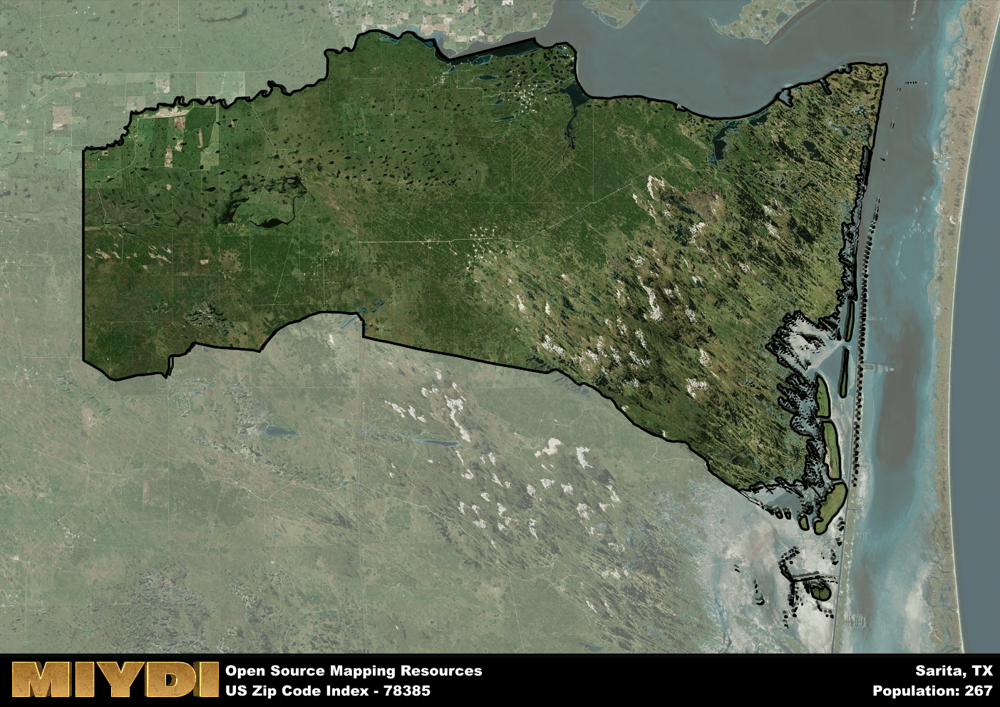

**Area Name:** Sarita

**Zip Code:** 78385

**State:** TX

Sarita is a part of the Kingsville - TX Micro Area, and makes up  of the Metro's population.  

# Sarita: A Historical and Vibrant Zip Code Area in South Texas

Located in the southern region of Texas, zip code 78385 encompasses the rural community of Sarita. Situated in Kenedy County, Sarita is a small town surrounded by vast ranch lands and the stunning natural beauty of the South Texas Plains. Despite its small size, Sarita serves as a crucial hub for local ranching and agricultural activities, connecting neighboring communities and providing essential services to residents in the area.

Sarita has a rich historical background, originally founded as a ranching outpost in the late 19th century. The town was named after the daughter of its founder, John G. Kenedy, a prominent figure in the development of South Texas. Over the years, Sarita has evolved into a tight-knit community that cherishes its heritage and traditions, evident in the preserved historic buildings and landmarks that dot the town. The resilience and tenacity of its residents have played a significant role in shaping Sarita's identity as a place with a deep sense of pride in its past.

Presently, Sarita thrives as a center for agriculture and ranching in the region, with local businesses catering to the needs of farmers and ranchers. The town boasts a range of services, including family-owned stores, restaurants, and recreational facilities that cater to both residents and visitors. Sarita is also home to several cultural sites that showcase the town's unique heritage, providing opportunities for visitors to learn about its history and traditions. With its picturesque landscapes and vibrant community spirit, Sarita continues to be a treasured gem in the heart of South Texas.

# Sarita Demographics

The population of Sarita is 267.  
Sarita has a population density of 0.62 per square mile.  
The area of Sarita is 433.97 square miles.  

## Sarita AI and Census Variables

The values presented in this dataset for Sarita are AI-optimized, streamlined, and categorized into relevant buckets for enhanced utility in AI and mapping programs. These simplified values have been optimized to facilitate efficient analysis and integration into various technological applications, offering users accessible and actionable insights into demographics within the Sarita area.

| AI Variables for Sarita | Value |
|-------------|-------|
| Shape Area | 1425287447.88672 |
| Shape Length | 627875.753735162 |
| CBSA Federal Processing Standard Code | 28780 |

## How to use this free AI optimized Geo-Spatial Data for Sarita, TX

This data is made freely available under the Creative Commons license, allowing for unrestricted use for any purpose. Users can access static resources directly from GitHub or leverage more advanced functionalities by utilizing the GeoJSON files. All datasets originate from official government or private sector sources and are meticulously compiled into relevant datasets within QGIS. However, the versatility of the data ensures compatibility with any mapping application.

## Data Accuracy Disclaimer
It's important to note that the data provided here may contain errors or discrepancies and should be considered as 'close enough' for business applications and AI rather than a definitive source of truth. This data is aggregated from multiple sources, some of which publish information on wildly different intervals, leading to potential inconsistencies. Additionally, certain data points may not be corrected for Covid-related changes, further impacting accuracy. Moreover, the assumption that demographic trends are consistent throughout a region may lead to discrepancies, as trends often concentrate in areas of highest population density. As a result, dense areas may be slightly underrepresented, while rural areas may be slightly overrepresented, resulting in a more conservative dataset. Furthermore, the focus primarily on areas within US Major and Minor Statistical areas means that approximately 40 million Americans living outside of these areas may not be fully represented. Lastly, the historical background and area descriptions generated using AI are susceptible to potential mistakes, so users should exercise caution when interpreting the information provided.
