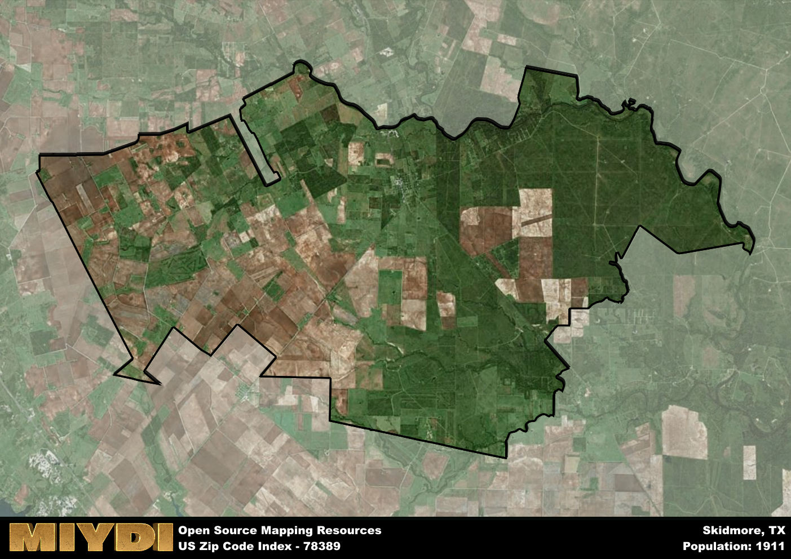

**Area Name:** Skidmore

**Zip Code:** 78389

**State:** TX

Skidmore is a part of the Beeville - TX Micro Area, and makes up 0.47% of the Metro's population.  

# Skidmore: A Historic Neighborhood in South Texas

Skidmore, corresponding to the zip code 78389, is a small rural community located in southern Texas, approximately 50 miles northwest of Corpus Christi. Bordered by the towns of Beeville and Mathis, Skidmore is nestled in the heart of cattle country, surrounded by vast open fields and ranches. Despite its rural setting, Skidmore benefits from its proximity to major transportation routes, including Highway 181, which provides easy access to nearby cities and urban centers.

Established in the late 19th century, Skidmore has a rich history closely tied to agriculture and ranching. Named after William Skidmore, an early settler in the area, the town experienced steady growth with the arrival of the railroad in the early 1900s. Skidmore is perhaps most famously known for the 1983 murder of local resident Vicki Lynn Weaver, a tragic event that garnered national attention and shaped the town's identity in the following years.

Today, Skidmore retains its rural charm while offering a range of services and amenities to its residents. The economy is primarily driven by agriculture, with many residents working in farming and ranching. The town boasts a few local businesses, including cafes, shops, and service providers. Skidmore also features a community park, providing recreational opportunities for residents, and is home to several historic sites that showcase its unique heritage. Overall, Skidmore remains a close-knit community with a strong sense of history and pride.

# Skidmore Demographics

The population of Skidmore is 1911.  
Skidmore has a population density of 15.56 per square mile.  
The area of Skidmore is 122.85 square miles.  

## Skidmore Income and Economic Data

These demographic numbers are sourced from IRS return data, providing comprehensive insights into the population dynamics and economic trends within Skidmore.

**Breakdown of return types for Skidmore**

The table offers insight into the composition of tax returns filed with the IRS, categorizing them into three main types. Single returns represent filings by individuals, joint returns by married couples, and head of household returns by individuals who qualify as heads of households, typically having dependents. This breakdown provides an understanding of the different filing statuses adopted by taxpayers when submitting their tax documentation.

| Return Types filed for Skidmore                              | Percentage          |
|----------------------------------------------------------|---------------------|
| Single Returns                                            | 0.43 |
| Joint Returns                                             | 0.35 |
| Head Household Returns                                    | 0.2 |

The income and economic data presented here is sourced from the IRS income brackets, utilized for categorizing tax returns by income levels. This table displays income ranges for both single filers and married couples, along with the corresponding number of returns and the percentage within each bracket, providing valuable insight into the distribution of taxes across various income groups.

| Bracket Name       | Single Filer Income Range | Married Couple Range | Number of Returns | Percentage of Returns |
|--------------------|----------------------------|----------------------|-------------------|-----------------------|
| 10% Bracket        | Up to $10,275              | Up to $20,550        | 320 | 0.39% |
| 12% Bracket        | $10,276 - $41,775          | $20,551 - $83,550    | 220 | 0.27% |
| 22% Bracket        | $41,776 - $89,075          | $83,551 - $178,150   | 110 | 0.13% |
| 24% Bracket        | $89,076 - $170,050         | $178,151 - $340,100  | 70 | 0.09% |
| 32% Bracket        | $170,051 - $215,950        | $340,101 - $431,900  | 100 | 0.12% |
| 35% Bracket        | $215,951 - $539,900        | $431,901 - $647,850  | 0 | 0% |

### Exploring Taxpayer Diversity: A Breakdown of Different Types of Tax Returns in Skidmore

The table offers insights into various types of tax returns filed, reflecting different aspects of taxpayer activities and demographics. Categories include charitable returns for donations, dependent returns for claimed dependents, educator population, elderly population, real estate returns, self-employment returns, student loan returns, and unemployment returns, providing valuable insights into taxpayer behavior and demographics.

| Skidmore Filing Types                    | Count | Percentage |
|--------------------------------------|-------|------------|
| Charitable Donations                 | 0 | 0% |
| Dependents Claimed                   | 0 | 0% |
| Educator Residents                   | 0 | 0% |
| Elderly Population                   | 200 | 0.24% |
| Farming Population                   | 80 | 0.098% |
| Real Estate Transactions             | 0 | 0% |
| Self-Employed Individuals            | 100 | 0.122% |
| Student Loan Cases                   | 30 | 0.037% |
| Unemployment Benefit Filings         | 120 | 0.15% |

### Exploring Real Estate Trends: A Comprehensive Analysis of the Skidmore Area and its Neighbors

This table contains an in-depth examination of the real estate market in the Skidmore area. Sourced from trusted real estate market firms, this dataset provides a wealth of raw data detailing the local real estate landscape, along with comparative analyses juxtaposing the market dynamics with those of neighboring areas. Explore the intricacies of the Skidmore real estate market and gain valuable insights into its relationship with adjacent regions.

| Real Estate Data for Skidmore                       | Value    |
|------------------------------------------------|----------|
| Average Listing Price for Skidmore               | 252507 |
| Median Listing Price for Skidmore                | 157200 |
| Median Days on Market for Skidmore               | 104 |
| Median Listing Price per Square Foot for Skidmore| 01 |
| Median Square Feet for Skidmore                  | 1454 |
| Real Estate Prices to Income Ratio           | 122.16% |
| Price per Square Foot Ratio                  | 61.89% |
| Price Median Ratio                           | 60.08% |
| Market Sales Speed Ratio                     | 172.4% |

This table offers essential real estate data for the Skidmore area, including average and median listing prices, median days on market, and property size. It also presents ratio metrics as percentages, providing insights into how the local market compares to the surrounding region. A ratio of 100% signifies performance in line with the regional average, while values above or below indicate overperformance or underperformance, respectively, relative to expectations.

## Skidmore Sports and Recreation Data

#### Annual Youth Sports Spending for Skidmore

This table provides fundamental insights into the Sports and Recreation data for the Skidmore area, detailing the estimated annual expenditure on Youth Athletics. This includes estimated spending by the major consumer brackets. 
| Sports Spending for Skidmore| Value |
|-------------------------|-------|
| Athlete Spending Compared to the region | 10.20% |
| Total Youth Athlete Spending | 98,678 |
| Athletic Spending - Essential Focused Consumer | 5,000 |
| Athletic Spending - Typical Consumer | 34,971 |
| Athletic Spending - Affluent Consumers | 18,644 |

#### Youth Coaching Estimates for Skidmore

This table presents the estimated number of coaches for the Skidmore area, derived from comprehensive national coaching surveys and athletic participation rates by state. It offers valuable insights into the vital role of coaching personnel in fostering athletic development and facilitating sports participation within the local community.

| Coaching Data for Skidmore | Value |
|-------------|-------|
| Total Coaches | 31 |
| Paid Coaches | 8 |
| Volunteer Coaches | 23 |

#### Youth Athlete Participation for Skidmore

This table shows the estimated total number of youth athletes in the Skidmore area, sourced from comprehensive national coaching surveys and athletic participation rates by state.

| Total YA Athletes in Skidmore | Value |
|-------------|-------|
| Total High School Athletes | 48 |
| Total Youth Athletes | 143 |
| Total Young Adult Athletes | 96 |
| Total Athletes to Age 25 | 287 |

#### High School Age Athletes - Breakdown by Sport for Skidmore

This table shows insights regarding high school age estimated players by sport in the Skidmore area, derived from national and state-level athletic participation trends. 

| HS Players by Sport in Skidmore | Value |
|-------------|-------|
| Football Players | 11 |
| Basketball Players | 7 |
| Soccer Players | 5 |
| Volleyball Players | 3 |
| Baseball Players | 6 |
| Tennis Players | 3 |
| Track Athletes | 8 |
| Golf Players | 1 |
| Swimming Athletes | 1 |
| Wrestling Competitors | 1 |
| Lacrosse Players | 0 |

Estimating the number of younger athletes presents unique challenges due to their varied starting ages, typically beginning around six years old, and a gradual decline in participation rates as they age. Unlike high school-aged athletes, younger athletes are less likely to switch sports as they grow older, contributing to the stability of participation numbers within specific sports at younger ages.  

As a general trend, the total number of younger athletes is approximately three times the number of high school-aged athletes, underscoring the significant presence of youth athletes in sports programs and highlighting the importance of early engagement in athletic activities.

## Skidmore AI and Census Variables

The values presented in this dataset for Skidmore are AI-optimized, streamlined, and categorized into relevant buckets for enhanced utility in AI and mapping programs. These simplified values have been optimized to facilitate efficient analysis and integration into various technological applications, offering users accessible and actionable insights into demographics within the Skidmore area.

| AI Variables for Skidmore | Value |
|-------------|-------|
| Shape Area | 411396752.679688 |
| Shape Length | 134653.976023196 |
| CBSA Federal Processing Standard Code | 13300 |
| RE Price per Square Foot Ratio | 61.89% |
| RE Price Average Ratio | 77.72% |
| RE Speed Ratio | 172.4% |
| RE Income Ratio | 122.16% |
| Elderly Opportunity Flag | 3 |
| Farm Opportunity Flag | 7 |
| RE Affordability Index Flag | 3 |
| Income Bracket Flag | 3 |
| RE Income Flag | 4 |
| RE Median Square Footage Price Flag | 2 |
| RE Median Square Footage Size Flag | 2 |
| RE Activity Flag | 7 |
| Poverty Line Risk Flag | 4 |

## How to use this free AI optimized Geo-Spatial Data for Skidmore, TX

This data is made freely available under the Creative Commons license, allowing for unrestricted use for any purpose. Users can access static resources directly from GitHub or leverage more advanced functionalities by utilizing the GeoJSON files. All datasets originate from official government or private sector sources and are meticulously compiled into relevant datasets within QGIS. However, the versatility of the data ensures compatibility with any mapping application.

## Data Accuracy Disclaimer
It's important to note that the data provided here may contain errors or discrepancies and should be considered as 'close enough' for business applications and AI rather than a definitive source of truth. This data is aggregated from multiple sources, some of which publish information on wildly different intervals, leading to potential inconsistencies. Additionally, certain data points may not be corrected for Covid-related changes, further impacting accuracy. Moreover, the assumption that demographic trends are consistent throughout a region may lead to discrepancies, as trends often concentrate in areas of highest population density. As a result, dense areas may be slightly underrepresented, while rural areas may be slightly overrepresented, resulting in a more conservative dataset. Furthermore, the focus primarily on areas within US Major and Minor Statistical areas means that approximately 40 million Americans living outside of these areas may not be fully represented. Lastly, the historical background and area descriptions generated using AI are susceptible to potential mistakes, so users should exercise caution when interpreting the information provided.
