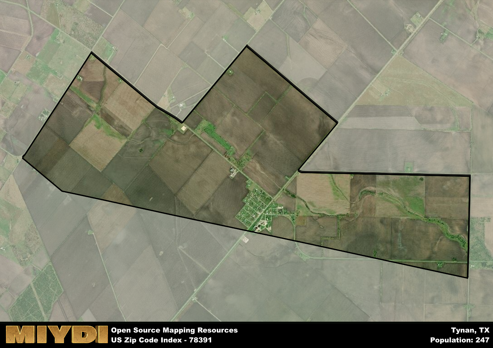

**Area Name:** Tynan

**Zip Code:** 78391

**State:** TX

Tynan is a part of the Beeville - TX Micro Area, and makes up  of the Metro's population.  

# Discover the Charming Neighborhood of Tynan, Zip Code 78391

Nestled in the heart of southern Texas, the zip code 78391 corresponds to the quaint neighborhood of Tynan. Bordered by vast farmlands and rural landscapes, Tynan is a peaceful oasis just a short drive away from the bustling city of Corpus Christi. Its proximity to major highways allows for easy access to nearby towns and cities, making it a well-connected and integrated part of the larger metropolitan area.

Tynan has a rich historical tapestry that dates back to its founding in the late 19th century. Originally established as a railway stop, the area quickly grew into a thriving community centered around agriculture and ranching. Over the years, Tynan has maintained its small-town charm while adapting to modern developments, creating a unique blend of old-world charm and contemporary convenience.

Today, Tynan boasts a tight-knit community that takes pride in its agricultural heritage. Residents enjoy a variety of local businesses, including family-owned farms, cozy diners, and antique shops. The neighborhood also offers plenty of green spaces for outdoor recreation, such as parks and nature trails. Visitors can explore historic sites like the Tynan Community Center, which serves as a hub for cultural events and community gatherings.

# Tynan Demographics

The population of Tynan is 247.  
Tynan has a population density of 37.09 per square mile.  
The area of Tynan is 6.66 square miles.  

## Tynan Income and Economic Data

These demographic numbers are sourced from IRS return data, providing comprehensive insights into the population dynamics and economic trends within Tynan.

**Breakdown of return types for Tynan**

The table offers insight into the composition of tax returns filed with the IRS, categorizing them into three main types. Single returns represent filings by individuals, joint returns by married couples, and head of household returns by individuals who qualify as heads of households, typically having dependents. This breakdown provides an understanding of the different filing statuses adopted by taxpayers when submitting their tax documentation.

| Return Types filed for Tynan                              | Percentage          |
|----------------------------------------------------------|---------------------|
| Single Returns                                            | 0.46 |
| Joint Returns                                             | 0.31 |
| Head Household Returns                                    | 0.23 |

The income and economic data presented here is sourced from the IRS income brackets, utilized for categorizing tax returns by income levels. This table displays income ranges for both single filers and married couples, along with the corresponding number of returns and the percentage within each bracket, providing valuable insight into the distribution of taxes across various income groups.

| Bracket Name       | Single Filer Income Range | Married Couple Range | Number of Returns | Percentage of Returns |
|--------------------|----------------------------|----------------------|-------------------|-----------------------|
| 10% Bracket        | Up to $10,275              | Up to $20,550        | 50 | 0.38% |
| 12% Bracket        | $10,276 - $41,775          | $20,551 - $83,550    | 60 | 0.46% |
| 22% Bracket        | $41,776 - $89,075          | $83,551 - $178,150   | 0 | 0% |
| 24% Bracket        | $89,076 - $170,050         | $178,151 - $340,100  | 20 | 0.15% |
| 32% Bracket        | $170,051 - $215,950        | $340,101 - $431,900  | 0 | 0% |
| 35% Bracket        | $215,951 - $539,900        | $431,901 - $647,850  | 0 | 0% |

### Exploring Taxpayer Diversity: A Breakdown of Different Types of Tax Returns in Tynan

The table offers insights into various types of tax returns filed, reflecting different aspects of taxpayer activities and demographics. Categories include charitable returns for donations, dependent returns for claimed dependents, educator population, elderly population, real estate returns, self-employment returns, student loan returns, and unemployment returns, providing valuable insights into taxpayer behavior and demographics.

| Tynan Filing Types                    | Count | Percentage |
|--------------------------------------|-------|------------|
| Charitable Donations                 | 0 | 0% |
| Dependents Claimed                   | 0 | 0% |
| Educator Residents                   | 0 | 0% |
| Elderly Population                   | 30 | 0.23% |
| Farming Population                   | 0 | 0% |
| Real Estate Transactions             | 0 | 0% |
| Self-Employed Individuals            | 0 | 0% |
| Student Loan Cases                   | 0 | 0% |
| Unemployment Benefit Filings         | 20 | 0.15% |

## Tynan AI and Census Variables

The values presented in this dataset for Tynan are AI-optimized, streamlined, and categorized into relevant buckets for enhanced utility in AI and mapping programs. These simplified values have been optimized to facilitate efficient analysis and integration into various technological applications, offering users accessible and actionable insights into demographics within the Tynan area.

| AI Variables for Tynan | Value |
|-------------|-------|
| Shape Area | 22287259.1914063 |
| Shape Length | 26632.1914146334 |
| CBSA Federal Processing Standard Code | 13300 |

## How to use this free AI optimized Geo-Spatial Data for Tynan, TX

This data is made freely available under the Creative Commons license, allowing for unrestricted use for any purpose. Users can access static resources directly from GitHub or leverage more advanced functionalities by utilizing the GeoJSON files. All datasets originate from official government or private sector sources and are meticulously compiled into relevant datasets within QGIS. However, the versatility of the data ensures compatibility with any mapping application.

## Data Accuracy Disclaimer
It's important to note that the data provided here may contain errors or discrepancies and should be considered as 'close enough' for business applications and AI rather than a definitive source of truth. This data is aggregated from multiple sources, some of which publish information on wildly different intervals, leading to potential inconsistencies. Additionally, certain data points may not be corrected for Covid-related changes, further impacting accuracy. Moreover, the assumption that demographic trends are consistent throughout a region may lead to discrepancies, as trends often concentrate in areas of highest population density. As a result, dense areas may be slightly underrepresented, while rural areas may be slightly overrepresented, resulting in a more conservative dataset. Furthermore, the focus primarily on areas within US Major and Minor Statistical areas means that approximately 40 million Americans living outside of these areas may not be fully represented. Lastly, the historical background and area descriptions generated using AI are susceptible to potential mistakes, so users should exercise caution when interpreting the information provided.
