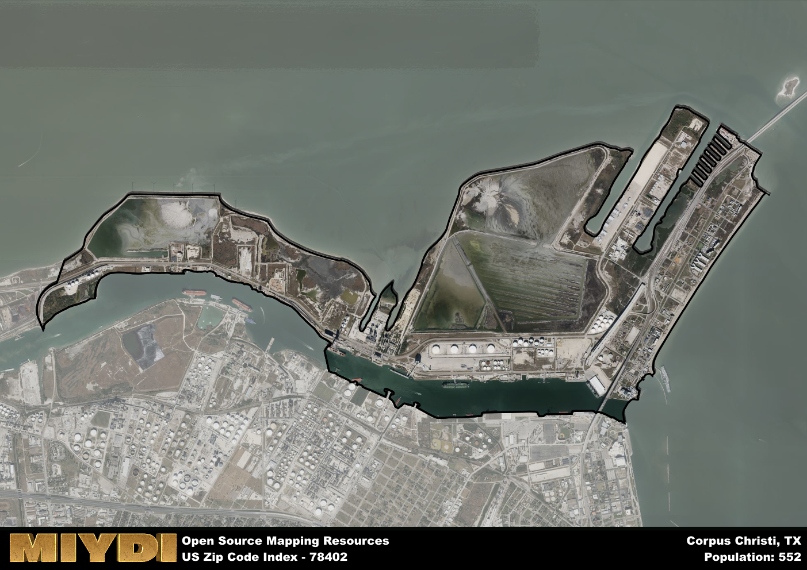

**Area Name:** Corpus Christi

**Zip Code:** 78402

**State:** TX

Corpus Christi is a part of the Corpus Christi - TX Metro Area, and makes up  of the Metro's population.  

# Del Mar District: A Historic Neighborhood in Corpus Christi

The zip code 78402 corresponds to the Del Mar District in Corpus Christi, Texas. Situated in the heart of the city, this neighborhood is bordered by the Corpus Christi Bay to the east and downtown Corpus Christi to the west. It is an integral part of the larger metropolitan area of Corpus Christi, known for its vibrant cultural scene, beautiful beaches, and thriving port industry.

The Del Mar District has a rich historical narrative that dates back to the early days of Corpus Christi. Originally settled by Spanish explorers and later by German immigrants, the area saw significant growth during the oil boom in the early 20th century. Today, it is a diverse and bustling neighborhood that is home to a mix of residential, commercial, and industrial spaces.

Currently, the Del Mar District is a hub of economic activity in Corpus Christi. The neighborhood is home to a variety of businesses, from small local shops to large industrial complexes. Residents and visitors alike can enjoy the many recreational amenities in the area, including parks, restaurants, and cultural attractions. The Del Mar District also boasts a number of historic sites, such as the Old Bayview Cemetery and the Selena Memorial. This neighborhood truly encapsulates the unique blend of history, culture, and modernity that defines Corpus Christi.

# Corpus Christi Demographics

The population of Corpus Christi is 552.  
Corpus Christi has a population density of 134.63 per square mile.  
The area of Corpus Christi is 4.1 square miles.  

## Corpus Christi Income and Economic Data

These demographic numbers are sourced from IRS return data, providing comprehensive insights into the population dynamics and economic trends within Corpus Christi.

**Breakdown of return types for Corpus Christi**

The table offers insight into the composition of tax returns filed with the IRS, categorizing them into three main types. Single returns represent filings by individuals, joint returns by married couples, and head of household returns by individuals who qualify as heads of households, typically having dependents. This breakdown provides an understanding of the different filing statuses adopted by taxpayers when submitting their tax documentation.

| Return Types filed for Corpus Christi                              | Percentage          |
|----------------------------------------------------------|---------------------|
| Single Returns                                            | 0.54 |
| Joint Returns                                             | 0.35 |
| Head Household Returns                                    | 0 |

The income and economic data presented here is sourced from the IRS income brackets, utilized for categorizing tax returns by income levels. This table displays income ranges for both single filers and married couples, along with the corresponding number of returns and the percentage within each bracket, providing valuable insight into the distribution of taxes across various income groups.

| Bracket Name       | Single Filer Income Range | Married Couple Range | Number of Returns | Percentage of Returns |
|--------------------|----------------------------|----------------------|-------------------|-----------------------|
| 10% Bracket        | Up to $10,275              | Up to $20,550        | 80 | 0.31% |
| 12% Bracket        | $10,276 - $41,775          | $20,551 - $83,550    | 60 | 0.23% |
| 22% Bracket        | $41,776 - $89,075          | $83,551 - $178,150   | 40 | 0.15% |
| 24% Bracket        | $89,076 - $170,050         | $178,151 - $340,100  | 20 | 0.08% |
| 32% Bracket        | $170,051 - $215,950        | $340,101 - $431,900  | 60 | 0.23% |
| 35% Bracket        | $215,951 - $539,900        | $431,901 - $647,850  | 0 | 0% |

### Exploring Taxpayer Diversity: A Breakdown of Different Types of Tax Returns in Corpus Christi

The table offers insights into various types of tax returns filed, reflecting different aspects of taxpayer activities and demographics. Categories include charitable returns for donations, dependent returns for claimed dependents, educator population, elderly population, real estate returns, self-employment returns, student loan returns, and unemployment returns, providing valuable insights into taxpayer behavior and demographics.

| Corpus Christi Filing Types                    | Count | Percentage |
|--------------------------------------|-------|------------|
| Charitable Donations                 | 0 | 0% |
| Dependents Claimed                   | 0 | 0% |
| Educator Residents                   | 0 | 0% |
| Elderly Population                   | 110 | 0.42% |
| Farming Population                   | 0 | 0% |
| Real Estate Transactions             | 0 | 0% |
| Self-Employed Individuals            | 30 | 0.115% |
| Student Loan Cases                   | 0 | 0% |
| Unemployment Benefit Filings         | 40 | 0.15% |

## Corpus Christi AI and Census Variables

The values presented in this dataset for Corpus Christi are AI-optimized, streamlined, and categorized into relevant buckets for enhanced utility in AI and mapping programs. These simplified values have been optimized to facilitate efficient analysis and integration into various technological applications, offering users accessible and actionable insights into demographics within the Corpus Christi area.

| AI Variables for Corpus Christi | Value |
|-------------|-------|
| Shape Area | 13625148.3164063 |
| Shape Length | 34675.609705207 |
| CBSA Federal Processing Standard Code | 18580 |

## How to use this free AI optimized Geo-Spatial Data for Corpus Christi, TX

This data is made freely available under the Creative Commons license, allowing for unrestricted use for any purpose. Users can access static resources directly from GitHub or leverage more advanced functionalities by utilizing the GeoJSON files. All datasets originate from official government or private sector sources and are meticulously compiled into relevant datasets within QGIS. However, the versatility of the data ensures compatibility with any mapping application.

## Data Accuracy Disclaimer
It's important to note that the data provided here may contain errors or discrepancies and should be considered as 'close enough' for business applications and AI rather than a definitive source of truth. This data is aggregated from multiple sources, some of which publish information on wildly different intervals, leading to potential inconsistencies. Additionally, certain data points may not be corrected for Covid-related changes, further impacting accuracy. Moreover, the assumption that demographic trends are consistent throughout a region may lead to discrepancies, as trends often concentrate in areas of highest population density. As a result, dense areas may be slightly underrepresented, while rural areas may be slightly overrepresented, resulting in a more conservative dataset. Furthermore, the focus primarily on areas within US Major and Minor Statistical areas means that approximately 40 million Americans living outside of these areas may not be fully represented. Lastly, the historical background and area descriptions generated using AI are susceptible to potential mistakes, so users should exercise caution when interpreting the information provided.
