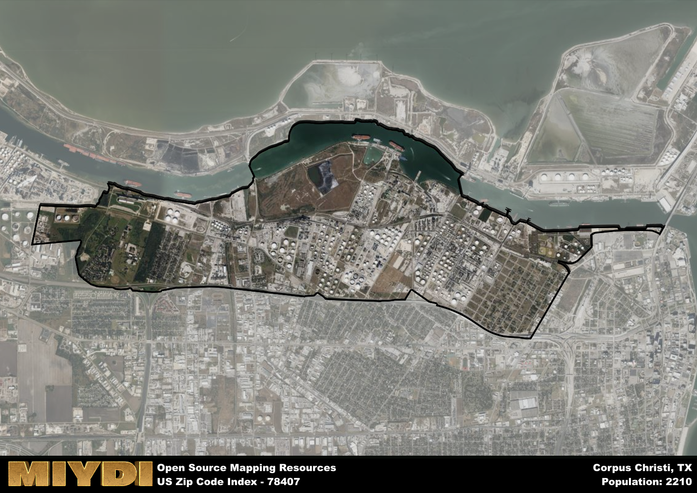

**Area Name:** Corpus Christi

**Zip Code:** 78407

**State:** TX

Corpus Christi is a part of the Corpus Christi - TX Metro Area, and makes up  of the Metro's population.  

# Zip Code 78407: Calallen Neighborhood in Corpus Christi

Located in the city of Corpus Christi, the zip code area of 78407 corresponds to the Calallen neighborhood. Situated in the northwest part of the city, Calallen is bordered by the Nueces River to the east and is in close proximity to the cities of Robstown and Banquete. This neighborhood is an integral part of the greater metropolitan area of Corpus Christi, contributing to the diverse urban fabric of the region.

Calallen has a rich historical narrative that dates back to its early settlement by ranchers and farmers in the 1800s. The neighborhood experienced significant growth with the development of transportation infrastructure, such as the construction of highways and railroads, which facilitated trade and commerce in the area. Calallen is known for its agricultural heritage, with a focus on farming and ranching activities that have shaped its identity over the years.

Today, Calallen is a thriving community with a mix of residential, commercial, and industrial areas. The neighborhood boasts a range of economic activities, including retail shops, restaurants, and small businesses that cater to the needs of its residents. Calallen also offers a variety of recreational amenities, such as parks, sports facilities, and community centers, providing opportunities for leisure and social interaction. Additionally, the area is home to cultural and historic sites that showcase its unique heritage and contribute to its vibrant character within the broader Corpus Christi area.

# Corpus Christi Demographics

The population of Corpus Christi is 2210.  
Corpus Christi has a population density of 471.22 per square mile.  
The area of Corpus Christi is 4.69 square miles.  

## Corpus Christi Income and Economic Data

These demographic numbers are sourced from IRS return data, providing comprehensive insights into the population dynamics and economic trends within Corpus Christi.

**Breakdown of return types for Corpus Christi**

The table offers insight into the composition of tax returns filed with the IRS, categorizing them into three main types. Single returns represent filings by individuals, joint returns by married couples, and head of household returns by individuals who qualify as heads of households, typically having dependents. This breakdown provides an understanding of the different filing statuses adopted by taxpayers when submitting their tax documentation.

| Return Types filed for Corpus Christi                              | Percentage          |
|----------------------------------------------------------|---------------------|
| Single Returns                                            | 0.51 |
| Joint Returns                                             | 0.21 |
| Head Household Returns                                    | 0.25 |

The income and economic data presented here is sourced from the IRS income brackets, utilized for categorizing tax returns by income levels. This table displays income ranges for both single filers and married couples, along with the corresponding number of returns and the percentage within each bracket, providing valuable insight into the distribution of taxes across various income groups.

| Bracket Name       | Single Filer Income Range | Married Couple Range | Number of Returns | Percentage of Returns |
|--------------------|----------------------------|----------------------|-------------------|-----------------------|
| 10% Bracket        | Up to $10,275              | Up to $20,550        | 340 | 0.5% |
| 12% Bracket        | $10,276 - $41,775          | $20,551 - $83,550    | 210 | 0.31% |
| 22% Bracket        | $41,776 - $89,075          | $83,551 - $178,150   | 60 | 0.09% |
| 24% Bracket        | $89,076 - $170,050         | $178,151 - $340,100  | 40 | 0.06% |
| 32% Bracket        | $170,051 - $215,950        | $340,101 - $431,900  | 30 | 0.04% |
| 35% Bracket        | $215,951 - $539,900        | $431,901 - $647,850  | 0 | 0% |

### Exploring Taxpayer Diversity: A Breakdown of Different Types of Tax Returns in Corpus Christi

The table offers insights into various types of tax returns filed, reflecting different aspects of taxpayer activities and demographics. Categories include charitable returns for donations, dependent returns for claimed dependents, educator population, elderly population, real estate returns, self-employment returns, student loan returns, and unemployment returns, providing valuable insights into taxpayer behavior and demographics.

| Corpus Christi Filing Types                    | Count | Percentage |
|--------------------------------------|-------|------------|
| Charitable Donations                 | 0 | 0% |
| Dependents Claimed                   | 0 | 0% |
| Educator Residents                   | 0 | 0% |
| Elderly Population                   | 120 | 0.18% |
| Farming Population                   | 0 | 0% |
| Real Estate Transactions             | 0 | 0% |
| Self-Employed Individuals            | 70 | 0.103% |
| Student Loan Cases                   | 0 | 0% |
| Unemployment Benefit Filings         | 150 | 0.22% |

## Corpus Christi AI and Census Variables

The values presented in this dataset for Corpus Christi are AI-optimized, streamlined, and categorized into relevant buckets for enhanced utility in AI and mapping programs. These simplified values have been optimized to facilitate efficient analysis and integration into various technological applications, offering users accessible and actionable insights into demographics within the Corpus Christi area.

| AI Variables for Corpus Christi | Value |
|-------------|-------|
| Shape Area | 15579929.6386719 |
| Shape Length | 25463.4959345683 |
| CBSA Federal Processing Standard Code | 18580 |

## How to use this free AI optimized Geo-Spatial Data for Corpus Christi, TX

This data is made freely available under the Creative Commons license, allowing for unrestricted use for any purpose. Users can access static resources directly from GitHub or leverage more advanced functionalities by utilizing the GeoJSON files. All datasets originate from official government or private sector sources and are meticulously compiled into relevant datasets within QGIS. However, the versatility of the data ensures compatibility with any mapping application.

## Data Accuracy Disclaimer
It's important to note that the data provided here may contain errors or discrepancies and should be considered as 'close enough' for business applications and AI rather than a definitive source of truth. This data is aggregated from multiple sources, some of which publish information on wildly different intervals, leading to potential inconsistencies. Additionally, certain data points may not be corrected for Covid-related changes, further impacting accuracy. Moreover, the assumption that demographic trends are consistent throughout a region may lead to discrepancies, as trends often concentrate in areas of highest population density. As a result, dense areas may be slightly underrepresented, while rural areas may be slightly overrepresented, resulting in a more conservative dataset. Furthermore, the focus primarily on areas within US Major and Minor Statistical areas means that approximately 40 million Americans living outside of these areas may not be fully represented. Lastly, the historical background and area descriptions generated using AI are susceptible to potential mistakes, so users should exercise caution when interpreting the information provided.
