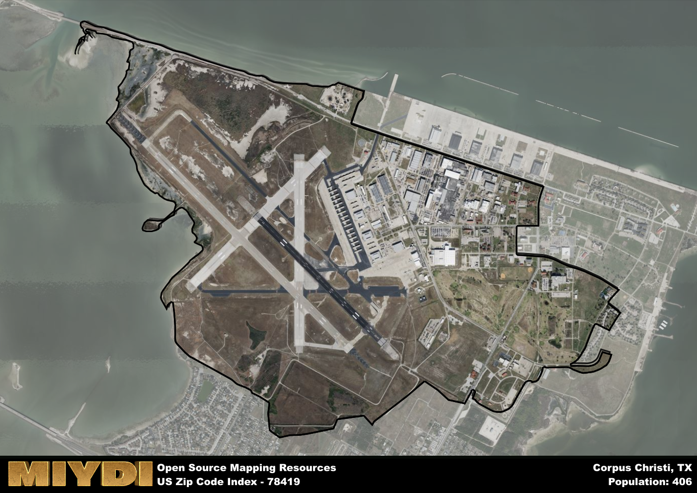

**Area Name:** Corpus Christi

**Zip Code:** 78419

**State:** TX

Corpus Christi is a part of the Corpus Christi - TX Metro Area, and makes up  of the Metro's population.  

# Flour Bluff: A Coastal Community in Corpus Christi

Located in the southeastern part of Corpus Christi, the zip code 78419 area corresponds to the neighborhood of Flour Bluff. Bordered by the Laguna Madre to the east and Corpus Christi Bay to the west, Flour Bluff is situated on a narrow peninsula, offering residents and visitors stunning waterfront views. The area is seamlessly integrated into the larger Corpus Christi metropolitan area, providing easy access to downtown attractions, shopping centers, and recreational facilities.

Flour Bluff has a rich history dating back to the mid-19th century when German, Czech, and Polish immigrants settled in the area, attracted by its fertile land and abundant fishing opportunities. The neighborhood grew into a thriving community with the establishment of naval air stations during World War II, bringing economic prosperity and development to the area. Flour Bluff earned its name from the white gypsum deposits that covered the ground, resembling flour, and has since become known for its strong sense of community and maritime heritage.

Today, Flour Bluff is a vibrant coastal community known for its fishing industry, water sports, and outdoor recreation opportunities. The neighborhood is home to a mix of residential areas, schools, and local businesses, offering residents a close-knit community feel with convenient access to urban amenities. Visitors can explore the Texas State Aquarium, enjoy fresh seafood at local restaurants, or relax on the sandy beaches along the Gulf of Mexico. Flour Bluff continues to preserve its historical charm while embracing modern development, making it a unique and sought-after destination in Corpus Christi.

# Corpus Christi Demographics

The population of Corpus Christi is 406.  
Corpus Christi has a population density of 128.48 per square mile.  
The area of Corpus Christi is 3.16 square miles.  

## Corpus Christi AI and Census Variables

The values presented in this dataset for Corpus Christi are AI-optimized, streamlined, and categorized into relevant buckets for enhanced utility in AI and mapping programs. These simplified values have been optimized to facilitate efficient analysis and integration into various technological applications, offering users accessible and actionable insights into demographics within the Corpus Christi area.

| AI Variables for Corpus Christi | Value |
|-------------|-------|
| Shape Area | 10477372.3945313 |
| Shape Length | 19900.5316404508 |
| CBSA Federal Processing Standard Code | 18580 |

## How to use this free AI optimized Geo-Spatial Data for Corpus Christi, TX

This data is made freely available under the Creative Commons license, allowing for unrestricted use for any purpose. Users can access static resources directly from GitHub or leverage more advanced functionalities by utilizing the GeoJSON files. All datasets originate from official government or private sector sources and are meticulously compiled into relevant datasets within QGIS. However, the versatility of the data ensures compatibility with any mapping application.

## Data Accuracy Disclaimer
It's important to note that the data provided here may contain errors or discrepancies and should be considered as 'close enough' for business applications and AI rather than a definitive source of truth. This data is aggregated from multiple sources, some of which publish information on wildly different intervals, leading to potential inconsistencies. Additionally, certain data points may not be corrected for Covid-related changes, further impacting accuracy. Moreover, the assumption that demographic trends are consistent throughout a region may lead to discrepancies, as trends often concentrate in areas of highest population density. As a result, dense areas may be slightly underrepresented, while rural areas may be slightly overrepresented, resulting in a more conservative dataset. Furthermore, the focus primarily on areas within US Major and Minor Statistical areas means that approximately 40 million Americans living outside of these areas may not be fully represented. Lastly, the historical background and area descriptions generated using AI are susceptible to potential mistakes, so users should exercise caution when interpreting the information provided.
