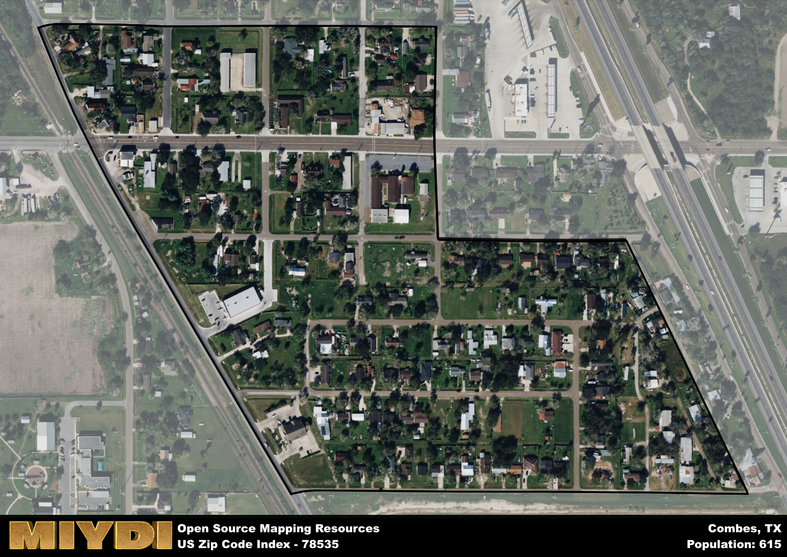

**Area Name:** Combes

**Zip Code:** 78535

**State:** TX

Combes is a part of the Brownsville-Harlingen - TX Metro Area, and makes up  of the Metro's population.  

# Combes, TX (78535): A Charming Neighborhood in the Rio Grande Valley

Located in the southern tip of Texas, the zip code area 78535 corresponds to the small town of Combes, nestled within the bustling Rio Grande Valley. Bordered by neighboring towns such as Harlingen and Santa Rosa, Combes seamlessly integrates into the greater metropolitan area, offering a quiet retreat from the urban sprawl while maintaining easy access to major population centers and transportation routes.

Combes has a rich historical narrative, founded in the early 1900s as a hub for agriculture and ranching. The town saw steady growth with the development of the railroad, attracting settlers looking to establish roots in the fertile Rio Grande Valley. Throughout the years, Combes has preserved its small-town charm while adapting to modern times, becoming a beloved community for families and retirees alike.

Today, Combes boasts a mix of residential neighborhoods, local businesses, and recreational amenities. Residents enjoy access to parks, community centers, and schools, fostering a strong sense of community pride. The area's economy thrives on agriculture, with citrus and vegetable farms dotting the landscape. Visitors can explore historic sites like the Combes Cemetery and the Veterans Memorial Plaza, showcasing the town's rich heritage. Combes, with its blend of history and modern conveniences, remains a hidden gem in the Rio Grande Valley.

# Combes Demographics

The population of Combes is 615.  
Combes has a population density of 6150 per square mile.  
The area of Combes is 0.1 square miles.  

## Combes AI and Census Variables

The values presented in this dataset for Combes are AI-optimized, streamlined, and categorized into relevant buckets for enhanced utility in AI and mapping programs. These simplified values have been optimized to facilitate efficient analysis and integration into various technological applications, offering users accessible and actionable insights into demographics within the Combes area.

| AI Variables for Combes | Value |
|-------------|-------|
| Shape Area | 330997.619140625 |
| Shape Length | 2703.84500608678 |
| CBSA Federal Processing Standard Code | 15180 |

## How to use this free AI optimized Geo-Spatial Data for Combes, TX

This data is made freely available under the Creative Commons license, allowing for unrestricted use for any purpose. Users can access static resources directly from GitHub or leverage more advanced functionalities by utilizing the GeoJSON files. All datasets originate from official government or private sector sources and are meticulously compiled into relevant datasets within QGIS. However, the versatility of the data ensures compatibility with any mapping application.

## Data Accuracy Disclaimer
It's important to note that the data provided here may contain errors or discrepancies and should be considered as 'close enough' for business applications and AI rather than a definitive source of truth. This data is aggregated from multiple sources, some of which publish information on wildly different intervals, leading to potential inconsistencies. Additionally, certain data points may not be corrected for Covid-related changes, further impacting accuracy. Moreover, the assumption that demographic trends are consistent throughout a region may lead to discrepancies, as trends often concentrate in areas of highest population density. As a result, dense areas may be slightly underrepresented, while rural areas may be slightly overrepresented, resulting in a more conservative dataset. Furthermore, the focus primarily on areas within US Major and Minor Statistical areas means that approximately 40 million Americans living outside of these areas may not be fully represented. Lastly, the historical background and area descriptions generated using AI are susceptible to potential mistakes, so users should exercise caution when interpreting the information provided.
