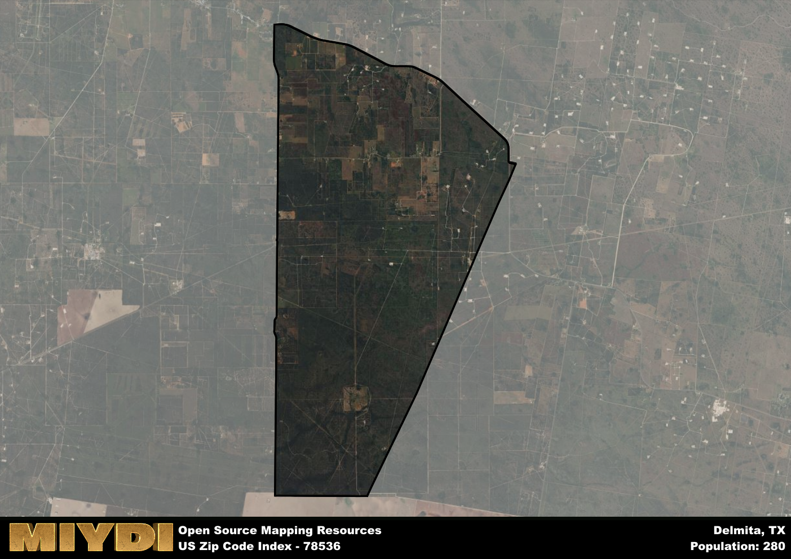

**Area Name:** Delmita

**Zip Code:** 78536

**State:** TX

Delmita is a part of the Rio Grande City-Roma - TX Micro Area, and makes up  of the Metro's population.  

# Delmita, TX 78536: A Snapshot of a Charming Neighborhood  

Delmita, Texas, located within the 78536 zip code, is a small rural community situated in the southern part of Starr County. Bordered by the Rio Grande to the south and the town of La Rosita to the east, Delmita is part of the larger metropolitan area of Rio Grande City. Despite its rural setting, Delmita is well-connected to nearby cities such as McAllen and Mission via State Highway 495, making it a convenient location for residents seeking both a quiet lifestyle and access to urban amenities.

Originally settled by Mexican immigrants in the early 20th century, Delmita has a rich history of agriculture and ranching. The area's growth was spurred by the construction of the railroad in the 1920s, which facilitated transportation of goods and people to and from the region. The name "Delmita" is derived from a combination of Spanish words, meaning "of the small table," a nod to the communal gatherings that took place in the area during its early days. Today, Delmita retains a strong sense of community and heritage, with many residents tracing their roots back several generations.

Presently, Delmita is a close-knit neighborhood known for its agricultural activities, particularly citrus and vegetable farming. The area offers a range of local services, including small businesses, schools, and churches, all contributing to the tight-knit community atmosphere. Residents and visitors alike can enjoy outdoor recreational activities such as fishing and birdwatching along the Rio Grande, as well as exploring historic sites like the old railroad depot. Delmita's cultural diversity and strong sense of tradition make it a unique and welcoming destination within the bustling region of Starr County.

# Delmita Demographics

The population of Delmita is 280.  
Delmita has a population density of 13.6 per square mile.  
The area of Delmita is 20.59 square miles.  

## Delmita Income and Economic Data

These demographic numbers are sourced from IRS return data, providing comprehensive insights into the population dynamics and economic trends within Delmita.

**Breakdown of return types for Delmita**

The table offers insight into the composition of tax returns filed with the IRS, categorizing them into three main types. Single returns represent filings by individuals, joint returns by married couples, and head of household returns by individuals who qualify as heads of households, typically having dependents. This breakdown provides an understanding of the different filing statuses adopted by taxpayers when submitting their tax documentation.

| Return Types filed for Delmita                              | Percentage          |
|----------------------------------------------------------|---------------------|
| Single Returns                                            | 0.5 |
| Joint Returns                                             | 0.25 |
| Head Household Returns                                    | 0 |

The income and economic data presented here is sourced from the IRS income brackets, utilized for categorizing tax returns by income levels. This table displays income ranges for both single filers and married couples, along with the corresponding number of returns and the percentage within each bracket, providing valuable insight into the distribution of taxes across various income groups.

| Bracket Name       | Single Filer Income Range | Married Couple Range | Number of Returns | Percentage of Returns |
|--------------------|----------------------------|----------------------|-------------------|-----------------------|
| 10% Bracket        | Up to $10,275              | Up to $20,550        | 60 | 0.5% |
| 12% Bracket        | $10,276 - $41,775          | $20,551 - $83,550    | 60 | 0.5% |
| 22% Bracket        | $41,776 - $89,075          | $83,551 - $178,150   | 0 | 0% |
| 24% Bracket        | $89,076 - $170,050         | $178,151 - $340,100  | 0 | 0% |
| 32% Bracket        | $170,051 - $215,950        | $340,101 - $431,900  | 0 | 0% |
| 35% Bracket        | $215,951 - $539,900        | $431,901 - $647,850  | 0 | 0% |

### Exploring Taxpayer Diversity: A Breakdown of Different Types of Tax Returns in Delmita

The table offers insights into various types of tax returns filed, reflecting different aspects of taxpayer activities and demographics. Categories include charitable returns for donations, dependent returns for claimed dependents, educator population, elderly population, real estate returns, self-employment returns, student loan returns, and unemployment returns, providing valuable insights into taxpayer behavior and demographics.

| Delmita Filing Types                    | Count | Percentage |
|--------------------------------------|-------|------------|
| Charitable Donations                 | 0 | 0% |
| Dependents Claimed                   | 0 | 0% |
| Educator Residents                   | 0 | 0% |
| Elderly Population                   | 30 | 0.25% |
| Farming Population                   | 0 | 0% |
| Real Estate Transactions             | 0 | 0% |
| Self-Employed Individuals            | 0 | 0% |
| Student Loan Cases                   | 0 | 0% |
| Unemployment Benefit Filings         | 30 | 0.25% |

## Delmita AI and Census Variables

The values presented in this dataset for Delmita are AI-optimized, streamlined, and categorized into relevant buckets for enhanced utility in AI and mapping programs. These simplified values have been optimized to facilitate efficient analysis and integration into various technological applications, offering users accessible and actionable insights into demographics within the Delmita area.

| AI Variables for Delmita | Value |
|-------------|-------|
| Shape Area | 67030902.9414063 |
| Shape Length | 36020.8723505759 |
| CBSA Federal Processing Standard Code | 40100 |

## How to use this free AI optimized Geo-Spatial Data for Delmita, TX

This data is made freely available under the Creative Commons license, allowing for unrestricted use for any purpose. Users can access static resources directly from GitHub or leverage more advanced functionalities by utilizing the GeoJSON files. All datasets originate from official government or private sector sources and are meticulously compiled into relevant datasets within QGIS. However, the versatility of the data ensures compatibility with any mapping application.

## Data Accuracy Disclaimer
It's important to note that the data provided here may contain errors or discrepancies and should be considered as 'close enough' for business applications and AI rather than a definitive source of truth. This data is aggregated from multiple sources, some of which publish information on wildly different intervals, leading to potential inconsistencies. Additionally, certain data points may not be corrected for Covid-related changes, further impacting accuracy. Moreover, the assumption that demographic trends are consistent throughout a region may lead to discrepancies, as trends often concentrate in areas of highest population density. As a result, dense areas may be slightly underrepresented, while rural areas may be slightly overrepresented, resulting in a more conservative dataset. Furthermore, the focus primarily on areas within US Major and Minor Statistical areas means that approximately 40 million Americans living outside of these areas may not be fully represented. Lastly, the historical background and area descriptions generated using AI are susceptible to potential mistakes, so users should exercise caution when interpreting the information provided.
