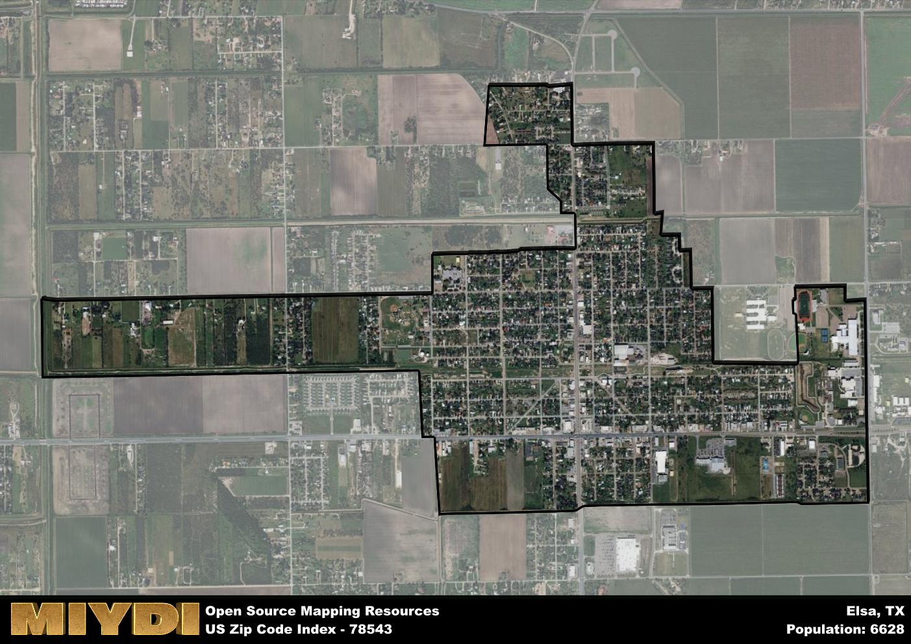

**Area Name:** Elsa

**Zip Code:** 78543

**State:** TX

Elsa is a part of the McAllen-Edinburg-Mission - TX Metro Area, and makes up 0.73% of the Metro's population.  

# Elsa, TX (78543): A Charming Neighborhood in the Rio Grande Valley

Located in the southern tip of Texas, the zip code 78543 corresponds to the charming neighborhood of Elsa. Bordered by the city of Edcouch to the north and La Blanca to the south, Elsa is part of the larger metropolitan area of the Rio Grande Valley. This tight-knit community is seamlessly integrated into the urban fabric of the region, offering a mix of residential areas, commercial establishments, and green spaces for its residents to enjoy.

Originally settled in the early 20th century, Elsa has a rich history tied to its agricultural roots. The area experienced significant growth during the mid-20th century when the railroad expanded into the region, facilitating transportation of goods and people. Named after Elsa Bittner, the daughter of a local landowner, the neighborhood has preserved its small-town charm while adapting to modern times. Today, Elsa is known for its vibrant community spirit and cultural diversity, making it a unique place to call home.

Present-day Elsa boasts a bustling economy supported by agriculture, retail, and service industries. The neighborhood offers a range of amenities such as parks, schools, and local businesses that cater to the needs of its residents. Visitors can explore the historic downtown area, which features well-preserved buildings and landmarks that showcase the area's past. With its strong sense of community and rich heritage, Elsa continues to thrive as a hidden gem in the Rio Grande Valley.

# Elsa Demographics

The population of Elsa is 6628.  
Elsa has a population density of 3831.21 per square mile.  
The area of Elsa is 1.73 square miles.  

### Exploring Real Estate Trends: A Comprehensive Analysis of the Elsa Area and its Neighbors

This table contains an in-depth examination of the real estate market in the Elsa area. Sourced from trusted real estate market firms, this dataset provides a wealth of raw data detailing the local real estate landscape, along with comparative analyses juxtaposing the market dynamics with those of neighboring areas. Explore the intricacies of the Elsa real estate market and gain valuable insights into its relationship with adjacent regions.

| Real Estate Data for Elsa                       | Value    |
|------------------------------------------------|----------|
| Average Listing Price for Elsa               | 264046 |
| Median Listing Price for Elsa                | 221250 |
| Median Days on Market for Elsa               | 63 |
| Median Listing Price per Square Foot for Elsa| 44 |
| Median Square Feet for Elsa                  | 1571 |
| Real Estate Prices to Income Ratio           | 261.52% |
| Price per Square Foot Ratio                  | 98.45% |
| Price Median Ratio                           | 82.69% |
| Market Sales Speed Ratio                     | 90.6% |

This table offers essential real estate data for the Elsa area, including average and median listing prices, median days on market, and property size. It also presents ratio metrics as percentages, providing insights into how the local market compares to the surrounding region. A ratio of 100% signifies performance in line with the regional average, while values above or below indicate overperformance or underperformance, respectively, relative to expectations.

## Elsa Sports and Recreation Data

#### Annual Youth Sports Spending for Elsa

This table provides fundamental insights into the Sports and Recreation data for the Elsa area, detailing the estimated annual expenditure on Youth Athletics. This includes estimated spending by the major consumer brackets. 
| Sports Spending for Elsa| Value |
|-------------------------|-------|
| Athlete Spending Compared to the region | 10.84% |
| Total Youth Athlete Spending | 39,451 |
| Athletic Spending - Essential Focused Consumer | 59,931 |
| Athletic Spending - Typical Consumer | 73,744 |
| Athletic Spending - Affluent Consumers | 05,559 |

#### Youth Coaching Estimates for Elsa

This table presents the estimated number of coaches for the Elsa area, derived from comprehensive national coaching surveys and athletic participation rates by state. It offers valuable insights into the vital role of coaching personnel in fostering athletic development and facilitating sports participation within the local community.

| Coaching Data for Elsa | Value |
|-------------|-------|
| Total Coaches | 109 |
| Paid Coaches | 28 |
| Volunteer Coaches | 80 |

#### Youth Athlete Participation for Elsa

This table shows the estimated total number of youth athletes in the Elsa area, sourced from comprehensive national coaching surveys and athletic participation rates by state.

| Total YA Athletes in Elsa | Value |
|-------------|-------|
| Total High School Athletes | 166 |
| Total Youth Athletes | 497 |
| Total Young Adult Athletes | 331 |
| Total Athletes to Age 25 | 994 |

#### High School Age Athletes - Breakdown by Sport for Elsa

This table shows insights regarding high school age estimated players by sport in the Elsa area, derived from national and state-level athletic participation trends. 

| HS Players by Sport in Elsa | Value |
|-------------|-------|
| Football Players | 38 |
| Basketball Players | 23 |
| Soccer Players | 18 |
| Volleyball Players | 12 |
| Baseball Players | 20 |
| Tennis Players | 10 |
| Track Athletes | 28 |
| Golf Players | 5 |
| Swimming Athletes | 5 |
| Wrestling Competitors | 5 |
| Lacrosse Players | 0 |

Estimating the number of younger athletes presents unique challenges due to their varied starting ages, typically beginning around six years old, and a gradual decline in participation rates as they age. Unlike high school-aged athletes, younger athletes are less likely to switch sports as they grow older, contributing to the stability of participation numbers within specific sports at younger ages.  

As a general trend, the total number of younger athletes is approximately three times the number of high school-aged athletes, underscoring the significant presence of youth athletes in sports programs and highlighting the importance of early engagement in athletic activities.

## Elsa AI and Census Variables

The values presented in this dataset for Elsa are AI-optimized, streamlined, and categorized into relevant buckets for enhanced utility in AI and mapping programs. These simplified values have been optimized to facilitate efficient analysis and integration into various technological applications, offering users accessible and actionable insights into demographics within the Elsa area.

| AI Variables for Elsa | Value |
|-------------|-------|
| Shape Area | 5602467.76757813 |
| Shape Length | 17524.421743062 |
| CBSA Federal Processing Standard Code | 32580 |
| RE Price per Square Foot Ratio | 98.45% |
| RE Price Average Ratio | 84.90% |
| RE Speed Ratio | 90.6% |
| RE Income Ratio | 261.52% |
| RE Affordability Index Flag | 4 |
| Income Bracket Flag | 1 |
| RE Income Flag | 6 |
| RE Median Square Footage Price Flag | 3 |
| RE Median Square Footage Size Flag | 3 |
| RE Activity Flag | 4 |
| Poverty Line Risk Flag | 1 |

## How to use this free AI optimized Geo-Spatial Data for Elsa, TX

This data is made freely available under the Creative Commons license, allowing for unrestricted use for any purpose. Users can access static resources directly from GitHub or leverage more advanced functionalities by utilizing the GeoJSON files. All datasets originate from official government or private sector sources and are meticulously compiled into relevant datasets within QGIS. However, the versatility of the data ensures compatibility with any mapping application.

## Data Accuracy Disclaimer
It's important to note that the data provided here may contain errors or discrepancies and should be considered as 'close enough' for business applications and AI rather than a definitive source of truth. This data is aggregated from multiple sources, some of which publish information on wildly different intervals, leading to potential inconsistencies. Additionally, certain data points may not be corrected for Covid-related changes, further impacting accuracy. Moreover, the assumption that demographic trends are consistent throughout a region may lead to discrepancies, as trends often concentrate in areas of highest population density. As a result, dense areas may be slightly underrepresented, while rural areas may be slightly overrepresented, resulting in a more conservative dataset. Furthermore, the focus primarily on areas within US Major and Minor Statistical areas means that approximately 40 million Americans living outside of these areas may not be fully represented. Lastly, the historical background and area descriptions generated using AI are susceptible to potential mistakes, so users should exercise caution when interpreting the information provided.
