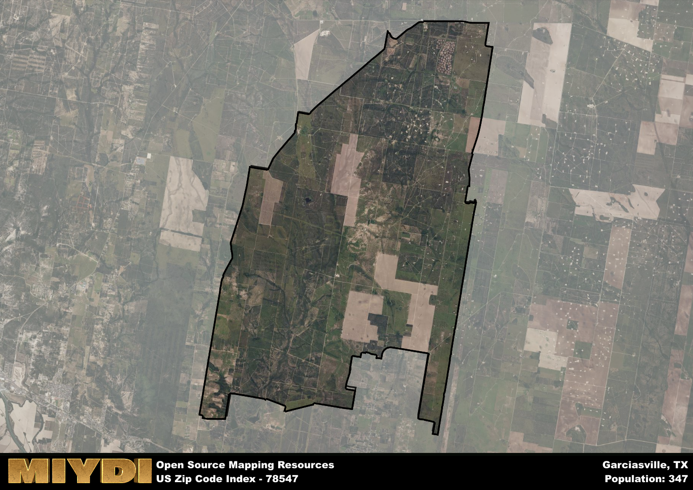

**Area Name:** Garciasville

**Zip Code:** 78547

**State:** TX

Garciasville is a part of the Rio Grande City-Roma - TX Micro Area, and makes up  of the Metro's population.  

# Garciasville: A Hidden Gem in South Texas

Garciasville, located within the zip code 78547, is a small rural community situated in the southern tip of Texas. The area is bordered by the Rio Grande to the south, providing a natural boundary between the United States and Mexico. Garciasville is part of the larger Rio Grande Valley metropolitan area, which includes cities like McAllen and Brownsville. The zip code area is known for its agricultural landscape, with citrus groves and farmland dominating the scenery.

The history of Garciasville dates back to the mid-19th century when the area was settled by Spanish colonists. The town was named after a prominent local family, the Garcias, who played a significant role in the development of the community. Over the years, Garciasville has remained a close-knit farming community, with a strong sense of cultural heritage and tradition. The area has seen steady growth in recent years, attracting new residents seeking a peaceful rural lifestyle.

Today, Garciasville is a charming neighborhood with a mix of small businesses, family-owned farms, and local services. The economy is primarily driven by agriculture, with citrus fruits and vegetables being the main crops grown in the area. Residents enjoy access to recreational activities such as fishing and birdwatching along the Rio Grande. The historic sites in Garciasville, including the old Garcia family ranch, offer a glimpse into the area's past. Overall, Garciasville is a hidden gem in South Texas, offering a tranquil escape from the hustle and bustle of larger urban centers.

# Garciasville Demographics

The population of Garciasville is 347.  
Garciasville has a population density of 5.96 per square mile.  
The area of Garciasville is 58.26 square miles.  

## Garciasville AI and Census Variables

The values presented in this dataset for Garciasville are AI-optimized, streamlined, and categorized into relevant buckets for enhanced utility in AI and mapping programs. These simplified values have been optimized to facilitate efficient analysis and integration into various technological applications, offering users accessible and actionable insights into demographics within the Garciasville area.

| AI Variables for Garciasville | Value |
|-------------|-------|
| Shape Area | 188952251.552734 |
| Shape Length | 73750.1577390263 |
| CBSA Federal Processing Standard Code | 40100 |

## How to use this free AI optimized Geo-Spatial Data for Garciasville, TX

This data is made freely available under the Creative Commons license, allowing for unrestricted use for any purpose. Users can access static resources directly from GitHub or leverage more advanced functionalities by utilizing the GeoJSON files. All datasets originate from official government or private sector sources and are meticulously compiled into relevant datasets within QGIS. However, the versatility of the data ensures compatibility with any mapping application.

## Data Accuracy Disclaimer
It's important to note that the data provided here may contain errors or discrepancies and should be considered as 'close enough' for business applications and AI rather than a definitive source of truth. This data is aggregated from multiple sources, some of which publish information on wildly different intervals, leading to potential inconsistencies. Additionally, certain data points may not be corrected for Covid-related changes, further impacting accuracy. Moreover, the assumption that demographic trends are consistent throughout a region may lead to discrepancies, as trends often concentrate in areas of highest population density. As a result, dense areas may be slightly underrepresented, while rural areas may be slightly overrepresented, resulting in a more conservative dataset. Furthermore, the focus primarily on areas within US Major and Minor Statistical areas means that approximately 40 million Americans living outside of these areas may not be fully represented. Lastly, the historical background and area descriptions generated using AI are susceptible to potential mistakes, so users should exercise caution when interpreting the information provided.
