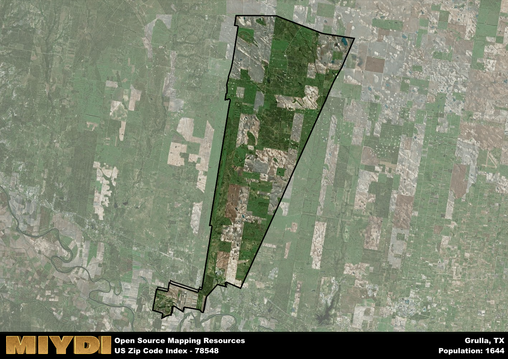

**Area Name:** Grulla

**Zip Code:** 78548

**State:** TX

Grulla is a part of the Rio Grande City-Roma - TX Micro Area, and makes up 0.96% of the Metro's population.  

# Grulla: A Charming Community in South Texas

Located in the southern region of Texas, the zip code area 78548 corresponds to the peaceful and welcoming community of Grulla. Situated in Starr County, Grulla is surrounded by the cities of Rio Grande City to the east and Roma to the west. This zip code area is an integral part of the Rio Grande Valley metropolitan area, contributing to the cultural and economic vibrancy of the larger urban fabric.

Grulla has a rich historical narrative that dates back to the early settlement of the region by Spanish explorers. The area witnessed significant growth during the 19th century, attracting settlers with its fertile land for agriculture. The community was officially established in the late 1800s and has since retained its small-town charm while embracing modern developments. The name "Grulla" is derived from the Spanish word for "crane," reflecting the area's abundant wildlife and natural beauty.

Presently, Grulla is a close-knit community known for its agricultural activities, particularly citrus farming and ranching. The area offers essential services such as schools, healthcare facilities, and local businesses that cater to residents' daily needs. Grulla also boasts recreational amenities like parks and outdoor spaces, providing opportunities for residents to enjoy the region's warm climate and scenic landscapes. Additionally, the community takes pride in its cultural heritage, with historic sites and events that celebrate its unique identity within the Rio Grande Valley.

# Grulla Demographics

The population of Grulla is 1644.  
Grulla has a population density of 21.14 per square mile.  
The area of Grulla is 77.77 square miles.  

### Exploring Real Estate Trends: A Comprehensive Analysis of the Grulla Area and its Neighbors

This table contains an in-depth examination of the real estate market in the Grulla area. Sourced from trusted real estate market firms, this dataset provides a wealth of raw data detailing the local real estate landscape, along with comparative analyses juxtaposing the market dynamics with those of neighboring areas. Explore the intricacies of the Grulla real estate market and gain valuable insights into its relationship with adjacent regions.

| Real Estate Data for Grulla                       | Value    |
|------------------------------------------------|----------|
| Average Listing Price for Grulla               | 70000 |
| Median Listing Price for Grulla                | 70000 |
| Median Days on Market for Grulla               | 137 |
| Median Listing Price per Square Foot for Grulla| 6 |
| Median Square Feet for Grulla                  | 1520 |
| Real Estate Prices to Income Ratio           | 60.31% |
| Price per Square Foot Ratio                  | 46.00% |
| Price Median Ratio                           | 36.83% |
| Market Sales Speed Ratio                     | 156.6% |

This table offers essential real estate data for the Grulla area, including average and median listing prices, median days on market, and property size. It also presents ratio metrics as percentages, providing insights into how the local market compares to the surrounding region. A ratio of 100% signifies performance in line with the regional average, while values above or below indicate overperformance or underperformance, respectively, relative to expectations.

## Grulla Sports and Recreation Data

#### Annual Youth Sports Spending for Grulla

This table provides fundamental insights into the Sports and Recreation data for the Grulla area, detailing the estimated annual expenditure on Youth Athletics. This includes estimated spending by the major consumer brackets. 
| Sports Spending for Grulla| Value |
|-------------------------|-------|
| Athlete Spending Compared to the region | 4.71% |
| Total Youth Athlete Spending | 57,095 |
| Athletic Spending - Essential Focused Consumer | 8,741 |
| Athletic Spending - Typical Consumer | 16,090 |
| Athletic Spending - Affluent Consumers | 02,210 |

#### Youth Coaching Estimates for Grulla

This table presents the estimated number of coaches for the Grulla area, derived from comprehensive national coaching surveys and athletic participation rates by state. It offers valuable insights into the vital role of coaching personnel in fostering athletic development and facilitating sports participation within the local community.

| Coaching Data for Grulla | Value |
|-------------|-------|
| Total Coaches | 27 |
| Paid Coaches | 7 |
| Volunteer Coaches | 20 |

#### Youth Athlete Participation for Grulla

This table shows the estimated total number of youth athletes in the Grulla area, sourced from comprehensive national coaching surveys and athletic participation rates by state.

| Total YA Athletes in Grulla | Value |
|-------------|-------|
| Total High School Athletes | 41 |
| Total Youth Athletes | 123 |
| Total Young Adult Athletes | 82 |
| Total Athletes to Age 25 | 247 |

#### High School Age Athletes - Breakdown by Sport for Grulla

This table shows insights regarding high school age estimated players by sport in the Grulla area, derived from national and state-level athletic participation trends. 

| HS Players by Sport in Grulla | Value |
|-------------|-------|
| Football Players | 9 |
| Basketball Players | 6 |
| Soccer Players | 5 |
| Volleyball Players | 3 |
| Baseball Players | 5 |
| Tennis Players | 2 |
| Track Athletes | 7 |
| Golf Players | 1 |
| Swimming Athletes | 1 |
| Wrestling Competitors | 1 |
| Lacrosse Players | 0 |

Estimating the number of younger athletes presents unique challenges due to their varied starting ages, typically beginning around six years old, and a gradual decline in participation rates as they age. Unlike high school-aged athletes, younger athletes are less likely to switch sports as they grow older, contributing to the stability of participation numbers within specific sports at younger ages.  

As a general trend, the total number of younger athletes is approximately three times the number of high school-aged athletes, underscoring the significant presence of youth athletes in sports programs and highlighting the importance of early engagement in athletic activities.

## Grulla AI and Census Variables

The values presented in this dataset for Grulla are AI-optimized, streamlined, and categorized into relevant buckets for enhanced utility in AI and mapping programs. These simplified values have been optimized to facilitate efficient analysis and integration into various technological applications, offering users accessible and actionable insights into demographics within the Grulla area.

| AI Variables for Grulla | Value |
|-------------|-------|
| Shape Area | 252092471.587891 |
| Shape Length | 96029.8624394306 |
| CBSA Federal Processing Standard Code | 40100 |
| RE Price per Square Foot Ratio | 46.00% |
| RE Speed Ratio | 156.6% |
| RE Income Ratio | 60.31% |
| Income Bracket Flag | 2 |
| RE Income Flag | 2 |
| RE Median Square Footage Price Flag | 1 |
| RE Median Square Footage Size Flag | 2 |
| RE Activity Flag | 6 |
| Poverty Line Risk Flag | 1 |

## How to use this free AI optimized Geo-Spatial Data for Grulla, TX

This data is made freely available under the Creative Commons license, allowing for unrestricted use for any purpose. Users can access static resources directly from GitHub or leverage more advanced functionalities by utilizing the GeoJSON files. All datasets originate from official government or private sector sources and are meticulously compiled into relevant datasets within QGIS. However, the versatility of the data ensures compatibility with any mapping application.

## Data Accuracy Disclaimer
It's important to note that the data provided here may contain errors or discrepancies and should be considered as 'close enough' for business applications and AI rather than a definitive source of truth. This data is aggregated from multiple sources, some of which publish information on wildly different intervals, leading to potential inconsistencies. Additionally, certain data points may not be corrected for Covid-related changes, further impacting accuracy. Moreover, the assumption that demographic trends are consistent throughout a region may lead to discrepancies, as trends often concentrate in areas of highest population density. As a result, dense areas may be slightly underrepresented, while rural areas may be slightly overrepresented, resulting in a more conservative dataset. Furthermore, the focus primarily on areas within US Major and Minor Statistical areas means that approximately 40 million Americans living outside of these areas may not be fully represented. Lastly, the historical background and area descriptions generated using AI are susceptible to potential mistakes, so users should exercise caution when interpreting the information provided.
