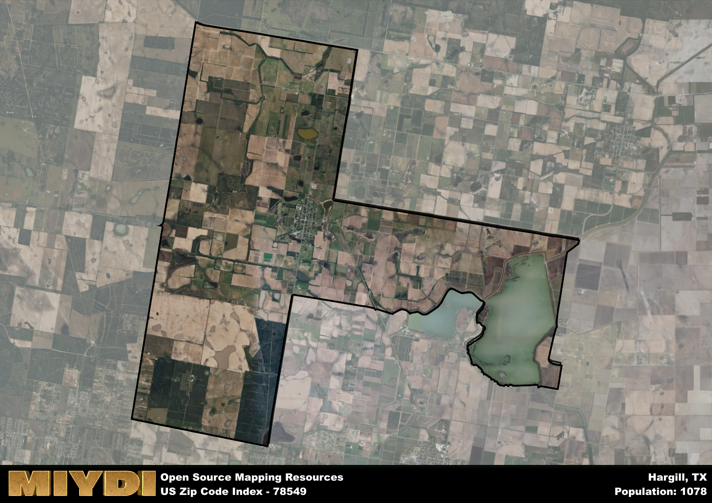

**Area Name:** Hargill

**Zip Code:** 78549

**State:** TX

Hargill is a part of the McAllen-Edinburg-Mission - TX Metro Area, and makes up  of the Metro's population.  

# Hargill: A Historic and Vibrant Community in South Texas

Situated in the southern region of Texas, Hargill is a small unincorporated community located within the zip code 78549. The area is bordered by the towns of Edinburg to the west and Elsa to the east, with the larger city of McAllen just a short drive to the south. Hargill is known for its rural charm and agricultural landscape, with vast fields of crops stretching out into the horizon.

Founded in the late 19th century, Hargill has a rich history rooted in agriculture and farming. The community was named after John G. Hargill, a local landowner who played a key role in the development of the area. Over the years, Hargill has grown into a tight-knit community with a strong sense of pride in its heritage. The town has weathered economic challenges but has remained resilient, with its residents working together to preserve its unique identity.

Today, Hargill is a thriving community with a mix of small businesses, family-owned farms, and community services. The area is known for its citrus and vegetable production, with many residents employed in the agriculture industry. Hargill offers a peaceful escape from the hustle and bustle of nearby urban centers, with parks and recreational facilities for residents to enjoy. The town also boasts several historic sites, including the Hargill Cemetery, which serves as a reminder of the area's rich past.

# Hargill Demographics

The population of Hargill is 1078.  
Hargill has a population density of 30.44 per square mile.  
The area of Hargill is 35.41 square miles.  

## Hargill AI and Census Variables

The values presented in this dataset for Hargill are AI-optimized, streamlined, and categorized into relevant buckets for enhanced utility in AI and mapping programs. These simplified values have been optimized to facilitate efficient analysis and integration into various technological applications, offering users accessible and actionable insights into demographics within the Hargill area.

| AI Variables for Hargill | Value |
|-------------|-------|
| Shape Area | 114859572.912109 |
| Shape Length | 65761.6777674347 |
| CBSA Federal Processing Standard Code | 32580 |

## How to use this free AI optimized Geo-Spatial Data for Hargill, TX

This data is made freely available under the Creative Commons license, allowing for unrestricted use for any purpose. Users can access static resources directly from GitHub or leverage more advanced functionalities by utilizing the GeoJSON files. All datasets originate from official government or private sector sources and are meticulously compiled into relevant datasets within QGIS. However, the versatility of the data ensures compatibility with any mapping application.

## Data Accuracy Disclaimer
It's important to note that the data provided here may contain errors or discrepancies and should be considered as 'close enough' for business applications and AI rather than a definitive source of truth. This data is aggregated from multiple sources, some of which publish information on wildly different intervals, leading to potential inconsistencies. Additionally, certain data points may not be corrected for Covid-related changes, further impacting accuracy. Moreover, the assumption that demographic trends are consistent throughout a region may lead to discrepancies, as trends often concentrate in areas of highest population density. As a result, dense areas may be slightly underrepresented, while rural areas may be slightly overrepresented, resulting in a more conservative dataset. Furthermore, the focus primarily on areas within US Major and Minor Statistical areas means that approximately 40 million Americans living outside of these areas may not be fully represented. Lastly, the historical background and area descriptions generated using AI are susceptible to potential mistakes, so users should exercise caution when interpreting the information provided.
