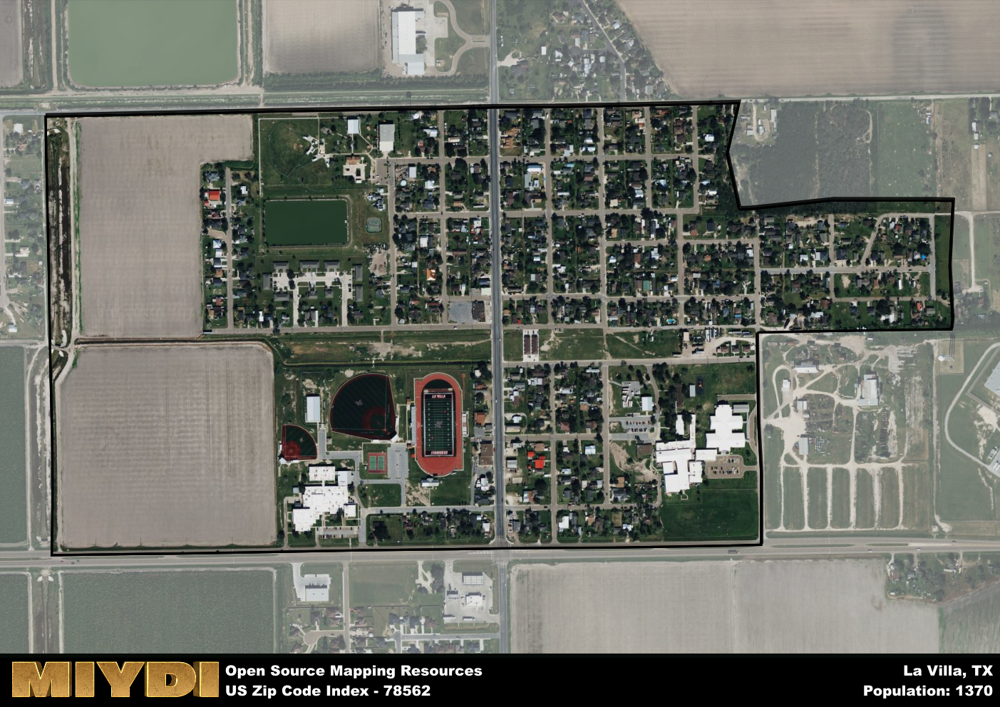

**Area Name:** La Villa

**Zip Code:** 78562

**State:** TX

La Villa is a part of the McAllen-Edinburg-Mission - TX Metro Area, and makes up 0.15% of the Metro's population.  

# La Villa, TX (78562): A Historic Gem in the Rio Grande Valley  

La Villa, located within the zip code 78562, is a small but historically rich neighborhood nestled in the heart of the Rio Grande Valley in South Texas. Bordered by the cities of Edcouch and Elsa to the north, La Villa seamlessly integrates with its neighboring communities, forming a cohesive urban fabric within this vibrant region. With easy access to major transportation routes, including Interstate 2, La Villa serves as a convenient hub for residents and visitors alike.

The area now known as La Villa has a storied past dating back to the mid-19th century when it was originally established as a ranching community. Over time, the settlement grew into a thriving agricultural center, known for its citrus and vegetable production. The town was officially incorporated in 1949, and its rich Hispanic heritage is evident in the architecture and cultural traditions that still permeate the area today. The name "La Villa" reflects the town's close-knit community spirit and deep-rooted history.

Today, La Villa is a charming neighborhood that offers a mix of residential, commercial, and agricultural spaces. The local economy is driven by agriculture, with citrus orchards and vegetable fields dotting the landscape. Residents and visitors can enjoy a variety of recreational amenities, including parks, sports facilities, and community events that celebrate the area's heritage. Notable landmarks such as the historic downtown district and cultural centers showcase the unique identity of La Villa, making it a hidden gem within the bustling Rio Grande Valley.

# La Villa Demographics

The population of La Villa is 1370.  
La Villa has a population density of 3261.9 per square mile.  
The area of La Villa is 0.42 square miles.  

### Exploring Real Estate Trends: A Comprehensive Analysis of the La Villa Area and its Neighbors

This table contains an in-depth examination of the real estate market in the La Villa area. Sourced from trusted real estate market firms, this dataset provides a wealth of raw data detailing the local real estate landscape, along with comparative analyses juxtaposing the market dynamics with those of neighboring areas. Explore the intricacies of the La Villa real estate market and gain valuable insights into its relationship with adjacent regions.

| Real Estate Data for La Villa                       | Value    |
|------------------------------------------------|----------|
| Average Listing Price for La Villa               | 75999 |
| Median Listing Price for La Villa                | 75999 |
| Median Days on Market for La Villa               | 359 |
| Median Listing Price per Square Foot for La Villa| 3 |
| Median Square Feet for La Villa                  | 1200 |
| Real Estate Prices to Income Ratio           | 85.35% |
| Price per Square Foot Ratio                  | 43.07% |
| Price Median Ratio                           | 28.40% |
| Market Sales Speed Ratio                     | 516.4% |

This table offers essential real estate data for the La Villa area, including average and median listing prices, median days on market, and property size. It also presents ratio metrics as percentages, providing insights into how the local market compares to the surrounding region. A ratio of 100% signifies performance in line with the regional average, while values above or below indicate overperformance or underperformance, respectively, relative to expectations.

## La Villa Sports and Recreation Data

#### Annual Youth Sports Spending for La Villa

This table provides fundamental insights into the Sports and Recreation data for the La Villa area, detailing the estimated annual expenditure on Youth Athletics. This includes estimated spending by the major consumer brackets. 
| Sports Spending for La Villa| Value |
|-------------------------|-------|
| Athlete Spending Compared to the region | 2.24% |
| Total Youth Athlete Spending | 73,126 |
| Athletic Spending - Essential Focused Consumer | 3,608 |
| Athletic Spending - Typical Consumer | 7,080 |
| Athletic Spending - Affluent Consumers | 2,394 |

#### Youth Coaching Estimates for La Villa

This table presents the estimated number of coaches for the La Villa area, derived from comprehensive national coaching surveys and athletic participation rates by state. It offers valuable insights into the vital role of coaching personnel in fostering athletic development and facilitating sports participation within the local community.

| Coaching Data for La Villa | Value |
|-------------|-------|
| Total Coaches | 22 |
| Paid Coaches | 6 |
| Volunteer Coaches | 17 |

#### Youth Athlete Participation for La Villa

This table shows the estimated total number of youth athletes in the La Villa area, sourced from comprehensive national coaching surveys and athletic participation rates by state.

| Total YA Athletes in La Villa | Value |
|-------------|-------|
| Total High School Athletes | 34 |
| Total Youth Athletes | 103 |
| Total Young Adult Athletes | 68 |
| Total Athletes to Age 25 | 205 |

#### High School Age Athletes - Breakdown by Sport for La Villa

This table shows insights regarding high school age estimated players by sport in the La Villa area, derived from national and state-level athletic participation trends. 

| HS Players by Sport in La Villa | Value |
|-------------|-------|
| Football Players | 8 |
| Basketball Players | 5 |
| Soccer Players | 4 |
| Volleyball Players | 2 |
| Baseball Players | 4 |
| Tennis Players | 2 |
| Track Athletes | 6 |
| Golf Players | 1 |
| Swimming Athletes | 1 |
| Wrestling Competitors | 1 |
| Lacrosse Players | 0 |

Estimating the number of younger athletes presents unique challenges due to their varied starting ages, typically beginning around six years old, and a gradual decline in participation rates as they age. Unlike high school-aged athletes, younger athletes are less likely to switch sports as they grow older, contributing to the stability of participation numbers within specific sports at younger ages.  

As a general trend, the total number of younger athletes is approximately three times the number of high school-aged athletes, underscoring the significant presence of youth athletes in sports programs and highlighting the importance of early engagement in athletic activities.

## La Villa AI and Census Variables

The values presented in this dataset for La Villa are AI-optimized, streamlined, and categorized into relevant buckets for enhanced utility in AI and mapping programs. These simplified values have been optimized to facilitate efficient analysis and integration into various technological applications, offering users accessible and actionable insights into demographics within the La Villa area.

| AI Variables for La Villa | Value |
|-------------|-------|
| Shape Area | 1355311.17578125 |
| Shape Length | 5429.44595578194 |
| CBSA Federal Processing Standard Code | 32580 |
| RE Price per Square Foot Ratio | 43.07% |
| RE Speed Ratio | 516.4% |
| RE Income Ratio | 85.35% |
| Income Bracket Flag | 1 |
| RE Income Flag | 2 |
| RE Median Square Footage Price Flag | 1 |
| RE Median Square Footage Size Flag | 1 |
| RE Activity Flag | 7 |
| Poverty Line Risk Flag | 1 |

## How to use this free AI optimized Geo-Spatial Data for La Villa, TX

This data is made freely available under the Creative Commons license, allowing for unrestricted use for any purpose. Users can access static resources directly from GitHub or leverage more advanced functionalities by utilizing the GeoJSON files. All datasets originate from official government or private sector sources and are meticulously compiled into relevant datasets within QGIS. However, the versatility of the data ensures compatibility with any mapping application.

## Data Accuracy Disclaimer
It's important to note that the data provided here may contain errors or discrepancies and should be considered as 'close enough' for business applications and AI rather than a definitive source of truth. This data is aggregated from multiple sources, some of which publish information on wildly different intervals, leading to potential inconsistencies. Additionally, certain data points may not be corrected for Covid-related changes, further impacting accuracy. Moreover, the assumption that demographic trends are consistent throughout a region may lead to discrepancies, as trends often concentrate in areas of highest population density. As a result, dense areas may be slightly underrepresented, while rural areas may be slightly overrepresented, resulting in a more conservative dataset. Furthermore, the focus primarily on areas within US Major and Minor Statistical areas means that approximately 40 million Americans living outside of these areas may not be fully represented. Lastly, the historical background and area descriptions generated using AI are susceptible to potential mistakes, so users should exercise caution when interpreting the information provided.
