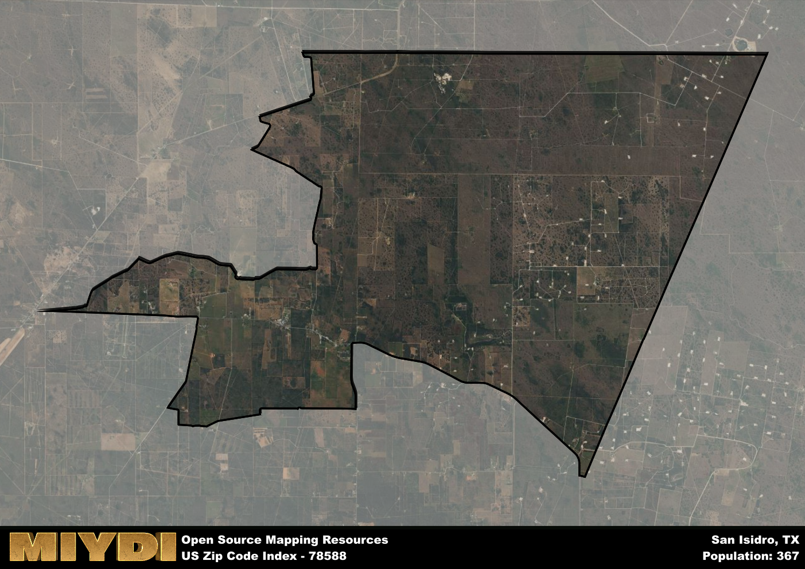

**Area Name:** San Isidro

**Zip Code:** 78588

**State:** TX

San Isidro is a part of the Rio Grande City-Roma - TX Micro Area, and makes up  of the Metro's population.  

# San Isidro: A Historic Community in the Heart of South Texas  
San Isidro, with the zip code 78588, is a small but vibrant community located in the southern tip of Texas. Situated in Starr County, San Isidro is bordered by the cities of Rio Grande City to the east and Roma to the west. It is a rural area known for its agricultural activities, with vast fields of crops and ranches dotting the landscape. Despite its rural setting, San Isidro is well-connected to major transportation routes, such as Highway 83, allowing for easy access to neighboring cities and the larger metropolitan area of McAllen.

The history of San Isidro dates back to the early 19th century when Spanish settlers established the community as a farming and ranching outpost. Over the years, the area grew as more immigrants from Mexico and Europe arrived, bringing their traditions and cultural influences. The community was named after Saint Isidore the Laborer, the patron saint of farmers, reflecting the agricultural heritage of the area. San Isidro has preserved its rich history through annual festivals and events that celebrate its diverse cultural heritage.

Today, San Isidro is a close-knit community that prides itself on its strong agricultural roots. The economy is largely driven by farming, ranching, and agribusiness, providing employment opportunities for local residents. The area is home to family-owned businesses, local markets, and restaurants that serve authentic Tex-Mex cuisine. Residents and visitors can also enjoy outdoor activities such as birdwatching, hiking, and fishing along the nearby Rio Grande River. San Isidro is a place where tradition meets modernity, offering a glimpse into the unique cultural tapestry of South Texas.

# San Isidro Demographics

The population of San Isidro is 367.  
San Isidro has a population density of 8.11 per square mile.  
The area of San Isidro is 45.23 square miles.  

## San Isidro Income and Economic Data

These demographic numbers are sourced from IRS return data, providing comprehensive insights into the population dynamics and economic trends within San Isidro.

**Breakdown of return types for San Isidro**

The table offers insight into the composition of tax returns filed with the IRS, categorizing them into three main types. Single returns represent filings by individuals, joint returns by married couples, and head of household returns by individuals who qualify as heads of households, typically having dependents. This breakdown provides an understanding of the different filing statuses adopted by taxpayers when submitting their tax documentation.

| Return Types filed for San Isidro                              | Percentage          |
|----------------------------------------------------------|---------------------|
| Single Returns                                            | 0.47 |
| Joint Returns                                             | 0.33 |
| Head Household Returns                                    | 0.2 |

The income and economic data presented here is sourced from the IRS income brackets, utilized for categorizing tax returns by income levels. This table displays income ranges for both single filers and married couples, along with the corresponding number of returns and the percentage within each bracket, providing valuable insight into the distribution of taxes across various income groups.

| Bracket Name       | Single Filer Income Range | Married Couple Range | Number of Returns | Percentage of Returns |
|--------------------|----------------------------|----------------------|-------------------|-----------------------|
| 10% Bracket        | Up to $10,275              | Up to $20,550        | 70 | 0.47% |
| 12% Bracket        | $10,276 - $41,775          | $20,551 - $83,550    | 60 | 0.4% |
| 22% Bracket        | $41,776 - $89,075          | $83,551 - $178,150   | 0 | 0% |
| 24% Bracket        | $89,076 - $170,050         | $178,151 - $340,100  | 20 | 0.13% |
| 32% Bracket        | $170,051 - $215,950        | $340,101 - $431,900  | 0 | 0% |
| 35% Bracket        | $215,951 - $539,900        | $431,901 - $647,850  | 0 | 0% |

### Exploring Taxpayer Diversity: A Breakdown of Different Types of Tax Returns in San Isidro

The table offers insights into various types of tax returns filed, reflecting different aspects of taxpayer activities and demographics. Categories include charitable returns for donations, dependent returns for claimed dependents, educator population, elderly population, real estate returns, self-employment returns, student loan returns, and unemployment returns, providing valuable insights into taxpayer behavior and demographics.

| San Isidro Filing Types                    | Count | Percentage |
|--------------------------------------|-------|------------|
| Charitable Donations                 | 0 | 0% |
| Dependents Claimed                   | 0 | 0% |
| Educator Residents                   | 40 | 0.267% |
| Elderly Population                   | 40 | 0.27% |
| Farming Population                   | 30 | 0.2% |
| Real Estate Transactions             | 0 | 0% |
| Self-Employed Individuals            | 20 | 0.133% |
| Student Loan Cases                   | 0 | 0% |
| Unemployment Benefit Filings         | 0 | 0% |

## San Isidro AI and Census Variables

The values presented in this dataset for San Isidro are AI-optimized, streamlined, and categorized into relevant buckets for enhanced utility in AI and mapping programs. These simplified values have been optimized to facilitate efficient analysis and integration into various technological applications, offering users accessible and actionable insights into demographics within the San Isidro area.

| AI Variables for San Isidro | Value |
|-------------|-------|
| Shape Area | 147469637.376953 |
| Shape Length | 73260.5783907881 |
| CBSA Federal Processing Standard Code | 40100 |

## How to use this free AI optimized Geo-Spatial Data for San Isidro, TX

This data is made freely available under the Creative Commons license, allowing for unrestricted use for any purpose. Users can access static resources directly from GitHub or leverage more advanced functionalities by utilizing the GeoJSON files. All datasets originate from official government or private sector sources and are meticulously compiled into relevant datasets within QGIS. However, the versatility of the data ensures compatibility with any mapping application.

## Data Accuracy Disclaimer
It's important to note that the data provided here may contain errors or discrepancies and should be considered as 'close enough' for business applications and AI rather than a definitive source of truth. This data is aggregated from multiple sources, some of which publish information on wildly different intervals, leading to potential inconsistencies. Additionally, certain data points may not be corrected for Covid-related changes, further impacting accuracy. Moreover, the assumption that demographic trends are consistent throughout a region may lead to discrepancies, as trends often concentrate in areas of highest population density. As a result, dense areas may be slightly underrepresented, while rural areas may be slightly overrepresented, resulting in a more conservative dataset. Furthermore, the focus primarily on areas within US Major and Minor Statistical areas means that approximately 40 million Americans living outside of these areas may not be fully represented. Lastly, the historical background and area descriptions generated using AI are susceptible to potential mistakes, so users should exercise caution when interpreting the information provided.
