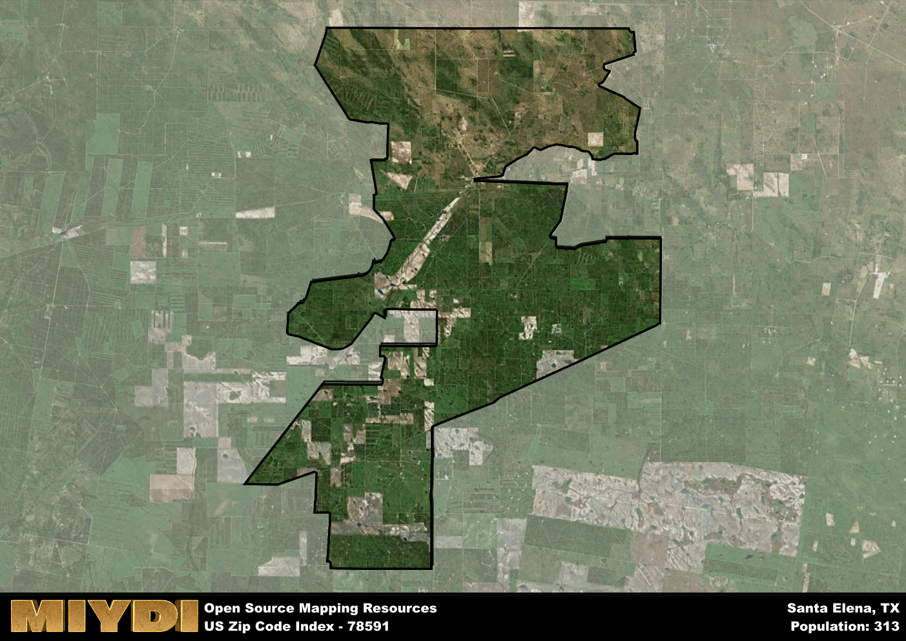

**Area Name:** Santa Elena

**Zip Code:** 78591

**State:** TX

Santa Elena is a part of the Rio Grande City-Roma - TX Micro Area, and makes up  of the Metro's population.  

# Santa Elena: A Historical and Vibrant Neighborhood in South Texas

Located in the southern tip of Texas, zip code 78591 encompasses the charming neighborhood of Santa Elena within the city of Santa Elena. Bordered by the Rio Grande to the south, this area is closely connected to the neighboring city of Roma and is part of the larger Rio Grande Valley metropolitan area. Santa Elena serves as a residential and commercial hub for the surrounding communities, with easy access to major transportation routes and amenities.

Santa Elena has a rich historical narrative dating back to the Spanish colonial era, when the area was first settled in the 18th century. Named after the historic Spanish presidio, Santa Elena has witnessed various cultural influences over the centuries, including Mexican, Tejano, and American traditions. The community has thrived on agriculture, ranching, and trade, contributing to its diverse heritage and vibrant local culture.

Today, Santa Elena is a bustling neighborhood with a mix of residential and commercial properties. The area is known for its agricultural businesses, local shops, and family-owned restaurants serving authentic Tex-Mex cuisine. Residents and visitors can enjoy nearby recreational activities along the Rio Grande, as well as explore historical sites such as the Santa Elena Canyon. With a strong sense of community and a blend of cultural influences, Santa Elena remains a dynamic and inviting neighborhood in the heart of South Texas.

# Santa Elena Demographics

The population of Santa Elena is 313.  
Santa Elena has a population density of 3.22 per square mile.  
The area of Santa Elena is 97.19 square miles.  

## Santa Elena Income and Economic Data

These demographic numbers are sourced from IRS return data, providing comprehensive insights into the population dynamics and economic trends within Santa Elena.

**Breakdown of return types for Santa Elena**

The table offers insight into the composition of tax returns filed with the IRS, categorizing them into three main types. Single returns represent filings by individuals, joint returns by married couples, and head of household returns by individuals who qualify as heads of households, typically having dependents. This breakdown provides an understanding of the different filing statuses adopted by taxpayers when submitting their tax documentation.

| Return Types filed for Santa Elena                              | Percentage          |
|----------------------------------------------------------|---------------------|
| Single Returns                                            | 0.47 |
| Joint Returns                                             | 0.33 |
| Head Household Returns                                    | 0 |

The income and economic data presented here is sourced from the IRS income brackets, utilized for categorizing tax returns by income levels. This table displays income ranges for both single filers and married couples, along with the corresponding number of returns and the percentage within each bracket, providing valuable insight into the distribution of taxes across various income groups.

| Bracket Name       | Single Filer Income Range | Married Couple Range | Number of Returns | Percentage of Returns |
|--------------------|----------------------------|----------------------|-------------------|-----------------------|
| 10% Bracket        | Up to $10,275              | Up to $20,550        | 60 | 0.4% |
| 12% Bracket        | $10,276 - $41,775          | $20,551 - $83,550    | 40 | 0.27% |
| 22% Bracket        | $41,776 - $89,075          | $83,551 - $178,150   | 20 | 0.13% |
| 24% Bracket        | $89,076 - $170,050         | $178,151 - $340,100  | 30 | 0.2% |
| 32% Bracket        | $170,051 - $215,950        | $340,101 - $431,900  | 0 | 0% |
| 35% Bracket        | $215,951 - $539,900        | $431,901 - $647,850  | 0 | 0% |

### Exploring Taxpayer Diversity: A Breakdown of Different Types of Tax Returns in Santa Elena

The table offers insights into various types of tax returns filed, reflecting different aspects of taxpayer activities and demographics. Categories include charitable returns for donations, dependent returns for claimed dependents, educator population, elderly population, real estate returns, self-employment returns, student loan returns, and unemployment returns, providing valuable insights into taxpayer behavior and demographics.

| Santa Elena Filing Types                    | Count | Percentage |
|--------------------------------------|-------|------------|
| Charitable Donations                 | 0 | 0% |
| Dependents Claimed                   | 0 | 0% |
| Educator Residents                   | 0 | 0% |
| Elderly Population                   | 60 | 0.4% |
| Farming Population                   | 40 | 0.267% |
| Real Estate Transactions             | 0 | 0% |
| Self-Employed Individuals            | 0 | 0% |
| Student Loan Cases                   | 0 | 0% |
| Unemployment Benefit Filings         | 0 | 0% |

## Santa Elena AI and Census Variables

The values presented in this dataset for Santa Elena are AI-optimized, streamlined, and categorized into relevant buckets for enhanced utility in AI and mapping programs. These simplified values have been optimized to facilitate efficient analysis and integration into various technological applications, offering users accessible and actionable insights into demographics within the Santa Elena area.

| AI Variables for Santa Elena | Value |
|-------------|-------|
| Shape Area | 316582673.611328 |
| Shape Length | 140727.820750596 |
| CBSA Federal Processing Standard Code | 40100 |

## How to use this free AI optimized Geo-Spatial Data for Santa Elena, TX

This data is made freely available under the Creative Commons license, allowing for unrestricted use for any purpose. Users can access static resources directly from GitHub or leverage more advanced functionalities by utilizing the GeoJSON files. All datasets originate from official government or private sector sources and are meticulously compiled into relevant datasets within QGIS. However, the versatility of the data ensures compatibility with any mapping application.

## Data Accuracy Disclaimer
It's important to note that the data provided here may contain errors or discrepancies and should be considered as 'close enough' for business applications and AI rather than a definitive source of truth. This data is aggregated from multiple sources, some of which publish information on wildly different intervals, leading to potential inconsistencies. Additionally, certain data points may not be corrected for Covid-related changes, further impacting accuracy. Moreover, the assumption that demographic trends are consistent throughout a region may lead to discrepancies, as trends often concentrate in areas of highest population density. As a result, dense areas may be slightly underrepresented, while rural areas may be slightly overrepresented, resulting in a more conservative dataset. Furthermore, the focus primarily on areas within US Major and Minor Statistical areas means that approximately 40 million Americans living outside of these areas may not be fully represented. Lastly, the historical background and area descriptions generated using AI are susceptible to potential mistakes, so users should exercise caution when interpreting the information provided.
