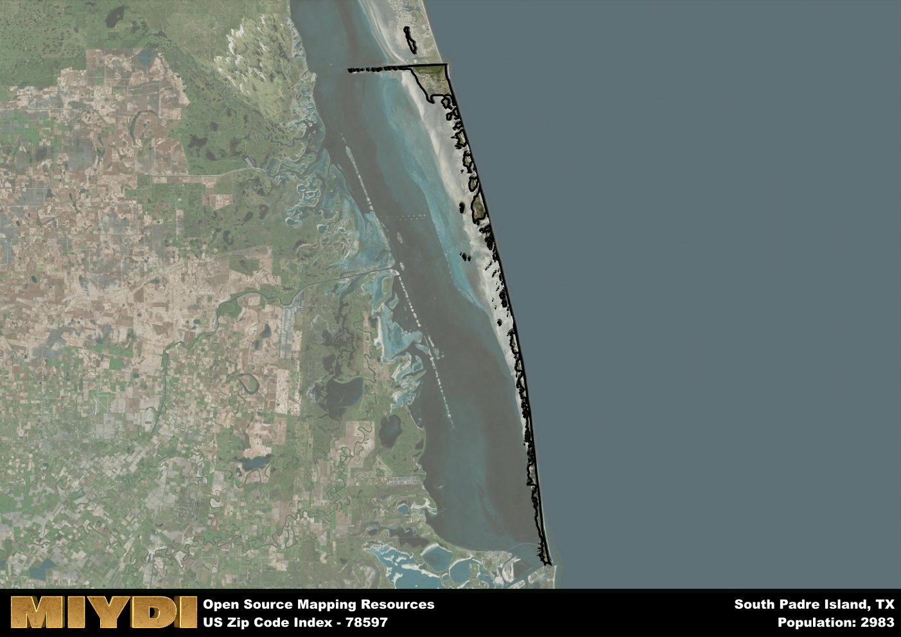

**Area Name:** South Padre Island

**Zip Code:** 78597

**State:** TX

South Padre Island is a part of the Raymondville - TX Micro Area, and makes up  of the Metro's population.  

# South Padre Island: A Tropical Paradise in Zip Code 78597

Located at the southern tip of Texas, zip code 78597 encompasses the beautiful South Padre Island. Bordered by the Gulf of Mexico to the east and Laguna Madre Bay to the west, this area is a popular tourist destination known for its stunning beaches and vibrant nightlife. Just a short drive from the city of Brownsville, South Padre Island is seamlessly integrated into the larger metropolitan area, offering a unique mix of coastal charm and urban convenience.

Originally inhabited by Native American tribes, South Padre Island was later colonized by Spanish explorers in the 16th century. The area saw significant growth in the 20th century with the development of tourism infrastructure and the construction of the Queen Isabella Causeway, connecting the island to the mainland. Today, South Padre Island is known for its bustling tourist industry, drawing visitors from around the world with its warm climate, water sports, and annual events such as Spring Break festivities and music festivals.

In the present day, South Padre Island is a thriving community with a diverse economy centered around tourism, fishing, and hospitality. The area offers a range of accommodations, from beachfront resorts to cozy vacation rentals, as well as a variety of restaurants serving up fresh seafood and Tex-Mex cuisine. Outdoor enthusiasts can enjoy a host of recreational activities, including surfing, fishing, and birdwatching, while history buffs can explore cultural sites such as the Port Isabel Lighthouse and the South Padre Island Birding and Nature Center. With its unique blend of natural beauty and modern amenities, South Padre Island continues to attract visitors seeking relaxation and adventure in a tropical paradise.

# South Padre Island Demographics

The population of South Padre Island is 2983.  
South Padre Island has a population density of 132.99 per square mile.  
The area of South Padre Island is 22.43 square miles.  

## South Padre Island Income and Economic Data

These demographic numbers are sourced from IRS return data, providing comprehensive insights into the population dynamics and economic trends within South Padre Island.

**Breakdown of return types for South Padre Island**

The table offers insight into the composition of tax returns filed with the IRS, categorizing them into three main types. Single returns represent filings by individuals, joint returns by married couples, and head of household returns by individuals who qualify as heads of households, typically having dependents. This breakdown provides an understanding of the different filing statuses adopted by taxpayers when submitting their tax documentation.

| Return Types filed for South Padre Island                              | Percentage          |
|----------------------------------------------------------|---------------------|
| Single Returns                                            | 0.52 |
| Joint Returns                                             | 0.41 |
| Head Household Returns                                    | 0.06 |

The income and economic data presented here is sourced from the IRS income brackets, utilized for categorizing tax returns by income levels. This table displays income ranges for both single filers and married couples, along with the corresponding number of returns and the percentage within each bracket, providing valuable insight into the distribution of taxes across various income groups.

| Bracket Name       | Single Filer Income Range | Married Couple Range | Number of Returns | Percentage of Returns |
|--------------------|----------------------------|----------------------|-------------------|-----------------------|
| 10% Bracket        | Up to $10,275              | Up to $20,550        | 400 | 0.31% |
| 12% Bracket        | $10,276 - $41,775          | $20,551 - $83,550    | 260 | 0.2% |
| 22% Bracket        | $41,776 - $89,075          | $83,551 - $178,150   | 170 | 0.13% |
| 24% Bracket        | $89,076 - $170,050         | $178,151 - $340,100  | 110 | 0.08% |
| 32% Bracket        | $170,051 - $215,950        | $340,101 - $431,900  | 230 | 0.18% |
| 35% Bracket        | $215,951 - $539,900        | $431,901 - $647,850  | 130 | 0.1% |

### Exploring Taxpayer Diversity: A Breakdown of Different Types of Tax Returns in South Padre Island

The table offers insights into various types of tax returns filed, reflecting different aspects of taxpayer activities and demographics. Categories include charitable returns for donations, dependent returns for claimed dependents, educator population, elderly population, real estate returns, self-employment returns, student loan returns, and unemployment returns, providing valuable insights into taxpayer behavior and demographics.

| South Padre Island Filing Types                    | Count | Percentage |
|--------------------------------------|-------|------------|
| Charitable Donations                 | 120 | 0.092% |
| Dependents Claimed                   | 0 | 0% |
| Educator Residents                   | 30 | 0.023% |
| Elderly Population                   | 640 | 0.49% |
| Farming Population                   | 20 | 0.015% |
| Real Estate Transactions             | 120 | 0.092% |
| Self-Employed Individuals            | 290 | 0.223% |
| Student Loan Cases                   | 50 | 0.038% |
| Unemployment Benefit Filings         | 220 | 0.17% |

## South Padre Island AI and Census Variables

The values presented in this dataset for South Padre Island are AI-optimized, streamlined, and categorized into relevant buckets for enhanced utility in AI and mapping programs. These simplified values have been optimized to facilitate efficient analysis and integration into various technological applications, offering users accessible and actionable insights into demographics within the South Padre Island area.

| AI Variables for South Padre Island | Value |
|-------------|-------|
| Shape Area | 72675301.9550781 |
| Shape Length | 289311.616864303 |
| CBSA Federal Processing Standard Code | 39700 |

## How to use this free AI optimized Geo-Spatial Data for South Padre Island, TX

This data is made freely available under the Creative Commons license, allowing for unrestricted use for any purpose. Users can access static resources directly from GitHub or leverage more advanced functionalities by utilizing the GeoJSON files. All datasets originate from official government or private sector sources and are meticulously compiled into relevant datasets within QGIS. However, the versatility of the data ensures compatibility with any mapping application.

## Data Accuracy Disclaimer
It's important to note that the data provided here may contain errors or discrepancies and should be considered as 'close enough' for business applications and AI rather than a definitive source of truth. This data is aggregated from multiple sources, some of which publish information on wildly different intervals, leading to potential inconsistencies. Additionally, certain data points may not be corrected for Covid-related changes, further impacting accuracy. Moreover, the assumption that demographic trends are consistent throughout a region may lead to discrepancies, as trends often concentrate in areas of highest population density. As a result, dense areas may be slightly underrepresented, while rural areas may be slightly overrepresented, resulting in a more conservative dataset. Furthermore, the focus primarily on areas within US Major and Minor Statistical areas means that approximately 40 million Americans living outside of these areas may not be fully represented. Lastly, the historical background and area descriptions generated using AI are susceptible to potential mistakes, so users should exercise caution when interpreting the information provided.
