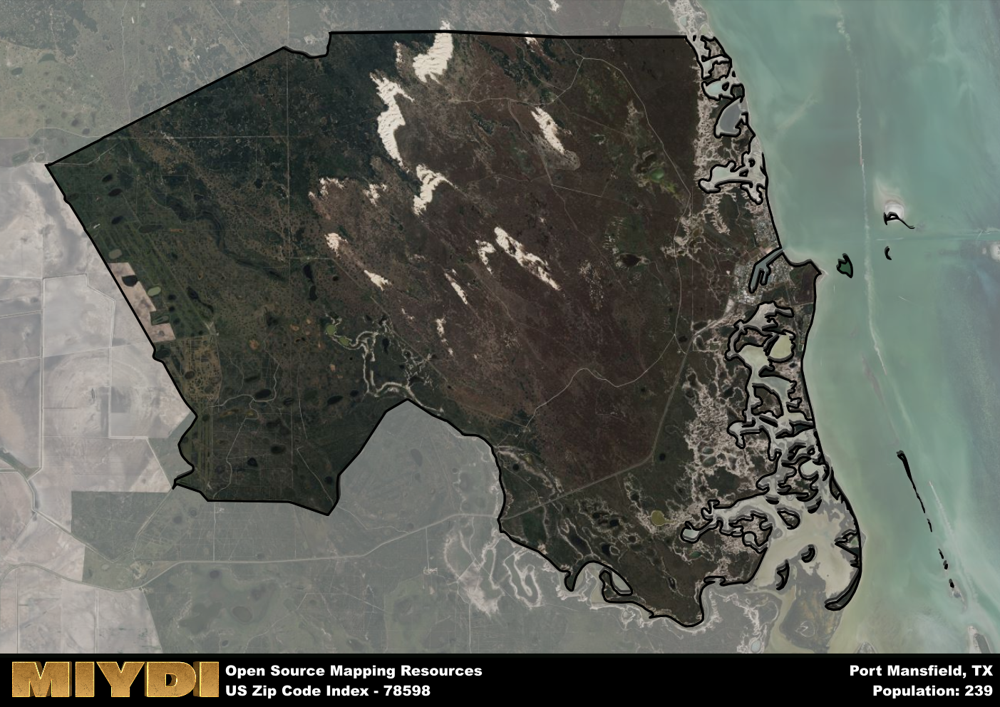

**Area Name:** Port Mansfield

**Zip Code:** 78598

**State:** TX

Port Mansfield is a part of the Raymondville - TX Micro Area, and makes up  of the Metro's population.  

# Port Mansfield: A Coastal Haven in South Texas

Located in the southern tip of Texas, zip code 78598 encompasses the serene coastal community of Port Mansfield. Bordered by the Gulf of Mexico to the east and Laguna Madre to the west, this zip code area is a hidden gem nestled between the towns of Raymondville and South Padre Island. Despite its remote location, Port Mansfield is easily accessible via State Highway 186, making it a popular destination for fishing enthusiasts and nature lovers seeking a peaceful retreat away from the hustle and bustle of more urbanized areas.

Port Mansfield has a rich history dating back to the early 20th century when it was primarily a fishing village inhabited by local fishermen and their families. Over the years, the community grew as more people discovered the area's abundant marine resources and tranquil atmosphere. The town was officially named Port Mansfield in honor of the Mansfield Cut, a nearby channel that provided access to the Gulf of Mexico for fishing boats and recreational vessels. Today, Port Mansfield retains its small-town charm while catering to tourists with its fishing charters, beachfront accommodations, and laid-back vibe.

Currently, Port Mansfield is a thriving coastal community with a strong emphasis on fishing and outdoor recreation. The area is home to a variety of charter companies offering deep-sea fishing expeditions, bay fishing trips, and bird-watching tours. In addition to its recreational offerings, Port Mansfield boasts a range of local businesses, including restaurants serving fresh seafood, convenience stores, and bait shops. Residents and visitors alike can enjoy the town's public beach access points, nature trails, and waterfront parks, making it a popular destination for those seeking a tranquil coastal escape in South Texas.

# Port Mansfield Demographics

The population of Port Mansfield is 239.  
Port Mansfield has a population density of 4.24 per square mile.  
The area of Port Mansfield is 56.43 square miles.  

## Port Mansfield Income and Economic Data

These demographic numbers are sourced from IRS return data, providing comprehensive insights into the population dynamics and economic trends within Port Mansfield.

**Breakdown of return types for Port Mansfield**

The table offers insight into the composition of tax returns filed with the IRS, categorizing them into three main types. Single returns represent filings by individuals, joint returns by married couples, and head of household returns by individuals who qualify as heads of households, typically having dependents. This breakdown provides an understanding of the different filing statuses adopted by taxpayers when submitting their tax documentation.

| Return Types filed for Port Mansfield                              | Percentage          |
|----------------------------------------------------------|---------------------|
| Single Returns                                            | 0.39 |
| Joint Returns                                             | 0.44 |
| Head Household Returns                                    | 0 |

The income and economic data presented here is sourced from the IRS income brackets, utilized for categorizing tax returns by income levels. This table displays income ranges for both single filers and married couples, along with the corresponding number of returns and the percentage within each bracket, providing valuable insight into the distribution of taxes across various income groups.

| Bracket Name       | Single Filer Income Range | Married Couple Range | Number of Returns | Percentage of Returns |
|--------------------|----------------------------|----------------------|-------------------|-----------------------|
| 10% Bracket        | Up to $10,275              | Up to $20,550        | 70 | 0.39% |
| 12% Bracket        | $10,276 - $41,775          | $20,551 - $83,550    | 40 | 0.22% |
| 22% Bracket        | $41,776 - $89,075          | $83,551 - $178,150   | 30 | 0.17% |
| 24% Bracket        | $89,076 - $170,050         | $178,151 - $340,100  | 0 | 0% |
| 32% Bracket        | $170,051 - $215,950        | $340,101 - $431,900  | 40 | 0.22% |
| 35% Bracket        | $215,951 - $539,900        | $431,901 - $647,850  | 0 | 0% |

### Exploring Taxpayer Diversity: A Breakdown of Different Types of Tax Returns in Port Mansfield

The table offers insights into various types of tax returns filed, reflecting different aspects of taxpayer activities and demographics. Categories include charitable returns for donations, dependent returns for claimed dependents, educator population, elderly population, real estate returns, self-employment returns, student loan returns, and unemployment returns, providing valuable insights into taxpayer behavior and demographics.

| Port Mansfield Filing Types                    | Count | Percentage |
|--------------------------------------|-------|------------|
| Charitable Donations                 | 0 | 0% |
| Dependents Claimed                   | 0 | 0% |
| Educator Residents                   | 0 | 0% |
| Elderly Population                   | 90 | 0.5% |
| Farming Population                   | 0 | 0% |
| Real Estate Transactions             | 0 | 0% |
| Self-Employed Individuals            | 30 | 0.167% |
| Student Loan Cases                   | 0 | 0% |
| Unemployment Benefit Filings         | 30 | 0.17% |

## Port Mansfield AI and Census Variables

The values presented in this dataset for Port Mansfield are AI-optimized, streamlined, and categorized into relevant buckets for enhanced utility in AI and mapping programs. These simplified values have been optimized to facilitate efficient analysis and integration into various technological applications, offering users accessible and actionable insights into demographics within the Port Mansfield area.

| AI Variables for Port Mansfield | Value |
|-------------|-------|
| Shape Area | 183383570.699219 |
| Shape Length | 166490.501038579 |
| CBSA Federal Processing Standard Code | 39700 |

## How to use this free AI optimized Geo-Spatial Data for Port Mansfield, TX

This data is made freely available under the Creative Commons license, allowing for unrestricted use for any purpose. Users can access static resources directly from GitHub or leverage more advanced functionalities by utilizing the GeoJSON files. All datasets originate from official government or private sector sources and are meticulously compiled into relevant datasets within QGIS. However, the versatility of the data ensures compatibility with any mapping application.

## Data Accuracy Disclaimer
It's important to note that the data provided here may contain errors or discrepancies and should be considered as 'close enough' for business applications and AI rather than a definitive source of truth. This data is aggregated from multiple sources, some of which publish information on wildly different intervals, leading to potential inconsistencies. Additionally, certain data points may not be corrected for Covid-related changes, further impacting accuracy. Moreover, the assumption that demographic trends are consistent throughout a region may lead to discrepancies, as trends often concentrate in areas of highest population density. As a result, dense areas may be slightly underrepresented, while rural areas may be slightly overrepresented, resulting in a more conservative dataset. Furthermore, the focus primarily on areas within US Major and Minor Statistical areas means that approximately 40 million Americans living outside of these areas may not be fully represented. Lastly, the historical background and area descriptions generated using AI are susceptible to potential mistakes, so users should exercise caution when interpreting the information provided.
