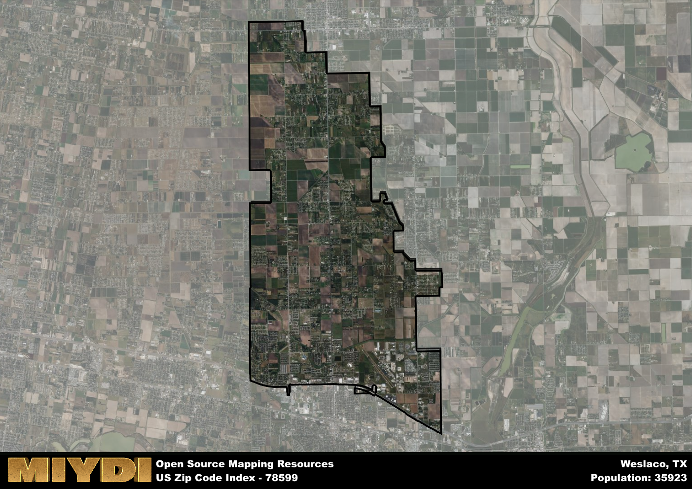

**Area Name:** Weslaco

**Zip Code:** 78599

**State:** TX

Weslaco is a part of the McAllen-Edinburg-Mission - TX Metro Area, and makes up 3.97% of the Metro's population.  

# Weslaco: A Vibrant Community in South Texas

Located in the heart of South Texas, zip code 78599 encompasses the bustling city of Weslaco. Bordered by Donna to the north, Mercedes to the west, and Progreso to the east, Weslaco is an integral part of the larger Rio Grande Valley metropolitan area. Situated just a short drive from the Mexican border, Weslaco serves as a hub for trade, agriculture, and cultural exchange in the region.

Weslaco has a rich history dating back to its founding in 1919. Originally established as a stop along the St. Louis, Brownsville and Mexico Railway, the city quickly grew into a center for agriculture, particularly citrus and cotton production. Over the years, Weslaco has experienced steady growth and development, becoming known for its vibrant community spirit and strong sense of identity.

Today, Weslaco thrives as a diverse and dynamic city, offering a mix of residential, commercial, and industrial areas. The city is home to a variety of businesses, schools, and healthcare facilities, providing residents with essential services and amenities. Weslaco also boasts a range of recreational opportunities, including parks, sports facilities, and cultural attractions such as the Weslaco Museum. With its blend of history, economic activity, and community engagement, Weslaco continues to be a vibrant and welcoming destination in South Texas.

# Weslaco Demographics

The population of Weslaco is 35923.  
Weslaco has a population density of 1253.42 per square mile.  
The area of Weslaco is 28.66 square miles.  

### Exploring Real Estate Trends: A Comprehensive Analysis of the Weslaco Area and its Neighbors

This table contains an in-depth examination of the real estate market in the Weslaco area. Sourced from trusted real estate market firms, this dataset provides a wealth of raw data detailing the local real estate landscape, along with comparative analyses juxtaposing the market dynamics with those of neighboring areas. Explore the intricacies of the Weslaco real estate market and gain valuable insights into its relationship with adjacent regions.

| Real Estate Data for Weslaco                       | Value    |
|------------------------------------------------|----------|
| Average Listing Price for Weslaco               | 280340 |
| Median Listing Price for Weslaco                | 272500 |
| Median Days on Market for Weslaco               | 49 |
| Median Listing Price per Square Foot for Weslaco| 60 |
| Median Square Feet for Weslaco                  | 1764 |
| Real Estate Prices to Income Ratio           | 246.59% |
| Price per Square Foot Ratio                  | 109.39% |
| Price Median Ratio                           | 101.84% |
| Market Sales Speed Ratio                     | 70.5% |

This table offers essential real estate data for the Weslaco area, including average and median listing prices, median days on market, and property size. It also presents ratio metrics as percentages, providing insights into how the local market compares to the surrounding region. A ratio of 100% signifies performance in line with the regional average, while values above or below indicate overperformance or underperformance, respectively, relative to expectations.

## Weslaco Sports and Recreation Data

#### Annual Youth Sports Spending for Weslaco

This table provides fundamental insights into the Sports and Recreation data for the Weslaco area, detailing the estimated annual expenditure on Youth Athletics. This includes estimated spending by the major consumer brackets. 
| Sports Spending for Weslaco| Value |
|-------------------------|-------|
| Athlete Spending Compared to the region | 72.37% |
| Total Youth Athlete Spending | ,605,310 |
| Athletic Spending - Essential Focused Consumer | 45,063 |
| Athletic Spending - Typical Consumer | ,531,420 |
| Athletic Spending - Affluent Consumers | ,227,650 |

#### Youth Coaching Estimates for Weslaco

This table presents the estimated number of coaches for the Weslaco area, derived from comprehensive national coaching surveys and athletic participation rates by state. It offers valuable insights into the vital role of coaching personnel in fostering athletic development and facilitating sports participation within the local community.

| Coaching Data for Weslaco | Value |
|-------------|-------|
| Total Coaches | 588 |
| Paid Coaches | 153 |
| Volunteer Coaches | 435 |

#### Youth Athlete Participation for Weslaco

This table shows the estimated total number of youth athletes in the Weslaco area, sourced from comprehensive national coaching surveys and athletic participation rates by state.

| Total YA Athletes in Weslaco | Value |
|-------------|-------|
| Total High School Athletes | 898 |
| Total Youth Athletes | 2693 |
| Total Young Adult Athletes | 1795 |
| Total Athletes to Age 25 | 5386 |

#### High School Age Athletes - Breakdown by Sport for Weslaco

This table shows insights regarding high school age estimated players by sport in the Weslaco area, derived from national and state-level athletic participation trends. 

| HS Players by Sport in Weslaco | Value |
|-------------|-------|
| Football Players | 206 |
| Basketball Players | 126 |
| Soccer Players | 99 |
| Volleyball Players | 63 |
| Baseball Players | 108 |
| Tennis Players | 54 |
| Track Athletes | 153 |
| Golf Players | 27 |
| Swimming Athletes | 27 |
| Wrestling Competitors | 27 |
| Lacrosse Players | 0 |

Estimating the number of younger athletes presents unique challenges due to their varied starting ages, typically beginning around six years old, and a gradual decline in participation rates as they age. Unlike high school-aged athletes, younger athletes are less likely to switch sports as they grow older, contributing to the stability of participation numbers within specific sports at younger ages.  

As a general trend, the total number of younger athletes is approximately three times the number of high school-aged athletes, underscoring the significant presence of youth athletes in sports programs and highlighting the importance of early engagement in athletic activities.

## Weslaco AI and Census Variables

The values presented in this dataset for Weslaco are AI-optimized, streamlined, and categorized into relevant buckets for enhanced utility in AI and mapping programs. These simplified values have been optimized to facilitate efficient analysis and integration into various technological applications, offering users accessible and actionable insights into demographics within the Weslaco area.

| AI Variables for Weslaco | Value |
|-------------|-------|
| Shape Area | 92633363.7148438 |
| Shape Length | 58913.0573549168 |
| CBSA Federal Processing Standard Code | 32580 |
| RE Price per Square Foot Ratio | 109.39% |
| RE Price Average Ratio | 90.14% |
| RE Speed Ratio | 70.5% |
| RE Income Ratio | 246.59% |
| RE Affordability Index Flag | 4 |
| Income Bracket Flag | 1 |
| RE Income Flag | 6 |
| RE Median Square Footage Price Flag | 3 |
| RE Median Square Footage Size Flag | 4 |
| RE Activity Flag | 3 |
| Poverty Line Risk Flag | 1 |

## How to use this free AI optimized Geo-Spatial Data for Weslaco, TX

This data is made freely available under the Creative Commons license, allowing for unrestricted use for any purpose. Users can access static resources directly from GitHub or leverage more advanced functionalities by utilizing the GeoJSON files. All datasets originate from official government or private sector sources and are meticulously compiled into relevant datasets within QGIS. However, the versatility of the data ensures compatibility with any mapping application.

## Data Accuracy Disclaimer
It's important to note that the data provided here may contain errors or discrepancies and should be considered as 'close enough' for business applications and AI rather than a definitive source of truth. This data is aggregated from multiple sources, some of which publish information on wildly different intervals, leading to potential inconsistencies. Additionally, certain data points may not be corrected for Covid-related changes, further impacting accuracy. Moreover, the assumption that demographic trends are consistent throughout a region may lead to discrepancies, as trends often concentrate in areas of highest population density. As a result, dense areas may be slightly underrepresented, while rural areas may be slightly overrepresented, resulting in a more conservative dataset. Furthermore, the focus primarily on areas within US Major and Minor Statistical areas means that approximately 40 million Americans living outside of these areas may not be fully represented. Lastly, the historical background and area descriptions generated using AI are susceptible to potential mistakes, so users should exercise caution when interpreting the information provided.
