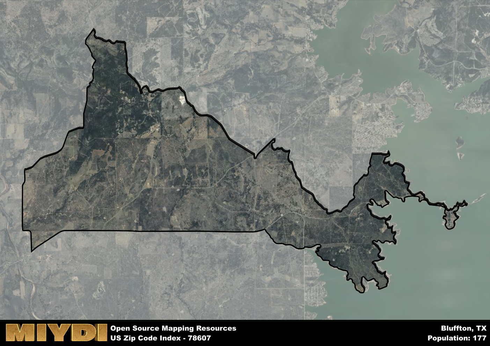

**Area Name:** Bluffton

**Zip Code:** 78607

**State:** TX

# Bluffton: A Charming Neighborhood in Central Texas  

Located in central Texas, zip code 78607 encompasses the picturesque area of Bluffton. Situated within Llano County, Bluffton is surrounded by rolling hills and the tranquil waters of the Colorado River. While it maintains a sense of seclusion, the neighborhood is only a short drive away from larger cities such as Austin and San Antonio, making it an ideal retreat for those seeking a peaceful setting with convenient access to urban amenities.

Bluffton has a rich history dating back to the mid-19th century when settlers were drawn to the area for its fertile land and stunning landscape. The neighborhood flourished with the establishment of farms and ranches, becoming a hub for agricultural activity in the region. The name "Bluffton" is believed to have been inspired by the bluffs overlooking the Colorado River, offering a scenic backdrop for the community. Over the years, Bluffton has maintained its rural charm while welcoming new residents and visitors to experience its unique blend of history and natural beauty.

Today, Bluffton is a thriving community known for its outdoor recreational opportunities, including fishing, hiking, and camping along the riverbanks. The neighborhood boasts a close-knit community with locally-owned shops and restaurants offering a taste of small-town hospitality. Residents and visitors alike can explore historic landmarks such as the Bluffton Schoolhouse, which stands as a testament to the neighborhood's enduring legacy. With its blend of rural charm and modern conveniences, Bluffton continues to enchant all who venture into its peaceful surroundings.

# Bluffton Demographics

The population of Bluffton is 177.  
Bluffton has a population density of 9.08 per square mile.  
The area of Bluffton is 19.49 square miles.  

## Bluffton Income and Economic Data

These demographic numbers are sourced from IRS return data, providing comprehensive insights into the population dynamics and economic trends within Bluffton.

**Breakdown of return types for Bluffton**

The table offers insight into the composition of tax returns filed with the IRS, categorizing them into three main types. Single returns represent filings by individuals, joint returns by married couples, and head of household returns by individuals who qualify as heads of households, typically having dependents. This breakdown provides an understanding of the different filing statuses adopted by taxpayers when submitting their tax documentation.

| Return Types filed for Bluffton                              | Percentage          |
|----------------------------------------------------------|---------------------|
| Single Returns                                            | 0.42 |
| Joint Returns                                             | 0.42 |
| Head Household Returns                                    | 0 |

The income and economic data presented here is sourced from the IRS income brackets, utilized for categorizing tax returns by income levels. This table displays income ranges for both single filers and married couples, along with the corresponding number of returns and the percentage within each bracket, providing valuable insight into the distribution of taxes across various income groups.

| Bracket Name       | Single Filer Income Range | Married Couple Range | Number of Returns | Percentage of Returns |
|--------------------|----------------------------|----------------------|-------------------|-----------------------|
| 10% Bracket        | Up to $10,275              | Up to $20,550        | 30 | 0.25% |
| 12% Bracket        | $10,276 - $41,775          | $20,551 - $83,550    | 30 | 0.25% |
| 22% Bracket        | $41,776 - $89,075          | $83,551 - $178,150   | 30 | 0.25% |
| 24% Bracket        | $89,076 - $170,050         | $178,151 - $340,100  | 0 | 0% |
| 32% Bracket        | $170,051 - $215,950        | $340,101 - $431,900  | 30 | 0.25% |
| 35% Bracket        | $215,951 - $539,900        | $431,901 - $647,850  | 0 | 0% |

### Exploring Taxpayer Diversity: A Breakdown of Different Types of Tax Returns in Bluffton

The table offers insights into various types of tax returns filed, reflecting different aspects of taxpayer activities and demographics. Categories include charitable returns for donations, dependent returns for claimed dependents, educator population, elderly population, real estate returns, self-employment returns, student loan returns, and unemployment returns, providing valuable insights into taxpayer behavior and demographics.

| Bluffton Filing Types                    | Count | Percentage |
|--------------------------------------|-------|------------|
| Charitable Donations                 | 0 | 0% |
| Dependents Claimed                   | 0 | 0% |
| Educator Residents                   | 0 | 0% |
| Elderly Population                   | 70 | 0.58% |
| Farming Population                   | 0 | 0% |
| Real Estate Transactions             | 0 | 0% |
| Self-Employed Individuals            | 0 | 0% |
| Student Loan Cases                   | 0 | 0% |
| Unemployment Benefit Filings         | 0 | 0% |

## Bluffton AI and Census Variables

The values presented in this dataset for Bluffton are AI-optimized, streamlined, and categorized into relevant buckets for enhanced utility in AI and mapping programs. These simplified values have been optimized to facilitate efficient analysis and integration into various technological applications, offering users accessible and actionable insights into demographics within the Bluffton area.

| AI Variables for Bluffton | Value |
|-------------|-------|
| Shape Area | 68682764.8125 |
| Shape Length | 72544.4560816485 |

## How to use this free AI optimized Geo-Spatial Data for Bluffton, TX

This data is made freely available under the Creative Commons license, allowing for unrestricted use for any purpose. Users can access static resources directly from GitHub or leverage more advanced functionalities by utilizing the GeoJSON files. All datasets originate from official government or private sector sources and are meticulously compiled into relevant datasets within QGIS. However, the versatility of the data ensures compatibility with any mapping application.

## Data Accuracy Disclaimer
It's important to note that the data provided here may contain errors or discrepancies and should be considered as 'close enough' for business applications and AI rather than a definitive source of truth. This data is aggregated from multiple sources, some of which publish information on wildly different intervals, leading to potential inconsistencies. Additionally, certain data points may not be corrected for Covid-related changes, further impacting accuracy. Moreover, the assumption that demographic trends are consistent throughout a region may lead to discrepancies, as trends often concentrate in areas of highest population density. As a result, dense areas may be slightly underrepresented, while rural areas may be slightly overrepresented, resulting in a more conservative dataset. Furthermore, the focus primarily on areas within US Major and Minor Statistical areas means that approximately 40 million Americans living outside of these areas may not be fully represented. Lastly, the historical background and area descriptions generated using AI are susceptible to potential mistakes, so users should exercise caution when interpreting the information provided.
