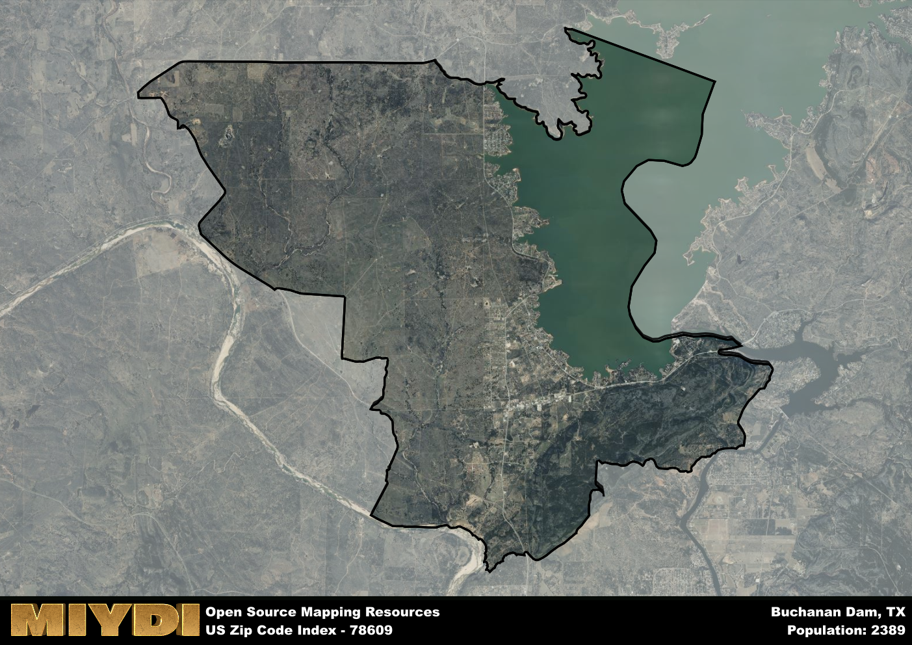

**Area Name:** Buchanan Dam

**Zip Code:** 78609

**State:** TX

# Buchanan Dam: A Charming Neighborhood in the Heart of Texas Hill Country  

Located in the heart of Texas Hill Country, the zip code 78609 area known as Buchanan Dam is situated along the picturesque shores of Lake Buchanan. Bordered by the towns of Burnet and Llano, Buchanan Dam is a tranquil residential community that seamlessly integrates with the surrounding natural beauty. Despite its serene setting, Buchanan Dam is only a short drive away from the bustling city of Austin, allowing residents to enjoy the best of both worlds - a peaceful lakeside retreat and easy access to urban amenities.

The history of Buchanan Dam dates back to the 1930s when the dam was constructed as part of the Lower Colorado River Authority's efforts to harness the power of the Colorado River for electricity generation and flood control. The area experienced a period of rapid growth as workers flocked to the region to take advantage of the employment opportunities provided by the dam project. Over the years, Buchanan Dam has evolved into a close-knit community known for its strong sense of community spirit and appreciation for the natural surroundings.

Today, Buchanan Dam offers a range of recreational activities for residents and visitors alike, including boating, fishing, and hiking. The area is also home to several small businesses, local restaurants, and antique shops that add to its unique charm. With its stunning natural landscapes and rich history, Buchanan Dam continues to attract those seeking a peaceful escape from the hustle and bustle of city life, making it a beloved gem in the Texas Hill Country.

# Buchanan Dam Demographics

The population of Buchanan Dam is 2389.  
Buchanan Dam has a population density of 43.75 per square mile.  
The area of Buchanan Dam is 54.6 square miles.  

## Buchanan Dam Income and Economic Data

These demographic numbers are sourced from IRS return data, providing comprehensive insights into the population dynamics and economic trends within Buchanan Dam.

**Breakdown of return types for Buchanan Dam**

The table offers insight into the composition of tax returns filed with the IRS, categorizing them into three main types. Single returns represent filings by individuals, joint returns by married couples, and head of household returns by individuals who qualify as heads of households, typically having dependents. This breakdown provides an understanding of the different filing statuses adopted by taxpayers when submitting their tax documentation.

| Return Types filed for Buchanan Dam                              | Percentage          |
|----------------------------------------------------------|---------------------|
| Single Returns                                            | 0.45 |
| Joint Returns                                             | 0.45 |
| Head Household Returns                                    | 0.06 |

The income and economic data presented here is sourced from the IRS income brackets, utilized for categorizing tax returns by income levels. This table displays income ranges for both single filers and married couples, along with the corresponding number of returns and the percentage within each bracket, providing valuable insight into the distribution of taxes across various income groups.

| Bracket Name       | Single Filer Income Range | Married Couple Range | Number of Returns | Percentage of Returns |
|--------------------|----------------------------|----------------------|-------------------|-----------------------|
| 10% Bracket        | Up to $10,275              | Up to $20,550        | 310 | 0.32% |
| 12% Bracket        | $10,276 - $41,775          | $20,551 - $83,550    | 220 | 0.23% |
| 22% Bracket        | $41,776 - $89,075          | $83,551 - $178,150   | 140 | 0.14% |
| 24% Bracket        | $89,076 - $170,050         | $178,151 - $340,100  | 90 | 0.09% |
| 32% Bracket        | $170,051 - $215,950        | $340,101 - $431,900  | 150 | 0.15% |
| 35% Bracket        | $215,951 - $539,900        | $431,901 - $647,850  | 60 | 0.06% |

### Exploring Taxpayer Diversity: A Breakdown of Different Types of Tax Returns in Buchanan Dam

The table offers insights into various types of tax returns filed, reflecting different aspects of taxpayer activities and demographics. Categories include charitable returns for donations, dependent returns for claimed dependents, educator population, elderly population, real estate returns, self-employment returns, student loan returns, and unemployment returns, providing valuable insights into taxpayer behavior and demographics.

| Buchanan Dam Filing Types                    | Count | Percentage |
|--------------------------------------|-------|------------|
| Charitable Donations                 | 40 | 0.041% |
| Dependents Claimed                   | 0 | 0% |
| Educator Residents                   | 0 | 0% |
| Elderly Population                   | 480 | 0.49% |
| Farming Population                   | 40 | 0.041% |
| Real Estate Transactions             | 40 | 0.041% |
| Self-Employed Individuals            | 150 | 0.155% |
| Student Loan Cases                   | 0 | 0% |
| Unemployment Benefit Filings         | 100 | 0.1% |

## Buchanan Dam AI and Census Variables

The values presented in this dataset for Buchanan Dam are AI-optimized, streamlined, and categorized into relevant buckets for enhanced utility in AI and mapping programs. These simplified values have been optimized to facilitate efficient analysis and integration into various technological applications, offering users accessible and actionable insights into demographics within the Buchanan Dam area.

| AI Variables for Buchanan Dam | Value |
|-------------|-------|
| Shape Area | 192143553.46875 |
| Shape Length | 91969.522355442 |

## How to use this free AI optimized Geo-Spatial Data for Buchanan Dam, TX

This data is made freely available under the Creative Commons license, allowing for unrestricted use for any purpose. Users can access static resources directly from GitHub or leverage more advanced functionalities by utilizing the GeoJSON files. All datasets originate from official government or private sector sources and are meticulously compiled into relevant datasets within QGIS. However, the versatility of the data ensures compatibility with any mapping application.

## Data Accuracy Disclaimer
It's important to note that the data provided here may contain errors or discrepancies and should be considered as 'close enough' for business applications and AI rather than a definitive source of truth. This data is aggregated from multiple sources, some of which publish information on wildly different intervals, leading to potential inconsistencies. Additionally, certain data points may not be corrected for Covid-related changes, further impacting accuracy. Moreover, the assumption that demographic trends are consistent throughout a region may lead to discrepancies, as trends often concentrate in areas of highest population density. As a result, dense areas may be slightly underrepresented, while rural areas may be slightly overrepresented, resulting in a more conservative dataset. Furthermore, the focus primarily on areas within US Major and Minor Statistical areas means that approximately 40 million Americans living outside of these areas may not be fully represented. Lastly, the historical background and area descriptions generated using AI are susceptible to potential mistakes, so users should exercise caution when interpreting the information provided.
