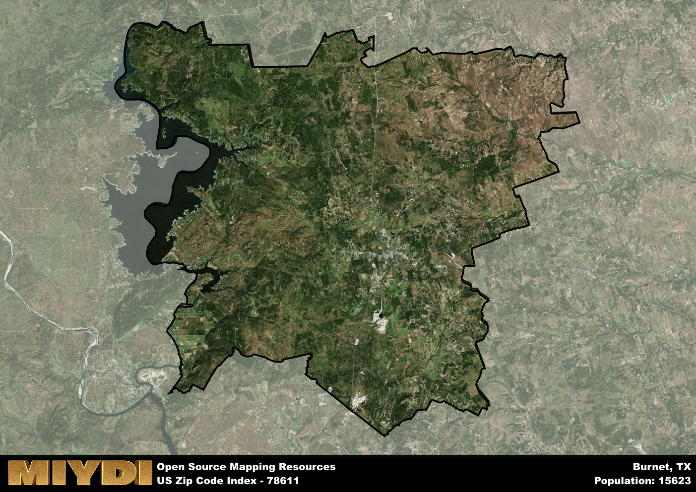

**Area Name:** Burnet

**Zip Code:** 78611

**State:** TX

# Exploring Burnet: A Historic Gem in the Heart of Texas Hill Country  

Located in the picturesque Texas Hill Country, zip code 78611 corresponds to the charming town of Burnet. Situated within Burnet County, this area is bordered by the Highland Lakes to the east and the Balcones Canyonlands National Wildlife Refuge to the west. Burnet seamlessly integrates with neighboring towns such as Marble Falls and Lampasas, forming a vibrant hub within the larger metropolitan area of Austin-Round Rock.

Burnet has a rich historical narrative that dates back to the mid-19th century when it was established as a trading post along the Chisholm Trail. The town grew rapidly due to its strategic location and proximity to major transportation routes. Burnet played a significant role in the development of Central Texas, serving as a center for agriculture, commerce, and culture. The town was named after David Gouverneur Burnet, the first president of the Republic of Texas, honoring its deep ties to the state's history.

Today, Burnet is a thriving community with a diverse economy that includes agriculture, tourism, and manufacturing. The town boasts a range of neighborhood-specific services, from boutique shops to family-owned restaurants, catering to both residents and visitors. Outdoor enthusiasts can explore the nearby Longhorn Cavern State Park or enjoy water activities on the Highland Lakes. Burnet also preserves its heritage through historic sites like the Fort Croghan Museum, offering a glimpse into the town's past. With its scenic beauty and vibrant culture, Burnet remains a hidden gem in the heart of Texas Hill Country.

# Burnet Demographics

The population of Burnet is 15623.  
Burnet has a population density of 50.72 per square mile.  
The area of Burnet is 308.01 square miles.  

## Burnet Income and Economic Data

These demographic numbers are sourced from IRS return data, providing comprehensive insights into the population dynamics and economic trends within Burnet.

**Breakdown of return types for Burnet**

The table offers insight into the composition of tax returns filed with the IRS, categorizing them into three main types. Single returns represent filings by individuals, joint returns by married couples, and head of household returns by individuals who qualify as heads of households, typically having dependents. This breakdown provides an understanding of the different filing statuses adopted by taxpayers when submitting their tax documentation.

| Return Types filed for Burnet                              | Percentage          |
|----------------------------------------------------------|---------------------|
| Single Returns                                            | 0.42 |
| Joint Returns                                             | 0.46 |
| Head Household Returns                                    | 0.1 |

The income and economic data presented here is sourced from the IRS income brackets, utilized for categorizing tax returns by income levels. This table displays income ranges for both single filers and married couples, along with the corresponding number of returns and the percentage within each bracket, providing valuable insight into the distribution of taxes across various income groups.

| Bracket Name       | Single Filer Income Range | Married Couple Range | Number of Returns | Percentage of Returns |
|--------------------|----------------------------|----------------------|-------------------|-----------------------|
| 10% Bracket        | Up to $10,275              | Up to $20,550        | 2100 | 0.3% |
| 12% Bracket        | $10,276 - $41,775          | $20,551 - $83,550    | 1700 | 0.24% |
| 22% Bracket        | $41,776 - $89,075          | $83,551 - $178,150   | 1050 | 0.15% |
| 24% Bracket        | $89,076 - $170,050         | $178,151 - $340,100  | 670 | 0.1% |
| 32% Bracket        | $170,051 - $215,950        | $340,101 - $431,900  | 1060 | 0.15% |
| 35% Bracket        | $215,951 - $539,900        | $431,901 - $647,850  | 390 | 0.06% |

### Exploring Taxpayer Diversity: A Breakdown of Different Types of Tax Returns in Burnet

The table offers insights into various types of tax returns filed, reflecting different aspects of taxpayer activities and demographics. Categories include charitable returns for donations, dependent returns for claimed dependents, educator population, elderly population, real estate returns, self-employment returns, student loan returns, and unemployment returns, providing valuable insights into taxpayer behavior and demographics.

| Burnet Filing Types                    | Count | Percentage |
|--------------------------------------|-------|------------|
| Charitable Donations                 | 430 | 0.062% |
| Dependents Claimed                   | 210 | 0.03% |
| Educator Residents                   | 150 | 0.022% |
| Elderly Population                   | 2530 | 0.36% |
| Farming Population                   | 350 | 0.05% |
| Real Estate Transactions             | 470 | 0.067% |
| Self-Employed Individuals            | 1140 | 0.164% |
| Student Loan Cases                   | 340 | 0.049% |
| Unemployment Benefit Filings         | 550 | 0.08% |

## Burnet AI and Census Variables

The values presented in this dataset for Burnet are AI-optimized, streamlined, and categorized into relevant buckets for enhanced utility in AI and mapping programs. These simplified values have been optimized to facilitate efficient analysis and integration into various technological applications, offering users accessible and actionable insights into demographics within the Burnet area.

| AI Variables for Burnet | Value |
|-------------|-------|
| Shape Area | 1084536151.07813 |
| Shape Length | 215780.195966332 |

## How to use this free AI optimized Geo-Spatial Data for Burnet, TX

This data is made freely available under the Creative Commons license, allowing for unrestricted use for any purpose. Users can access static resources directly from GitHub or leverage more advanced functionalities by utilizing the GeoJSON files. All datasets originate from official government or private sector sources and are meticulously compiled into relevant datasets within QGIS. However, the versatility of the data ensures compatibility with any mapping application.

## Data Accuracy Disclaimer
It's important to note that the data provided here may contain errors or discrepancies and should be considered as 'close enough' for business applications and AI rather than a definitive source of truth. This data is aggregated from multiple sources, some of which publish information on wildly different intervals, leading to potential inconsistencies. Additionally, certain data points may not be corrected for Covid-related changes, further impacting accuracy. Moreover, the assumption that demographic trends are consistent throughout a region may lead to discrepancies, as trends often concentrate in areas of highest population density. As a result, dense areas may be slightly underrepresented, while rural areas may be slightly overrepresented, resulting in a more conservative dataset. Furthermore, the focus primarily on areas within US Major and Minor Statistical areas means that approximately 40 million Americans living outside of these areas may not be fully represented. Lastly, the historical background and area descriptions generated using AI are susceptible to potential mistakes, so users should exercise caution when interpreting the information provided.
