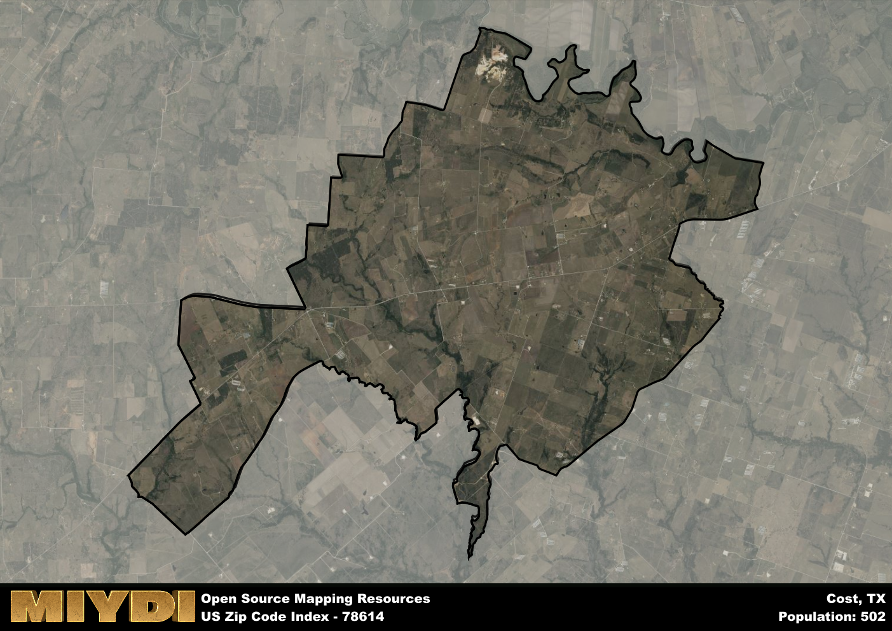

**Area Name:** Cost

**Zip Code:** 78614

**State:** TX

# Cost, Texas - A Charming Rural Community in Central Texas

Cost, Texas, located within the 78614 zip code, is a small rural community situated in Central Texas. The area is bordered by open fields and farmland, with neighboring towns such as Gonzales and Luling providing additional services and amenities to residents. Cost is a peaceful and tight-knit community, offering a serene escape from the hustle and bustle of nearby urban centers.

The history of Cost dates back to the early 19th century when settlers established farms and ranches in the area. Over the years, the community grew around a central square, with churches and schools playing a vital role in shaping its identity. The town was officially incorporated in the late 1800s and has since maintained its rural charm and historic character, attracting visitors looking to experience a simpler way of life.

Today, Cost continues to thrive as a close-knit community with a focus on agriculture and small businesses. Residents enjoy local shops and restaurants, as well as outdoor recreational activities like fishing and hiking in the surrounding natural areas. The town also boasts a number of historic sites and landmarks, showcasing its rich past and heritage. Cost remains a hidden gem in Central Texas, offering a peaceful and welcoming environment for both residents and visitors alike.

# Cost Demographics

The population of Cost is 502.  
Cost has a population density of 10.98 per square mile.  
The area of Cost is 45.74 square miles.  

## Cost Income and Economic Data

These demographic numbers are sourced from IRS return data, providing comprehensive insights into the population dynamics and economic trends within Cost.

**Breakdown of return types for Cost**

The table offers insight into the composition of tax returns filed with the IRS, categorizing them into three main types. Single returns represent filings by individuals, joint returns by married couples, and head of household returns by individuals who qualify as heads of households, typically having dependents. This breakdown provides an understanding of the different filing statuses adopted by taxpayers when submitting their tax documentation.

| Return Types filed for Cost                              | Percentage          |
|----------------------------------------------------------|---------------------|
| Single Returns                                            | 0.52 |
| Joint Returns                                             | 0.4 |
| Head Household Returns                                    | 0.12 |

The income and economic data presented here is sourced from the IRS income brackets, utilized for categorizing tax returns by income levels. This table displays income ranges for both single filers and married couples, along with the corresponding number of returns and the percentage within each bracket, providing valuable insight into the distribution of taxes across various income groups.

| Bracket Name       | Single Filer Income Range | Married Couple Range | Number of Returns | Percentage of Returns |
|--------------------|----------------------------|----------------------|-------------------|-----------------------|
| 10% Bracket        | Up to $10,275              | Up to $20,550        | 70 | 0.28% |
| 12% Bracket        | $10,276 - $41,775          | $20,551 - $83,550    | 80 | 0.32% |
| 22% Bracket        | $41,776 - $89,075          | $83,551 - $178,150   | 30 | 0.12% |
| 24% Bracket        | $89,076 - $170,050         | $178,151 - $340,100  | 20 | 0.08% |
| 32% Bracket        | $170,051 - $215,950        | $340,101 - $431,900  | 50 | 0.2% |
| 35% Bracket        | $215,951 - $539,900        | $431,901 - $647,850  | 0 | 0% |

### Exploring Taxpayer Diversity: A Breakdown of Different Types of Tax Returns in Cost

The table offers insights into various types of tax returns filed, reflecting different aspects of taxpayer activities and demographics. Categories include charitable returns for donations, dependent returns for claimed dependents, educator population, elderly population, real estate returns, self-employment returns, student loan returns, and unemployment returns, providing valuable insights into taxpayer behavior and demographics.

| Cost Filing Types                    | Count | Percentage |
|--------------------------------------|-------|------------|
| Charitable Donations                 | 0 | 0% |
| Dependents Claimed                   | 0 | 0% |
| Educator Residents                   | 0 | 0% |
| Elderly Population                   | 90 | 0.36% |
| Farming Population                   | 60 | 0.24% |
| Real Estate Transactions             | 0 | 0% |
| Self-Employed Individuals            | 50 | 0.2% |
| Student Loan Cases                   | 0 | 0% |
| Unemployment Benefit Filings         | 20 | 0.08% |

## Cost AI and Census Variables

The values presented in this dataset for Cost are AI-optimized, streamlined, and categorized into relevant buckets for enhanced utility in AI and mapping programs. These simplified values have been optimized to facilitate efficient analysis and integration into various technological applications, offering users accessible and actionable insights into demographics within the Cost area.

| AI Variables for Cost | Value |
|-------------|-------|
| Shape Area | 156685481.019531 |
| Shape Length | 96603.9568775894 |

## How to use this free AI optimized Geo-Spatial Data for Cost, TX

This data is made freely available under the Creative Commons license, allowing for unrestricted use for any purpose. Users can access static resources directly from GitHub or leverage more advanced functionalities by utilizing the GeoJSON files. All datasets originate from official government or private sector sources and are meticulously compiled into relevant datasets within QGIS. However, the versatility of the data ensures compatibility with any mapping application.

## Data Accuracy Disclaimer
It's important to note that the data provided here may contain errors or discrepancies and should be considered as 'close enough' for business applications and AI rather than a definitive source of truth. This data is aggregated from multiple sources, some of which publish information on wildly different intervals, leading to potential inconsistencies. Additionally, certain data points may not be corrected for Covid-related changes, further impacting accuracy. Moreover, the assumption that demographic trends are consistent throughout a region may lead to discrepancies, as trends often concentrate in areas of highest population density. As a result, dense areas may be slightly underrepresented, while rural areas may be slightly overrepresented, resulting in a more conservative dataset. Furthermore, the focus primarily on areas within US Major and Minor Statistical areas means that approximately 40 million Americans living outside of these areas may not be fully represented. Lastly, the historical background and area descriptions generated using AI are susceptible to potential mistakes, so users should exercise caution when interpreting the information provided.
