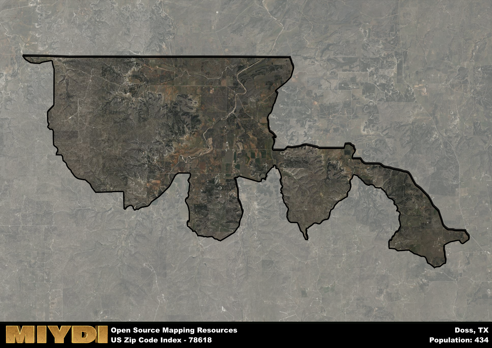

**Area Name:** Doss

**Zip Code:** 78618

**State:** TX

Doss is a part of the Fredericksburg - TX Micro Area, and makes up  of the Metro's population.  

# Doss: A Charming Community in the Heart of the Texas Hill Country

Located in the picturesque Texas Hill Country, zip code 78618 encompasses the small community of Doss. Situated in Gillespie County, Doss is surrounded by rolling hills, lush vineyards, and quaint rural landscapes. The area is in close proximity to the larger cities of Fredericksburg and Kerrville, providing residents with easy access to urban amenities while still enjoying a peaceful country lifestyle. Doss is a tight-knit community known for its friendly residents and beautiful natural surroundings.

Doss has a rich historical heritage dating back to the mid-1800s when German settlers first established the area. These early pioneers were drawn to the fertile land and mild climate, creating a thriving agricultural community. Over the years, Doss has maintained its rural charm and agricultural roots, with many residents still engaged in farming and ranching. The community takes pride in its German heritage, evident in the local architecture, food, and cultural traditions that are celebrated throughout the year.

Today, Doss is a vibrant community that offers a mix of rural tranquility and modern conveniences. The area is known for its vineyards and wineries, attracting wine enthusiasts from near and far. Doss also boasts a variety of outdoor recreational activities, including hiking, fishing, and bird watching. The community is home to local businesses, shops, and restaurants that cater to residents and visitors alike. Historic sites such as the Doss Heritage and Cultural Center provide insight into the area's past, while community events and festivals showcase the unique charm of this hidden gem in the Texas Hill Country.

# Doss Demographics

The population of Doss is 434.  
Doss has a population density of 6.42 per square mile.  
The area of Doss is 67.56 square miles.  

## Doss Income and Economic Data

These demographic numbers are sourced from IRS return data, providing comprehensive insights into the population dynamics and economic trends within Doss.

**Breakdown of return types for Doss**

The table offers insight into the composition of tax returns filed with the IRS, categorizing them into three main types. Single returns represent filings by individuals, joint returns by married couples, and head of household returns by individuals who qualify as heads of households, typically having dependents. This breakdown provides an understanding of the different filing statuses adopted by taxpayers when submitting their tax documentation.

| Return Types filed for Doss                              | Percentage          |
|----------------------------------------------------------|---------------------|
| Single Returns                                            | 0.35 |
| Joint Returns                                             | 0.53 |
| Head Household Returns                                    | 0 |

The income and economic data presented here is sourced from the IRS income brackets, utilized for categorizing tax returns by income levels. This table displays income ranges for both single filers and married couples, along with the corresponding number of returns and the percentage within each bracket, providing valuable insight into the distribution of taxes across various income groups.

| Bracket Name       | Single Filer Income Range | Married Couple Range | Number of Returns | Percentage of Returns |
|--------------------|----------------------------|----------------------|-------------------|-----------------------|
| 10% Bracket        | Up to $10,275              | Up to $20,550        | 40 | 0.24% |
| 12% Bracket        | $10,276 - $41,775          | $20,551 - $83,550    | 50 | 0.29% |
| 22% Bracket        | $41,776 - $89,075          | $83,551 - $178,150   | 40 | 0.24% |
| 24% Bracket        | $89,076 - $170,050         | $178,151 - $340,100  | 0 | 0% |
| 32% Bracket        | $170,051 - $215,950        | $340,101 - $431,900  | 40 | 0.24% |
| 35% Bracket        | $215,951 - $539,900        | $431,901 - $647,850  | 0 | 0% |

### Exploring Taxpayer Diversity: A Breakdown of Different Types of Tax Returns in Doss

The table offers insights into various types of tax returns filed, reflecting different aspects of taxpayer activities and demographics. Categories include charitable returns for donations, dependent returns for claimed dependents, educator population, elderly population, real estate returns, self-employment returns, student loan returns, and unemployment returns, providing valuable insights into taxpayer behavior and demographics.

| Doss Filing Types                    | Count | Percentage |
|--------------------------------------|-------|------------|
| Charitable Donations                 | 0 | 0% |
| Dependents Claimed                   | 0 | 0% |
| Educator Residents                   | 0 | 0% |
| Elderly Population                   | 70 | 0.41% |
| Farming Population                   | 60 | 0.353% |
| Real Estate Transactions             | 0 | 0% |
| Self-Employed Individuals            | 20 | 0.118% |
| Student Loan Cases                   | 0 | 0% |
| Unemployment Benefit Filings         | 0 | 0% |

## Doss AI and Census Variables

The values presented in this dataset for Doss are AI-optimized, streamlined, and categorized into relevant buckets for enhanced utility in AI and mapping programs. These simplified values have been optimized to facilitate efficient analysis and integration into various technological applications, offering users accessible and actionable insights into demographics within the Doss area.

| AI Variables for Doss | Value |
|-------------|-------|
| Shape Area | 236195510.675781 |
| Shape Length | 121509.25670008 |
| CBSA Federal Processing Standard Code | 23240 |

## How to use this free AI optimized Geo-Spatial Data for Doss, TX

This data is made freely available under the Creative Commons license, allowing for unrestricted use for any purpose. Users can access static resources directly from GitHub or leverage more advanced functionalities by utilizing the GeoJSON files. All datasets originate from official government or private sector sources and are meticulously compiled into relevant datasets within QGIS. However, the versatility of the data ensures compatibility with any mapping application.

## Data Accuracy Disclaimer
It's important to note that the data provided here may contain errors or discrepancies and should be considered as 'close enough' for business applications and AI rather than a definitive source of truth. This data is aggregated from multiple sources, some of which publish information on wildly different intervals, leading to potential inconsistencies. Additionally, certain data points may not be corrected for Covid-related changes, further impacting accuracy. Moreover, the assumption that demographic trends are consistent throughout a region may lead to discrepancies, as trends often concentrate in areas of highest population density. As a result, dense areas may be slightly underrepresented, while rural areas may be slightly overrepresented, resulting in a more conservative dataset. Furthermore, the focus primarily on areas within US Major and Minor Statistical areas means that approximately 40 million Americans living outside of these areas may not be fully represented. Lastly, the historical background and area descriptions generated using AI are susceptible to potential mistakes, so users should exercise caution when interpreting the information provided.
