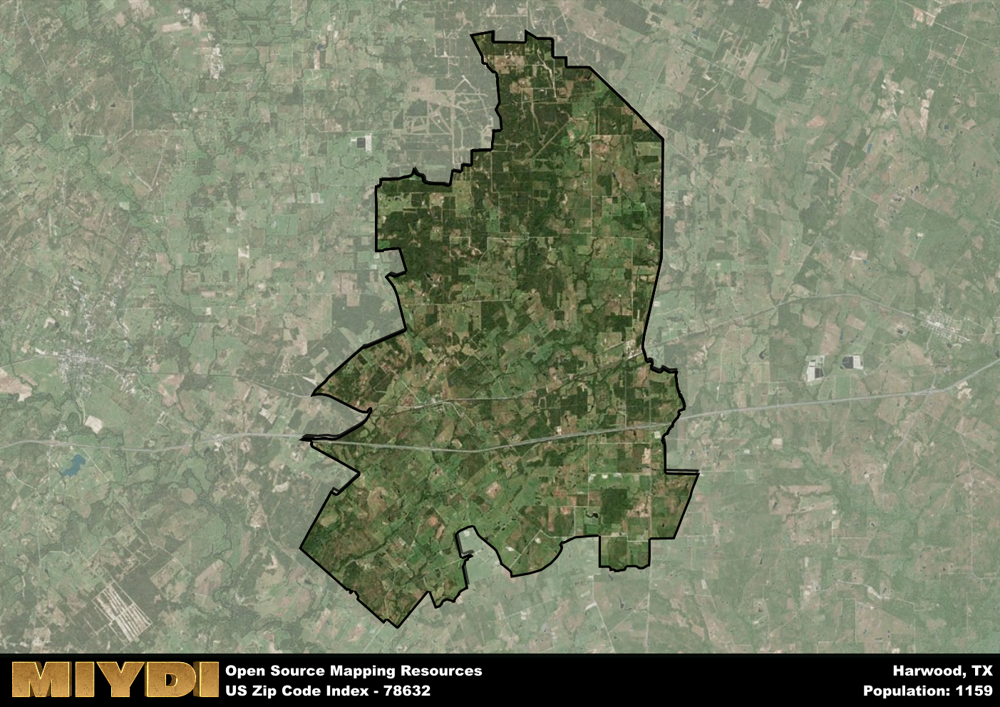

**Area Name:** Harwood

**Zip Code:** 78632

**State:** TX

Harwood is a part of the Austin-Round Rock-Georgetown - TX Metro Area, and makes up  of the Metro's population.  

# Harwood: A Historic Gem in Central Texas

Located in Central Texas, the zip code 78632 area corresponds to the small, rural community of Harwood. Surrounded by sprawling farmlands and ranches, Harwood is situated near major highways connecting it to nearby towns like Luling and Gonzales. Despite its rural setting, it is only a short drive away from the bustling city of Austin, making it an ideal retreat for those seeking a quiet, country lifestyle within reach of urban amenities.

Harwood has a rich historical past dating back to the mid-1800s when German and Czech immigrants settled in the area, establishing farms and building a close-knit community. The town was officially named Harwood in 1876, after an early settler, and soon became a hub for agriculture and commerce in the region. Over the years, Harwood has retained its small-town charm while embracing modern developments, creating a unique blend of old-world charm and contemporary convenience.

Today, Harwood thrives as a tight-knit community with a strong agricultural presence. Residents enjoy a variety of local services, including family-owned businesses, schools, and churches. The area also boasts several parks and recreational facilities, offering opportunities for outdoor activities such as hiking, fishing, and picnicking. Visitors can explore historic sites like the Harwood Community Center and the Harwood Cemetery, providing a glimpse into the town's storied past. With its scenic landscapes and rich heritage, Harwood continues to be a hidden gem in the heart of Texas.

# Harwood Demographics

The population of Harwood is 1159.  
Harwood has a population density of 13.59 per square mile.  
The area of Harwood is 85.28 square miles.  

## Harwood Income and Economic Data

These demographic numbers are sourced from IRS return data, providing comprehensive insights into the population dynamics and economic trends within Harwood.

**Breakdown of return types for Harwood**

The table offers insight into the composition of tax returns filed with the IRS, categorizing them into three main types. Single returns represent filings by individuals, joint returns by married couples, and head of household returns by individuals who qualify as heads of households, typically having dependents. This breakdown provides an understanding of the different filing statuses adopted by taxpayers when submitting their tax documentation.

| Return Types filed for Harwood                              | Percentage          |
|----------------------------------------------------------|---------------------|
| Single Returns                                            | 0.41 |
| Joint Returns                                             | 0.41 |
| Head Household Returns                                    | 0.11 |

The income and economic data presented here is sourced from the IRS income brackets, utilized for categorizing tax returns by income levels. This table displays income ranges for both single filers and married couples, along with the corresponding number of returns and the percentage within each bracket, providing valuable insight into the distribution of taxes across various income groups.

| Bracket Name       | Single Filer Income Range | Married Couple Range | Number of Returns | Percentage of Returns |
|--------------------|----------------------------|----------------------|-------------------|-----------------------|
| 10% Bracket        | Up to $10,275              | Up to $20,550        | 130 | 0.28% |
| 12% Bracket        | $10,276 - $41,775          | $20,551 - $83,550    | 130 | 0.28% |
| 22% Bracket        | $41,776 - $89,075          | $83,551 - $178,150   | 70 | 0.15% |
| 24% Bracket        | $89,076 - $170,050         | $178,151 - $340,100  | 40 | 0.09% |
| 32% Bracket        | $170,051 - $215,950        | $340,101 - $431,900  | 90 | 0.2% |
| 35% Bracket        | $215,951 - $539,900        | $431,901 - $647,850  | 0 | 0% |

### Exploring Taxpayer Diversity: A Breakdown of Different Types of Tax Returns in Harwood

The table offers insights into various types of tax returns filed, reflecting different aspects of taxpayer activities and demographics. Categories include charitable returns for donations, dependent returns for claimed dependents, educator population, elderly population, real estate returns, self-employment returns, student loan returns, and unemployment returns, providing valuable insights into taxpayer behavior and demographics.

| Harwood Filing Types                    | Count | Percentage |
|--------------------------------------|-------|------------|
| Charitable Donations                 | 0 | 0% |
| Dependents Claimed                   | 0 | 0% |
| Educator Residents                   | 0 | 0% |
| Elderly Population                   | 150 | 0.33% |
| Farming Population                   | 90 | 0.196% |
| Real Estate Transactions             | 0 | 0% |
| Self-Employed Individuals            | 50 | 0.109% |
| Student Loan Cases                   | 0 | 0% |
| Unemployment Benefit Filings         | 40 | 0.09% |

## Harwood AI and Census Variables

The values presented in this dataset for Harwood are AI-optimized, streamlined, and categorized into relevant buckets for enhanced utility in AI and mapping programs. These simplified values have been optimized to facilitate efficient analysis and integration into various technological applications, offering users accessible and actionable insights into demographics within the Harwood area.

| AI Variables for Harwood | Value |
|-------------|-------|
| Shape Area | 293659320.464844 |
| Shape Length | 107569.702361211 |
| CBSA Federal Processing Standard Code | 12420 |

## How to use this free AI optimized Geo-Spatial Data for Harwood, TX

This data is made freely available under the Creative Commons license, allowing for unrestricted use for any purpose. Users can access static resources directly from GitHub or leverage more advanced functionalities by utilizing the GeoJSON files. All datasets originate from official government or private sector sources and are meticulously compiled into relevant datasets within QGIS. However, the versatility of the data ensures compatibility with any mapping application.

## Data Accuracy Disclaimer
It's important to note that the data provided here may contain errors or discrepancies and should be considered as 'close enough' for business applications and AI rather than a definitive source of truth. This data is aggregated from multiple sources, some of which publish information on wildly different intervals, leading to potential inconsistencies. Additionally, certain data points may not be corrected for Covid-related changes, further impacting accuracy. Moreover, the assumption that demographic trends are consistent throughout a region may lead to discrepancies, as trends often concentrate in areas of highest population density. As a result, dense areas may be slightly underrepresented, while rural areas may be slightly overrepresented, resulting in a more conservative dataset. Furthermore, the focus primarily on areas within US Major and Minor Statistical areas means that approximately 40 million Americans living outside of these areas may not be fully represented. Lastly, the historical background and area descriptions generated using AI are susceptible to potential mistakes, so users should exercise caution when interpreting the information provided.
