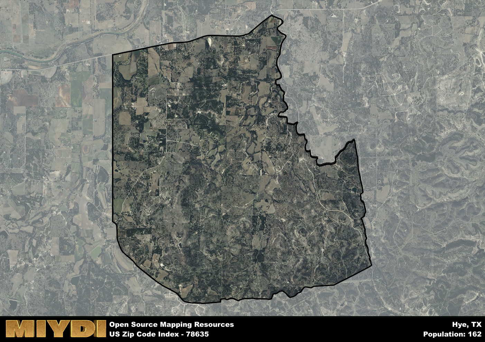

**Area Name:** Hye

**Zip Code:** 78635

**State:** TX

# Hye: A Quaint Community in the Heart of Texas Wine Country  

Located in zip code 78635, Hye is a small unincorporated community in the Texas Hill Country. Surrounded by rolling hills and vineyards, Hye is part of the larger metropolitan area of Austin, situated approximately 60 miles southeast. The area is easily accessible via Highway 290, making it a popular destination for those looking to explore the wineries and picturesque landscapes of the region.

Hye has a rich historical legacy dating back to the mid-19th century when German immigrants settled in the area. The community was named after Hiram G. "Hye" Brown, a leading figure in the development of the region. Over the years, Hye has evolved into a charming town known for its wineries, historic buildings, and welcoming community. The area's history is celebrated through various events and festivals that showcase its heritage.

Today, Hye is a thriving community with a focus on wine production, tourism, and agriculture. Visitors can enjoy wine tastings at the local vineyards, explore historic sites such as the Hye Post Office and the Hye Hall, and take in the natural beauty of the surrounding countryside. The area also offers hiking and biking trails, bed and breakfast accommodations, and a variety of dining options. Hye is a hidden gem within the Texas Hill Country, offering a peaceful retreat for residents and tourists alike.

# Hye Demographics

The population of Hye is 162.  
Hye has a population density of 6.19 per square mile.  
The area of Hye is 26.17 square miles.  

## Hye AI and Census Variables

The values presented in this dataset for Hye are AI-optimized, streamlined, and categorized into relevant buckets for enhanced utility in AI and mapping programs. These simplified values have been optimized to facilitate efficient analysis and integration into various technological applications, offering users accessible and actionable insights into demographics within the Hye area.

| AI Variables for Hye | Value |
|-------------|-------|
| Shape Area | 91039310.640625 |
| Shape Length | 43753.6403053727 |

## How to use this free AI optimized Geo-Spatial Data for Hye, TX

This data is made freely available under the Creative Commons license, allowing for unrestricted use for any purpose. Users can access static resources directly from GitHub or leverage more advanced functionalities by utilizing the GeoJSON files. All datasets originate from official government or private sector sources and are meticulously compiled into relevant datasets within QGIS. However, the versatility of the data ensures compatibility with any mapping application.

## Data Accuracy Disclaimer
It's important to note that the data provided here may contain errors or discrepancies and should be considered as 'close enough' for business applications and AI rather than a definitive source of truth. This data is aggregated from multiple sources, some of which publish information on wildly different intervals, leading to potential inconsistencies. Additionally, certain data points may not be corrected for Covid-related changes, further impacting accuracy. Moreover, the assumption that demographic trends are consistent throughout a region may lead to discrepancies, as trends often concentrate in areas of highest population density. As a result, dense areas may be slightly underrepresented, while rural areas may be slightly overrepresented, resulting in a more conservative dataset. Furthermore, the focus primarily on areas within US Major and Minor Statistical areas means that approximately 40 million Americans living outside of these areas may not be fully represented. Lastly, the historical background and area descriptions generated using AI are susceptible to potential mistakes, so users should exercise caution when interpreting the information provided.
